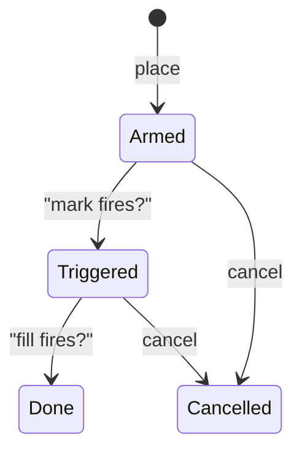
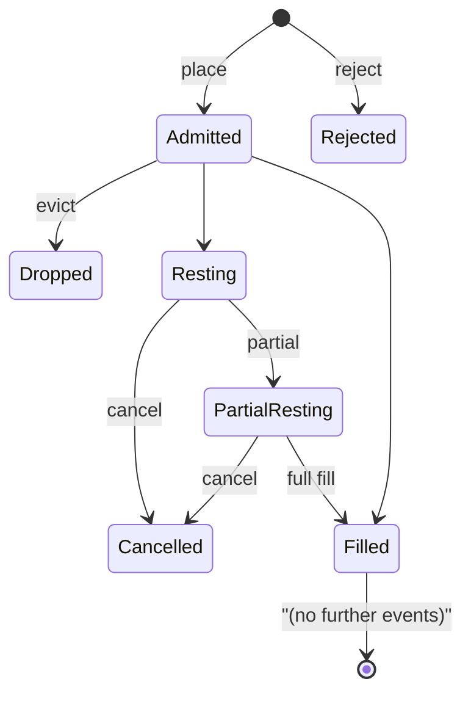

# 订单类型

:::tip
**稳定。**
:::

## TL;DR

MetaFlux 支持完整的订单原语阶梯 — 限价、IOC、ALO、FOK、市价、止损、止盈、触发限价、TWAP、阶梯、仅平仓 — 以及防自成交（STP）模式，用于控制与自身订单的匹配。每个变体都是一个 `POST /exchange { type: "Order", ... }` 形状；TWAP 和阶梯等专门流程使用它们自己的操作变体。

## 时间有效性（Time-in-force）

| TIF | 行为 | 使用场景 |
|-----|------|--------|
| `Gtc` | 好价成交。保持在订单簿上直到成交或取消。 | 默认值；被动做市、持续报价 |
| `Ioc` | 即时成交或取消。匹配可用流动性，取消任何未成交部分。 | 立即获取流动性；不想留在订单簿上 |
| `Alo` | 仅加单（"仅做市"）。如果任何部分会穿过订单簿，整个订单被取消。 | 严格做市商；保证永不支付挂单费 |
| `Fok` | 全部成交或全部取消。要么立即成交全部数量，要么取消全部。 | 单一价格水平的原子执行 |

```
买 1 BTC @ 100.5 Gtc      →  停留在订单簿上，当卖价达到 100.5 或更低时成交
买 1 BTC @ 100.5 Ioc      →  立即匹配 ≤ 100.5 的卖价；取消剩余
买 1 BTC @ 100.5 Alo      →  如果任何卖价 ≤ 100.5，则拒绝  否则停留
买 1 BTC @ 100.5 Fok      →  如果总数 ≥ 1.0 @ ≤ 100.5，则成交  否则拒绝
```

## 仅平仓

`reduce_only: true` 在开仓时拒绝订单，如果成交会**增加**绝对头寸大小。用于保护性平仓 — 仅平仓止损不会意外将你从多头转为空头。

```
头寸：多头 1 BTC
卖 0.5 reduce_only=true   →  可以（平仓 0.5 的多头）
卖 2.0 reduce_only=true   →  被拒绝：会转为空头 1
买  0.5 reduce_only=true   →  被拒绝：会增加多头至 1.5
```

仅平仓在**提交时**而非开仓时评估，此时头寸从最新提交的状态读取。在开仓和分发之间发生的比赛成交可能导致提交时的 `reduce_only_violation_post_admit`（见[错误](../api/errors.md#commit-time-errors-not-http-in-event-stream)）。

## 防自成交

如果新订单会与来自同一 `sender` 的现有订单匹配，则 STP 启动。

| STP 模式 | 当新订单穿过旧订单 | 当等价格两者都停留 |
|---------|------------------|------------------|
| `None` | 允许交易 | 两者都停留 |
| `CancelNewest` | 新订单被取消 | 新订单被取消 |
| `CancelOldest` | 旧订单被取消，新订单可在其他地方匹配 | 旧订单被取消，新订单停留 |
| `CancelBoth` | 两者都被取消 | 两者都被取消 |
| `DecrementAndCancel` | 以 `min(new, old)` 匹配；取消较小的；较大的保留剩余 | 相同 — 匹配然后取消较小的 |

工作示例 — `DecrementAndCancel`：

```
你的停留买单：买 1 BTC @ 100.5  (oid 1)
你下卖单：卖 0.4 BTC @ 100.5  (oid 2)  with stp=DecrementAndCancel

结果：
  - oid 1 减少到 0.6 BTC 剩余
  - oid 2 被取消（较小的订单）
  - 没有交易成交（没有费用、没有成交事件）
  - 你的头寸不变
```

STP 在匹配步骤被执行，所以它在资产端、价格和时间上都有效。STP 仅考虑针对同一 `sender` 签署的订单 — 来自同一主账户下的代理的订单也计算在内。

## 触发器

**触发器订单**是一个停留条件，当满足时，会触发一个内部订单进入订单簿。

| 触发器类型 | 触发条件 | 内部订单 |
|----------|--------|--------|
| `StopLoss` | 标记价格从"安全"方向穿过 `trigger_px` 至"亏损"方向 | 市价或限价；通常仅平仓 |
| `TakeProfit` | 标记价格从"亏损"方向穿过 `trigger_px` 至"盈利"方向 | 市价或限价；通常仅平仓 |
| `StopLimit` | 与 `StopLoss` 相同 | 仅限价内部订单 |
| `TakeProfitLimit` | 与 `TakeProfit` 相同 | 仅限价内部订单 |

对于多头头寸：
- `StopLoss` 在 `mark ≤ trigger_px` 时触发（价格下跌切割多头）
- `TakeProfit` 在 `mark ≥ trigger_px` 时触发（价格上升预订利润）

对于空头，不等式反向。

`limit_px`：
- `null` → 在触发时发送市价（`Ioc`）订单
- 存在 → 在 `limit_px` 发送限价订单

触发器状态机：



触发器在每次标记价格更新时评估（每次提交）。它们在块之间和重启后都能存活。

## 分组

`Order { grouping: ... }` 将腿分组到一个族。

| 分组 | 含义 |
|-----|------|
| `Na` | 独立订单 |
| `NormalTpsl` | 两个订单：一个入场 + 一个 {StopLoss, TakeProfit}。成交一个会取消另一个（OCO）。 |
| `PositionTpsl` | 两个触发器订单，附加到**头寸**而非入场订单。它们在头寸变化中存活（例如加仓）并在头寸关闭时才取消。 |

使用 `PositionTpsl` 表示"我总想在我的净头寸上有止损" — 相同的 TPSL 括号保持武装状态，同时你增加或修剪头寸。

## 阶梯订单

`ScaleOrder` 放置一个限价订单梯。

```json
{
  "type": "ScaleOrder",
  "params": {
    "asset": 0, "side": "Buy",
    "total_size": "1000000000",
    "start_price": "9900000000",
    "end_price":   "9800000000",
    "n_levels": 10,
    "shape": "Flat"
  }
}
```

形状：

| 形状 | 跨腿的大小分配 |
|-----|--------------|
| `Flat` | 每个腿相等 |
| `Linear` | 从一端到另一端的线性斜坡 |
| `Geometric` | 几何斜坡（在价差附近较小，远处较大） |

每个腿得到一个自动分配的 `cloid`，派生自 `cloid_prefix + leg_index`。通过取消每个腿来取消整个梯，或使用[`cancel_by_cloid`](../api/rest/exchange.md#cancel_by_cloid)和前缀的扩展。

## TWAP

`TwapOrder` 在 `duration_ms` 上调度切片。

```
duration = 1 hour = 3,600,000 ms
slices   = duration / SLICE_INTERVAL  (default 60s slice; 60 slices per hour)
sz_per_slice = size / slices

slice  1: send IOC near mid at t = randomize(0, SLICE_INTERVAL * (1 + jitter%))
slice  2: send IOC at t = slice_1_t + SLICE_INTERVAL * (1 + jitter%)
...
slice 60: send last IOC just before t = duration
```

`randomize_pct` ∈ `[0, 50]` 通过 ±`randomize_pct/100 × slice_interval` 抖动切片时间。设置更高以更难被检测；设置更低以进行紧密的时间控制。

切片由协议提交；提交 `TwapOrder` 后客户端无需做任何事情。切片事件乘坐[`userEvents` WS 通道](../api/ws/subscriptions.md#userevents)（专用 `twap*` 流在路线图中）。

TWAP 可在运行中通过 `TwapCancel` 取消；已成交的切片保持成交，未来切片停止。

## 市价订单

没有独特的"市价"操作 — "市价订单"是在极端价格处的 `Ioc` 限价（买入为 `MAX_PRICE`，卖出为 `0`）。当你调用 `marketBuy(...)` 时，SDK 会为你做这个。订单簿以任何存在的流动性匹配；未穿过的剩余被取消。

警告：所有市价订单都受**标记价格带**的约束 — 如果最佳卖价比标记价格高 5%，你的市价买单将填充可用流动性直到 `mark × (1 + band_pct)`，然后取消剩余。见[标记价格](./mark-prices.md)。

## 订单生命周期状态机



每个状态转换在[`userEvents`](../api/ws/subscriptions.md#userevents)上发出相应事件（订单生命周期事件乘坐此通道）。

## 边界情况

<details>
<summary>显示边界情况</summary>

- **仅平仓与成交竞争。** 止损是仅平仓的；成交关闭头寸；止损触发；提交时检查失败，返回 `reduce_only_violation_post_admit`。解决方案：将 `userFills` 事件连接回你的机器人以在完全关闭时取消括号。
- **STP 在开仓与匹配。** STP 仅在匹配步骤被执行。两个不穿过的相反方向订单都会停留。STP 仅在它们实际交易时触发。
- **TWAP 中期波动。** 每个切片是靠近中间的 IOC — 如果流动性在切片之间干涸，切片可能完全未成交。观察切片事件。
- **ALO + 穿过订单簿。** 会穿过*任何*水平的 ALO 被完全拒绝，而非部分拒绝。要以紧密的价格滑入订单簿，使用最好对方最差一步的非穿过限价。
- **触发器和 TIF。** 设置了 `limit_px` 的 `StopLoss` 在触发时作为 Gtc 限价停留。如果你想要分片式退出，手动添加类似 TWAP 的喷雾。

</details>

## 示例 — TypeScript

```typescript
// limit buy, GTC, post-only
await client.order({
  asset: 0, side: 'Buy', priceE8: '10050000000', sizeE8: '100000000',
  tif: 'Alo', reduceOnly: false, stpMode: 'CancelNewest'
});

// stop-loss attached to a long position
await client.trigger({
  asset: 0, side: 'Sell', sizeE8: '100000000',
  triggerPxE8: '9500000000', limitPxE8: null,
  triggerKind: 'StopLoss', reduceOnly: true
});

// 1-hour TWAP buy
await client.twap({
  asset: 0, side: 'Buy', sizeE8: '1000000000',
  durationMs: 3_600_000, randomizePct: 20, reduceOnly: false
});

// 10-level scale buy
await client.scale({
  asset: 0, side: 'Buy',
  totalSizeE8: '1000000000',
  startPriceE8: '9900000000',
  endPriceE8: '9800000000',
  nLevels: 10, shape: 'Linear'
});
```

## 另见

- [`POST /exchange`](../api/rest/exchange.md) — 完整的每变体模式
- [保证金模式](./margin-modes.md)
- [标记价格](./mark-prices.md) — 触发器如何触发
- [分级清算](./tiered-liquidation.md) — 压力下如何管理头寸

## 常见问题

<details>
<summary>显示常见问题</summary>

**问：ALO 订单会支付挂单费吗？**
答：永远不会。如果会穿过，整个订单在开仓时被拒绝 — 没有部分挂单。

**问：单个 `Order` 操作可以混合 TIF 吗？**
答：可以。`orders: []` 是异构的；每个条目有自己的 `tif`。

**问：匹配引擎如何在相同价格处打破平局？**
答：严格的 FIFO — 最早的 `oid` 赢。ALO 订单通过首先在订单簿上坐下来获得优先级；这是它们自然的费用折扣边缘。

**问：TWAP 切片计入我的速率限制吗？**
答：不计。它们由协议在内部提交，而非由你的客户端提交。提交 `TwapOrder` 是一次速率限制收费。

</details>
