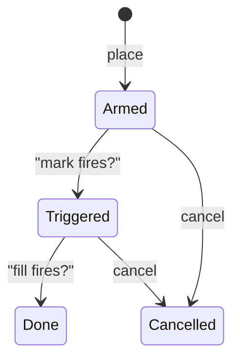
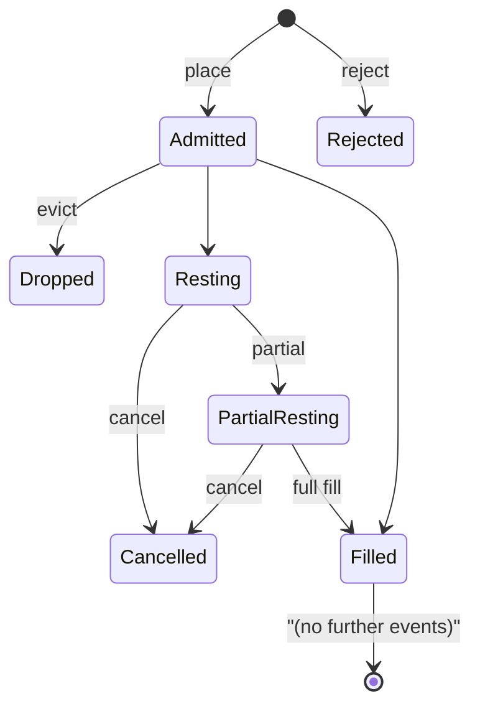

# 订单类型

:::tip
**稳定版。**
:::

## 简介

MetaFlux 支持完整的订单原语层级 —— 限价单、IOC、ALO、FOK、市价单、止损单、止盈单、触发限价单、TWAP、梯度挂单，以及只减仓（reduce-only）—— 还有防自成交（STP）模式，用于控制是否与自己的订单撮合。所有变体均采用 `POST /exchange { type: "Order", ... }` 结构；TWAP 和梯度挂单等特殊流程使用各自专属的 action 变体。

## 有效期（Time-in-force）

| TIF | 行为 | 适用场景 |
|-----|-----------|----------|
| `Gtc` | 成交前有效（Good-till-cancelled）。挂单直至成交或撤单。 | 默认；被动做市、持续报价 |
| `Ioc` | 即时成交否则撤销（Immediate-or-cancel）。撮合当前可用数量，未成交余量立即撤销。 | 立即吃单；不希望挂入订单簿 |
| `Alo` | 只做 Maker（Add-limit-only / post-only）。若有任何部分会与订单簿对手方成交，整笔订单将被取消。 | 严格做市；保证不支付 taker 手续费 |
| `Fok` | 全量成交否则撤销（Fill-or-kill）。要么立即全部成交，要么整笔取消。 | 在单一价位原子性执行 |

```
Buy 1 BTC @ 100.5 Gtc      →  rests on book, fills as ask reaches 100.5 or lower
Buy 1 BTC @ 100.5 Ioc      →  immediately matches asks ≤ 100.5; cancels rest
Buy 1 BTC @ 100.5 Alo      →  IF any ask ≤ 100.5  THEN reject  ELSE rest
Buy 1 BTC @ 100.5 Fok      →  IF total ≥ 1.0 @ ≤ 100.5  THEN fill  ELSE reject
```

## 只减仓（Reduce-only）

`reduce_only: true` 会在订单准入时检查：若成交会**扩大**仓位的绝对值，则直接拒绝该订单。适用于保护性平仓 —— 只减仓的止损单不会意外地将多仓翻转为空仓。

```
position: long 1 BTC
sell 0.5 reduce_only=true   →  ok (closes 0.5 of long)
sell 2.0 reduce_only=true   →  rejected: would flip to short 1
buy  0.5 reduce_only=true   →  rejected: would grow long to 1.5
```

只减仓的校验在**提交时**执行（而非准入时），此时从最新已提交状态读取仓位。若在准入与派发之间有成交将仓位清零，可能触发提交时 `reduce_only_violation_post_admit` 错误（参见[错误码](../api/errors.md#commit-time-errors-not-http-in-event-stream)）。

## 防自成交（STP）

若新订单会与同一 `sender` 的既有订单撮合，则触发 STP 机制。

| STP 模式 | 新单与旧单交叉时 | 同价位均挂单时 |
|----------|---------------------|-----------------------------|
| `None` | 允许成交 | 均挂入订单簿 |
| `CancelNewest` | 新单撤销 | 新单撤销 |
| `CancelOldest` | 旧单撤销，新单可与其他对手方成交 | 旧单撤销，新单挂入订单簿 |
| `CancelBoth` | 新旧均撤销 | 新旧均撤销 |
| `DecrementAndCancel` | 按 `min(新单, 旧单)` 撮合；撤销数量较小的一方；较大一方保留剩余数量 | 同理 —— 撮合后撤销较小一方 |

示例 —— `DecrementAndCancel`：

```
your resting bid:  buy 1 BTC @ 100.5  (oid 1)
you place sell:    sell 0.4 BTC @ 100.5  (oid 2)  with stp=DecrementAndCancel

result:
  - oid 1 is decremented to 0.6 BTC remaining
  - oid 2 is cancelled (smaller order)
  - no trade fires (no fee, no fill event)
  - your position is unchanged
```

STP 在撮合步骤执行，因此跨资产方向、价位和时间均有效。STP 仅检测同一 `sender` 签名的订单 —— 同一主账户下的代理账户订单也在检测范围内。

## 触发单

**触发单**是一个挂载的条件，条件满足时会将一笔内部订单推入订单簿。

| 触发类型 | 触发条件 | 内部订单 |
|--------------|-----------|-------------|
| `StopLoss` | 标记价格从"安全区"向"亏损方向"穿越 `trigger_px` | 市价单或限价单；通常设为只减仓 |
| `TakeProfit` | 标记价格从"亏损方向"向"盈利方向"穿越 `trigger_px` | 市价单或限价单；通常设为只减仓 |
| `StopLimit` | 与 `StopLoss` 相同 | 仅限价单 |
| `TakeProfitLimit` | 与 `TakeProfit` 相同 | 仅限价单 |

对于多仓：
- `StopLoss` 在 `mark ≤ trigger_px` 时触发（价格下跌，止损多仓）
- `TakeProfit` 在 `mark ≥ trigger_px` 时触发（价格上涨，锁定盈利）

空仓的不等号方向相反。

`limit_px`：
- `null` → 触发时以市价（`Ioc`）下单
- 有值 → 触发时以 `limit_px` 下限价单

触发单状态机：



触发单在每次标记价格更新（每次提交）时评估，跨区块和跨重启均持久有效。

## 订单分组

`Order { grouping: ... }` 将多条腿组合为一个订单组。

| 分组类型 | 含义 |
|----------|---------|
| `Na` | 独立订单 |
| `NormalTpsl` | 两笔订单：一笔入场单 + 一笔止损或止盈单。任意一笔成交后撤销另一笔（OCO 二选一）。 |
| `PositionTpsl` | 两笔触发单，绑定到**仓位**而非入场单。仓位变动时（如加仓均摊）仍保持有效，仅在仓位清零时撤销。 |

当你希望"始终为净仓位保留止损/止盈保护"时，使用 `PositionTpsl` —— 无论加仓还是减仓，同一组 TPSL 会持续生效。

## 梯度挂单（Scale Orders）

`ScaleOrder` 在多个价位挂入一组限价单。

```json
{
  "type": "ScaleOrder",
  "params": {
    "asset": 0, "side": "Buy",
    "total_size": "1000000000",
    "start_price": "9900000000",
    "end_price":   "9800000000",
    "n_levels": 10,
    "shape": "Flat"
  }
}
```

形态（Shapes）：

| 形态 | 各腿数量分配方式 |
|-------|------------------------------|
| `Flat` | 每腿等量 |
| `Linear` | 从一端到另一端线性递增 |
| `Geometric` | 几何递增（靠近价差处数量小，远端数量大） |

每条腿自动分配一个 `cloid`，由 `cloid_prefix + leg_index` 生成。撤销整组挂单时，逐腿撤销，或使用 [`cancel_by_cloid`](../api/rest/exchange.md#cancel_by_cloid) 批量撤销前缀对应的全部订单。

## TWAP

`TwapOrder` 在 `duration_ms` 时间内分批下单。

```
duration = 1 hour = 3,600,000 ms
slices   = duration / SLICE_INTERVAL  (default 60s slice; 60 slices per hour)
sz_per_slice = size / slices

slice  1: send IOC near mid at t = randomize(0, SLICE_INTERVAL * (1 + jitter%))
slice  2: send IOC at t = slice_1_t + SLICE_INTERVAL * (1 + jitter%)
...
slice 60: send last IOC just before t = duration
```

`randomize_pct` ∈ `[0, 50]`，对每个分片的执行时间做 ±`randomize_pct/100 × slice_interval` 的随机抖动。设置较高可提升隐蔽性；设置较低可实现严格的时间控制。

分片由协议自动提交，客户端提交 `TwapOrder` 后无需任何后续操作。分片事件通过 [`userEvents` WebSocket 频道](../api/ws/subscriptions.md#userevents) 推送（专属 `twap*` 流已列入路线图）。

TWAP 可在执行过程中通过 `TwapCancel` 取消；已成交的分片保持成交状态，后续分片停止执行。

## 市价单

系统没有独立的"市价单" action —— "市价单"本质上是以极端价格挂入的 `Ioc` 限价单（买入用 `MAX_PRICE`，卖出用 `0`）。调用 `marketBuy(...)` 时，SDK 会自动完成这一处理。订单簿按现有流动性成交，未撮合的余量立即撤销。

注意：**所有市价单均受标记价格带限制** —— 若最优 ask 高于标记价格 5%，市价买单将在 `mark × (1 + band_pct)` 以内成交现有流动性，超出部分撤销。详见[标记价格](./mark-prices.md)。

## 订单生命周期状态机



每次状态转换都会在 [`userEvents`](../api/ws/subscriptions.md#userevents) 上推送对应事件（订单生命周期事件均通过该频道下发）。

## 边界情况

<details>
<summary>展开边界情况</summary>

- **只减仓与成交竞争。** 止损单设为只减仓；某次成交将仓位清零；止损单触发；提交时校验失败，报 `reduce_only_violation_post_admit`。解决方案：将 `userFills` 事件接入机器人逻辑，在仓位完全平掉时主动撤销关联的 TPSL 订单。
- **STP 的准入时与撮合时区别。** STP 仅在撮合步骤执行。两笔反向订单若不相互交叉，均会挂入订单簿。STP 仅在双方实际可成交时才触发。
- **TWAP 遇到高波动。** 每个分片均为靠近中间价的 IOC 单 —— 若分片间流动性枯竭，分片可能完全未成交。请关注分片事件。
- **ALO 单与订单簿交叉。** 会与订单簿任意价位交叉的 ALO 单将被整笔拒绝，不存在部分成交。若需以接近最优价挂单，请使用比对手方最优价差一个 tick 的非交叉限价单。
- **触发单与 TIF。** 设置了 `limit_px` 的 `StopLoss` 触发后，以 Gtc 限价单挂入订单簿。若需分批平仓，请手动叠加类 TWAP 的分片逻辑。

</details>

## 示例 — TypeScript

```typescript
// limit buy, GTC, post-only
await client.order({
  asset: 0, side: 'Buy', priceE8: '10050000000', sizeE8: '100000000',
  tif: 'Alo', reduceOnly: false, stpMode: 'CancelNewest'
});

// stop-loss attached to a long position
await client.trigger({
  asset: 0, side: 'Sell', sizeE8: '100000000',
  triggerPxE8: '9500000000', limitPxE8: null,
  triggerKind: 'StopLoss', reduceOnly: true
});

// 1-hour TWAP buy
await client.twap({
  asset: 0, side: 'Buy', sizeE8: '1000000000',
  durationMs: 3_600_000, randomizePct: 20, reduceOnly: false
});

// 10-level scale buy
await client.scale({
  asset: 0, side: 'Buy',
  totalSizeE8: '1000000000',
  startPriceE8: '9900000000',
  endPriceE8: '9800000000',
  nLevels: 10, shape: 'Linear'
});
```

## 参见

- [`POST /exchange`](../api/rest/exchange.md) — 各变体完整 schema
- [保证金模式](./margin-modes.md)
- [标记价格](./mark-prices.md) — 触发单的触发机制
- [分级清算](./tiered-liquidation.md) — 极端行情下的仓位管理

## 常见问题

<details>
<summary>展开常见问题</summary>

**Q：ALO 订单会支付 taker 手续费吗？**
A：不会。若会与订单簿交叉，整笔订单在准入时即被拒绝 —— 不存在部分 taker 成交。

**Q：单笔 `Order` action 能混用不同 TIF 吗？**
A：可以。`orders: []` 是异构数组，每个条目有各自独立的 `tif`。

**Q：同价位时撮合引擎如何决定优先顺序？**
A：严格 FIFO —— 最早的 `oid` 优先成交。ALO 订单因先挂入订单簿而天然获得优先权，这也是其手续费返还优势的来源。

**Q：TWAP 分片会占用我的频率限额吗？**
A：不会。分片由协议内部提交，不计入客户端频率限额。提交 `TwapOrder` 本身仅消耗一次频率限额。

</details>
