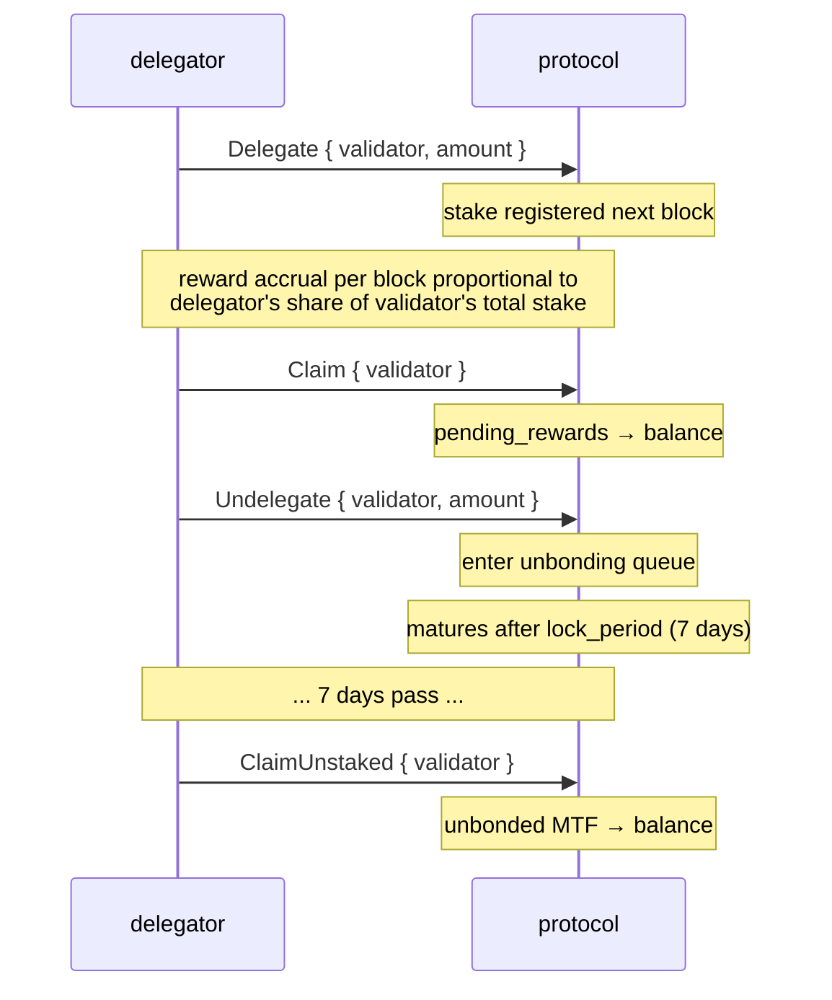
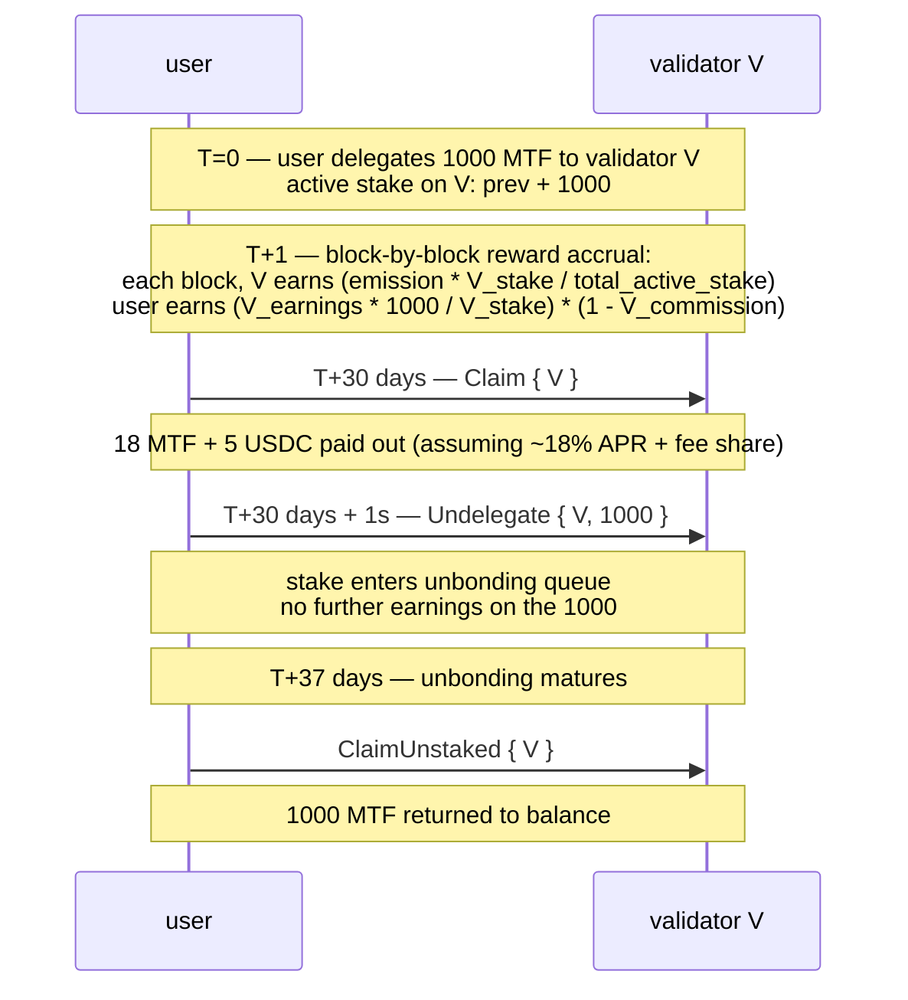

# 质押

:::info
**已在 Devnet 上线。** 委托、取消委托、领取奖励及验证者注册均已在 4 节点 Devnet 的共识层完成端到端验证，功能正常运行。
:::

## 概览

持有 MTF，委托给验证者，即可赚取协议增发奖励及手续费分成。在 `lock_period` 期限内，质押资产保持流动性；解除质押需等待 `7 days` 才能完全释放。行为不端的验证者将遭到罚没（Slash），委托人也将承担相应的部分损失。

## 参与角色

| 角色 | 说明 |
|------|------|
| **验证者** | 运行共识节点，提出区块，参与投票。须自质押金额高于 `min_self_bond`（默认 10 万 MTF）。 |
| **委托人** | 持有 MTF，选择验证者进行委托，所得奖励扣除验证者佣金后归己。 |
| **协议** | 每个区块增发奖励，按质押比例分配。 |

## 质押流程



## 操作指令

### `Delegate`

```json
{
  "type": "Delegate",
  "params": { "validator": "0x<val_addr>", "amount": "10000000000" }
}
```

将 MTF 从账户余额转入验证者的委托池。下一个区块生效，自此开始计算奖励。

### `Undelegate`

```json
{
  "type": "Undelegate",
  "params": { "validator": "0x<val_addr>", "amount": "10000000000" }
}
```

从活跃质押中移除，进入解绑队列。解绑期间不计奖励，到期时间为 `now + lock_period_ms`。

### `Redelegate`

```json
{
  "type": "Redelegate",
  "params": { "from": "0x<val1>", "to": "0x<val2>", "amount": "10000000000" }
}
```

在验证者之间转移质押，**无需**进入解绑队列。同一 `(from, to)` 配对在 24 小时内限操作一次（防止频繁切换）。

### `Claim`

```json
{
  "type": "Claim",
  "params": { "validator": "0x<val_addr>" }
}
```

将 `pending_rewards` 中已累积的奖励归集到委托人的 MTF 余额。若待领取金额为零，则为空操作。

自动领取功能**并非**自动触发——请按固定周期（每日/每周）手动领取，或在调整委托前先行领取。

### `ClaimUnstaked`

```json
{
  "type": "ClaimUnstaked",
  "params": { "validator": "0x<val_addr>" }
}
```

将已到期的解绑资产（锁定期已过的部分）归集回 MTF 余额。该操作幂等，可重复调用。

## 奖励来源

| 来源 | 发放节奏 | 分配方式 |
|------|----------|----------|
| 协议增发 | 每区块 | `emission_per_block × stake_share × (1 - validator_commission)` |
| 手续费收入（国库 → 质押者） | 每 Epoch | `treasury_inflow × staker_share × stake_share × (1 - commission)` |

`emission_per_block`：由治理设定，当前值可通过 `staking_state` 查询获取。  
`staker_share`（国库分配比例）：由治理设定，默认值为 `50%`。  
`validator_commission`：各验证者自行设定，治理规定上限为 `20%`。

奖励以 MTF（增发部分）和 USDC（手续费收入部分）分别计算，领取时两者一并返回。`staking_state` 会显示各币种的待领取金额。

## 锁定期

解除质押的默认锁定期为 **7 天**，可由治理针对各质押池单独调整。

| 状态 | 持续时间 | 计奖？ | 可被罚没？ |
|------|----------|:------:|:----------:|
| 活跃（已委托） | 无限期 | 是 | 是 |
| 解绑中 | `lock_period_ms` | 否 | 是（到期前均可）|
| 已解绑（待领取） | 至主动领取 | 否 | 否 |

解绑期间仍面临罚没风险——若验证者在你解绑途中遭到罚没，即便你已发起退出信号，解绑中的委托人仍会被连带削减。

## 罚没机制

以下行为将触发验证者罚没：

| 违规行为 | 罚没比例 | 委托人受损情况 |
|----------|----------|----------------|
| 双重签名（在同一高度对两个冲突区块签名） | 质押的 5% + 监禁 | 按比例损失委托额的 5% |
| 宕机（连续错过 `downtime_blocks` 个出块槽） | 质押的 0.1% + 监禁 | 按比例损失 0.1% |
| 对无效分叉投票 | 5% + 永久移除 | 按比例损失 5% |

被罚没的委托人在罚没区块处，其 `delegation.amount` 将相应减少，且无任何预警——罚没由共识层直接执行。

风险规避建议：
- 选择运营稳健的验证者（关注历史在线率和佣金稳定性）。
- 跨多个验证者分散委托（单一验证者被罚没只影响对应部分）。
- 避免选择接近 `min_self_bond` 下限的验证者（更可能以不受控方式退出）。

## 验证者筛选

```bash
curl -X POST https://devnet-gateway.mtf.exchange/info -d '{"type":"validator_summaries"}'
```

返回活跃验证者集合（`{epoch, total_stake, n_active, validators[]}`），每条记录包含：

```json
{
  "validator":          "0x<val>",
  "signer":             "0x<signer>",
  "validator_index":    3,
  "stake":              "10000000000000",
  "self_stake":         "100000000000",
  "commission_bps":     500,
  "is_active":          true,
  "is_jailed":          false,
  "first_active_epoch": 12
}
```

筛选建议：
- **佣金**（`commission_bps`）：越低，委托人实际 APR 越高；但需警惕"钓鱼式调价"（先低后涨）。
- **自质押量**（`self_stake`）：越高，说明运营者自身利益与节点深度绑定。
- **监禁状态**（`is_jailed`）：当前被监禁的验证者在解禁前不计任何奖励。
- **活跃状态**（`is_active`）：只有 `is_active: true` 的验证者才在实时签名集内。

## APR 估算

[`staking_apr`](../api/rest/info.md#staking_apr) `/info` 查询类型为**实时数据**——返回区块奖励效应实际生效的增发 APR，以及对应的已承诺参数：

```bash
curl -X POST https://devnet-gateway.mtf.exchange/info -d '{"type":"staking_apr"}'
```

```json
{
  "type": "staking_apr",
  "data": {
    "total_stake":             "1000000",
    "effective_apr":           "0.08",
    "effective_apr_bps":       "800",
    "governance_rate_bps":     800,
    "emission_floor_stake":    "50000000",
    "n_active_validators":     1,
    "current_epoch":           2,
    "is_gross_pre_commission": true
  }
}
```

`effective_apr` 由**质押曲线**推导而来，并非直接取治理利率：

```text
effective_apr = 0.08 × √( 50M / max(total_stake, 50M) )
```

即：总质押量不超过 5000 万 MTF 时，APR 固定为 **8%**；超出后按 1/√stake 衰减（质押越多，每位质押者的分成越少）。`governance_rate_bps` 为已承诺参数，但**并不**直接用于奖励计算——两者同时对外展示，便于观察差异。APR 为**税前总收益率**，未扣除各验证者佣金（`is_gross_pre_commission: true`）。

委托人的实际净 APR：

```
net_apr  =  effective_apr  ×  (1 - validator_commission_bps/10_000)
```

## 边界情况

<details>
<summary>展开查看边界情况</summary>

- **解绑中，验证者退出。** 你的解绑质押将在罚没区块转移至队列中的下一个验证者。退出后，如需更换，可对新验证者进行再委托；锁定期继续针对新验证者计算。
- **活跃集更替。** 若验证者掉出活跃集（委托总量低于准入门槛），在其不活跃期间，你的质押不计任何奖励。可再委托至活跃验证者。
- **自质押下限。** 若验证者的自质押因被罚没或提款而低于 `min_self_bond`，将被监禁，委托人在监禁期间不计奖励。

</details>

## 完整操作序列



## 延伸阅读

- [`POST /exchange Delegate / Undelegate / Claim`](../api/rest/exchange.md)（Devnet 上已支持的操作变体）
- [`POST /info staking_state`](../api/rest/info.md#staking_state)
- [`POST /info staking_apr`](../api/rest/info.md#staking_apr) — 实际生效的增发 APR 及已承诺参数
- [`POST /info protocol_metrics`](../api/rest/info.md#protocol_metrics) — 全协议质押聚合数据（`staking.*`）
- [HL 兼容 `delegations`](../api/rest/hl-compat.md#delegations)
- [手续费](./fees.md) — 手续费收入是质押奖励来源之一

## 常见问题

<details>
<summary>展开查看常见问题</summary>

**Q：我可以同时质押和交易吗？**  
A：可以——已质押的 MTF 与 USDC 交易余额属于同一账户下的独立子余额，互不影响。

**Q：质押需要代理钱包吗？**  
A：不需要，但你也可以使用代理钱包。代理钱包可调用 `Delegate` / `Undelegate` / `Claim`（质押操作无需提款权限）。

**Q：我可以取消解绑吗？**  
A：不可以——一旦提交，必须等满完整的 `lock_period`。如果预计需要将质押转移到其他地方，建议提前使用再委托操作。

**Q：启动时 MTF 代币从何而来？**  
A：创世分配 + 每区块增发。具体分配方式请参阅[代币经济学文档]（即将发布）。协议不会任意空投——增发是唯一持续来源。

</details>
