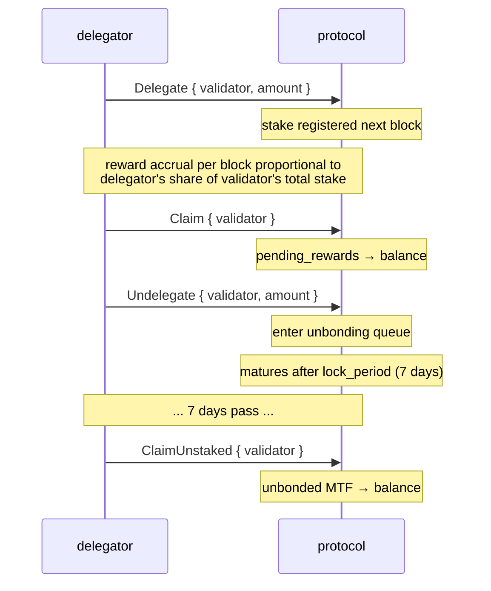
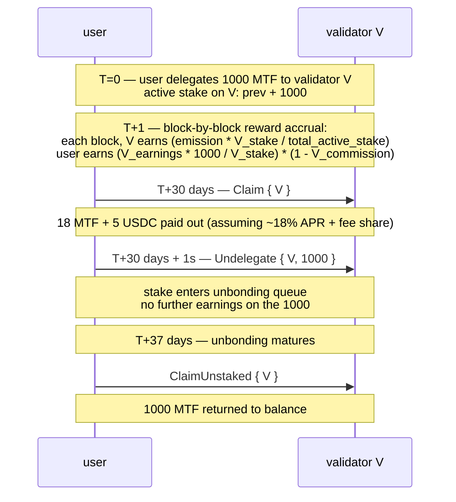

# 质押

:::info
**已在测试网上线。** 委托、取消委托、收益领取和验证者注册已在 4 节点测试网上完全激活和端到端验证。
:::

## 摘要

持有 MTF，委托给验证者，赚取协议发行物加上费用收入份额。质押在 `lock_period` 内具有流动性；取消质押需要 `7 天` 才能完全释放。违规验证者会被罚没；委托人面临部分罚没风险。

## 参与者

| 角色 | 说明 |
|------|-------------|
| **验证者** | 运行共识节点、提议区块、投票。必须自我锁定超过 `min_self_bond`（默认 100k MTF）。 |
| **委托人** | 持有 MTF、选择验证者、赚取扣除验证者佣金的收益。 |
| **协议** | 每区块发行奖励；按质押分配。 |

## 质押流程



## 操作

### `Delegate`

```json
{
  "type": "Delegate",
  "params": { "validator": "0x<val_addr>", "amount": "10000000000" }
}
```

将 MTF 从余额转移到验证者的委托池。在下一区块生效。从那时起赚取奖励。

### `Undelegate`

```json
{
  "type": "Undelegate",
  "params": { "validator": "0x<val_addr>", "amount": "10000000000" }
}
```

从活跃质押中移除；进入解绑队列。在解绑期间不赚取奖励。在 `now + lock_period_ms` 时成熟。

### `Redelegate`

```json
{
  "type": "Redelegate",
  "params": { "from": "0x<val1>", "to": "0x<val2>", "amount": "10000000000" }
}
```

在验证者之间移动质押**无需**进入解绑队列。限制为在 24 小时内每个 `(from, to)` 对最多一次重新委托（防止摇摆）。

### `Claim`

```json
{
  "type": "Claim",
  "params": { "validator": "0x<val_addr>" }
}
```

从 `pending_rewards` 清扫累积的奖励到委托人的 MTF 余额。如果待领取为零则为空操作。

自动领取**不是**自动的——按节奏（每日/每周）领取或在更改委托之前领取。

### `ClaimUnstaked`

```json
{
  "type": "ClaimUnstaked",
  "params": { "validator": "0x<val_addr>" }
}
```

清扫已成熟的取消委托（那些锁定期已过去的）回到 MTF 余额。幂等操作。

## 奖励来源

| 来源 | 频率 | 份额 |
|--------|---------|-------|
| 协议发行 | 每区块 | `emission_per_block × stake_share × (1 - validator_commission)` |
| 费用收入（金库 → 质押者） | 每轮次 | `treasury_inflow × staker_share × stake_share × (1 - commission)` |

`emission_per_block`：治理设置；当前值在 `staking_state` 查询中。
`staker_share`（金库份额）：治理设置，默认 `50%`。
`validator_commission`：按验证者，治理上限 `20%`。

奖励以 MTF 计算（发行）和 USDC 计算（费用收入）——领取返回两者。`staking_state` 显示每种货币中的待领取。

## 锁定期

默认值：**7 天**用于取消质押。可按质押池通过治理调整。

| 状态 | 持续时间 | 赚取奖励？ | 可罚没？ |
|-------|----------|:--------------:|:----------:|
| 活跃（已委托） | 无限期 | 是 | 是 |
| 解绑 | `lock_period_ms` | 否 | 是（直到成熟） |
| 已解绑（在领取队列中） | 直到领取 | 否 | 否 |

解绑期间的罚没风险是陷阱——一个在解绑中途被罚没的验证者会拖累解绑委托人，即使他们已经发出了退出信号。

## 罚没

验证者因以下原因被罚没：

| 违规 | 罚没 | 委托人的处罚 |
|---------|-------|--------------------------|
| 双签（在相同高度签署两个冲突块） | 质押的 5% + 禁闭 | 委托的按比例 5% 损失 |
| 停机（连续错过 `downtime_blocks` 提议者位置） | 质押的 0.1% + 禁闭 | 按比例 0.1% 损失 |
| 在无效分叉上投票 | 5% + 永久移除 | 按比例 5% |

被罚没的委托人在罚没区块处看到其 `delegation.amount` 减少。无通知——罚没源自共识。

缓解措施：
- 选择运营良好的验证者（正常运行时间记录、佣金稳定性）。
- 跨验证者多样化（单个验证者罚没仅影响该部分）。
- 避免接近 `min_self_bond` 的验证者（更可能不优雅地退出）。

## 验证者选择

```bash
curl -X POST https://devnet-gateway.mtf.exchange/info -d '{"type":"validator_summaries"}'
```

返回活跃验证者集合（`{epoch, total_stake, n_active, validators[]}`）；
每个条目包含：

```json
{
  "validator":          "0x<val>",
  "signer":             "0x<signer>",
  "validator_index":    3,
  "stake":              "10000000000000",
  "self_stake":         "100000000000",
  "commission_bps":     500,
  "is_active":          true,
  "is_jailed":          false,
  "first_active_epoch": 12
}
```

选择依据：
- **佣金** (`commission_bps`)：较低 → 较高的净 APR。但要当心诱饵转换（上限上升）。
- **自我质押** (`self_stake`)：较高 → 运营者在游戏中有利益。
- **禁闭状态** (`is_jailed`)：当前被禁闭的验证者在被解禁前不赚取任何东西。
- **活跃** (`is_active`)：仅 `is_active: true` 的验证者在实时签名集中。

## APR 估算

[`staking_apr`](../api/rest/info.md#staking_apr) `/info` 查询类型是**实时的**——
它返回开始区块奖励效应实际应用的有效发行 APR，加上其承诺输入：

```bash
curl -X POST https://devnet-gateway.mtf.exchange/info -d '{"type":"staking_apr"}'
```

```json
{
  "type": "staking_apr",
  "data": {
    "total_stake":             "1000000",
    "effective_apr":           "0.08",
    "effective_apr_bps":       "800",
    "governance_rate_bps":     800,
    "emission_floor_stake":    "50000000",
    "n_active_validators":     1,
    "current_epoch":           2,
    "is_gross_pre_commission": true
  }
}
```

`effective_apr` 源自**质押曲线**，而不是治理率：

```text
effective_apr = 0.08 × √( 50M / max(total_stake, 50M) )
```

即在 50M MTF 或以下的质押处为平坦的 **8%**，在其上方以 ∝ 1/√stake 衰减（质押越多 = 每个质押者的份额越低）。`governance_rate_bps` 已承诺但**未被**奖励效应消耗——两者都被显示以便发散是可观察的。APR 是**毛值**，扣除每个验证者佣金前（`is_gross_pre_commission: true`）。

委托人的净 APR：

```
net_apr  =  effective_apr  ×  (1 - validator_commission_bps/10_000)
```

## 边界情况

<details>
<summary>显示边界情况</summary>

- **验证者在你解绑时退出。** 你的解绑质押在罚没区块处转移到队列中的下一个验证者。如果你偏好另一个验证者，可在退出后重新委托；锁定继续针对新验证者。
- **活跃集合周转。** 如果验证者脱离活跃集合（其委托跌破截断值），你的质押在他们离开时赚取不到奖励。你可以重新委托到一个活跃验证者。
- **自我锁定最小值。** 一个自我锁定跌破 `min_self_bond`（通过罚没或提取）的验证者被禁闭；委托人在禁闭期间不赚取。

</details>

## 序列——完整周期



## 另请参阅

- [`POST /exchange Delegate / Undelegate / Claim`](../api/rest/exchange.md)（在测试网上支持的操作变体）
- [`POST /info staking_state`](../api/rest/info.md#staking_state)
- [`POST /info staking_apr`](../api/rest/info.md#staking_apr)——有效发行 APR + 承诺输入
- [`POST /info protocol_metrics`](../api/rest/info.md#protocol_metrics)——协议范围的质押聚合（`staking.*`）
- [HL-compat `delegations`](../api/rest/hl-compat.md#delegations)
- [费用](./fees.md)——费用收入是质押奖励来源之一

## 常见问题

<details>
<summary>显示常见问题</summary>

**问：我可以同时质押和交易吗？**
答：可以——质押 MTF 和 USDC 交易余额是同一账户的独立子余额。

**问：我需要代理钱包才能质押吗？**
答：不需要——但你可以使用一个。代理钱包可以调用 `Delegate` / `Undelegate` / `Claim`（质押变化不需要提取权限）。

**问：我可以取消解绑吗？**
答：不可以——一旦提交，你需要等待完整的 `lock_period`。如果你预期需要在其他地方使用质押，请改为重新委托。

**问：MTF 代币在启动时来自哪里？**
答：创世配置 + 每区块发行。有关分配，请参见 [tokenomics 文档]（即将推出）。协议不会任意空投——发行是唯一的持续来源。

</details>
