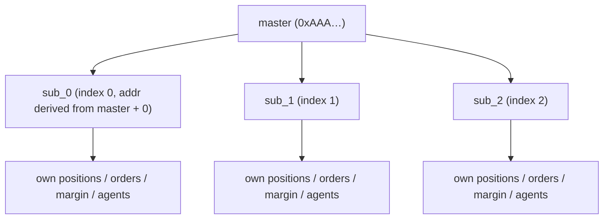
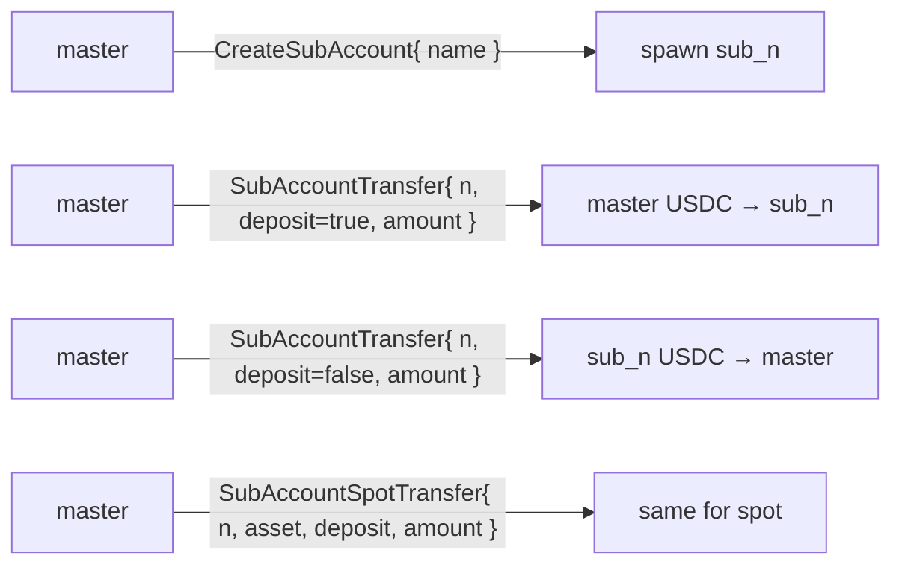
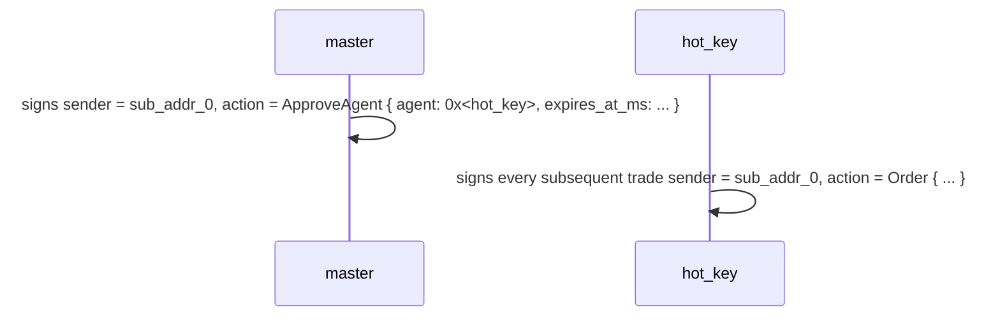
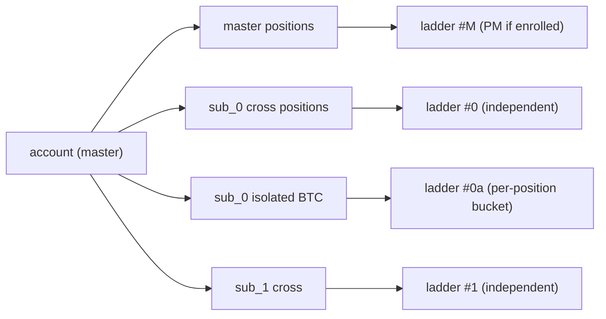
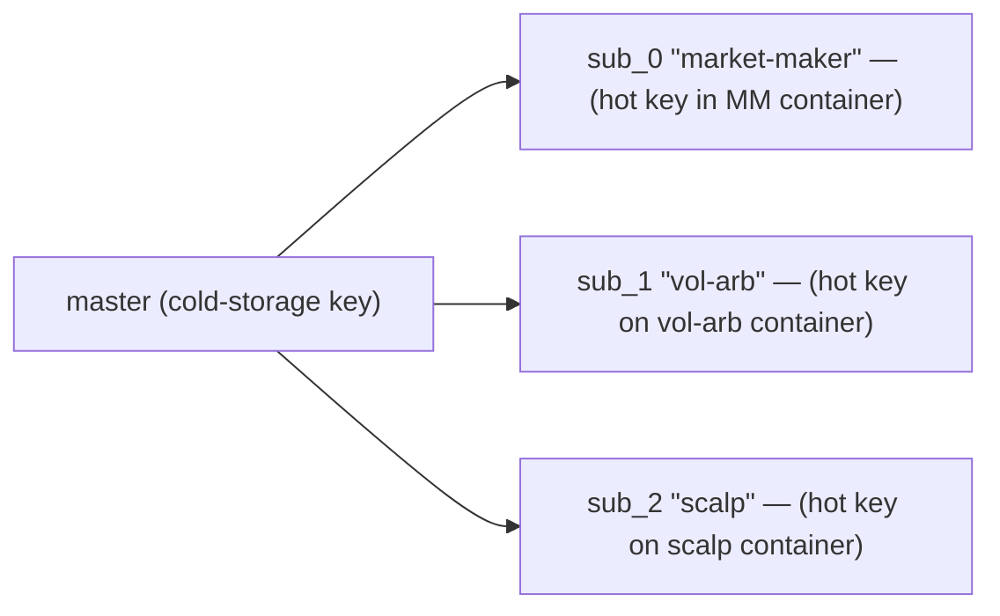
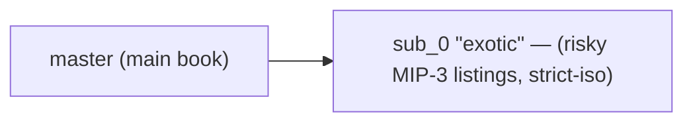
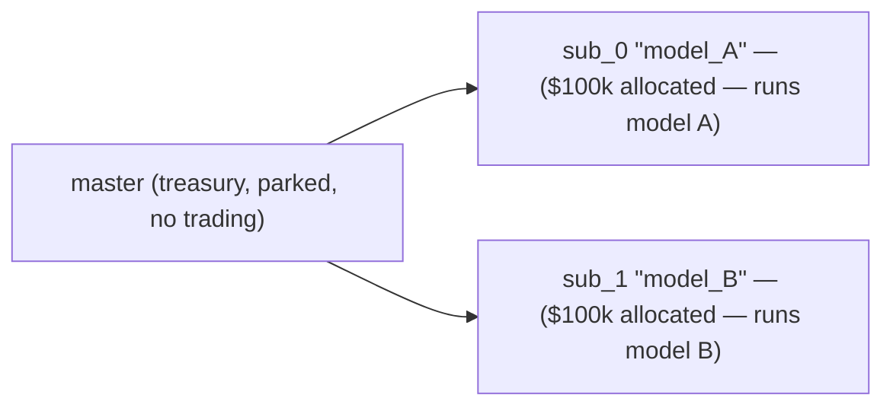
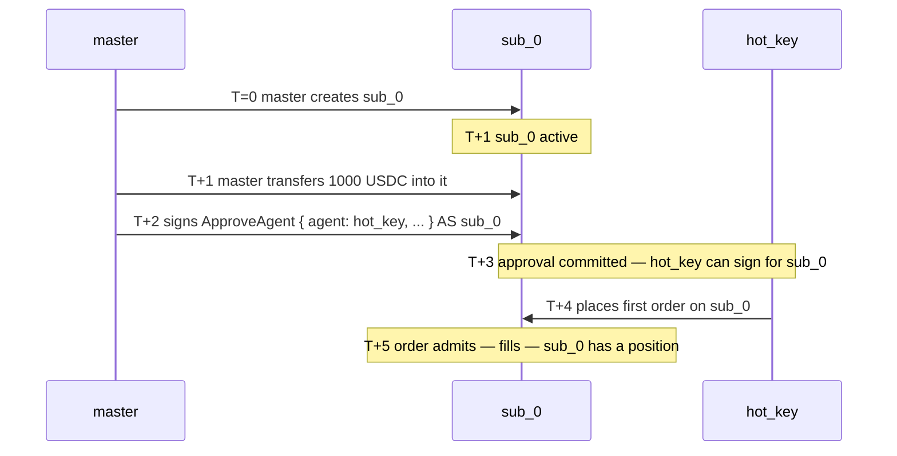

# 子账户

:::info
**预览。** 面向用户的 API 已稳定；地址派生方案将在主网上线前最终确定。
:::

## 概述

子账户是从主账户派生出来的地址，拥有独立的持仓、保证金和订单，但资金的划入划出只能通过主账户进行。每个主账户最多可创建 32 个子账户。适用于隔离策略、分离交易席位，或进行 A/B 组合测试，无需重新入账。

## 概念模型



每个子账户在状态机中都是一等账户——拥有独立的余额、持仓、清算阈值以及[代理钱包](./agent-wallets.md)。主子账户的隶属关系记录在一张附属映射表中。

硬性上限：每个主账户最多 **32 个子账户**（V2 可能放宽）。达到上限后，`CreateSubAccount` 将返回 `{"error":"sub_account_cap"}`。

## 资金转账

仅允许在主账户与子账户之间转账：



链外提现（提到第三方地址）必须从**主账户**发起。子账户不能直接发起链外提现。

## 地址派生

每个子账户索引 `n` 都会确定性地映射到一个由主账户 20 字节地址派生出的地址：

```
sub_addr_n = first_20_bytes( keccak256( master_addr || uint64_be(n) ) )
```

任何人都可以在不依赖链上状态的情况下计算出子账户地址。该派生规则在 V1 上线时已作为共识规则固定；在此之前，以返回的地址为准。

## 资金隔离保证

| 保证 | 机制 |
|-----------|-----------|
| 子账户亏损不会耗尽主账户 | 子账户以自身余额进行清算；主账户只看到转账台账 |
| 子账户亏损不会波及其他子账户 | 同上——每个子账户都是独立的隔离边界 |
| 主账户**可以**自愿为亏损的子账户补仓 | 通过 `SubAccountTransfer` 存款，属主动操作 |
| 主账户**不会**被强制兜底 | 子账户爆仓损失由子账户自己承担，仅此而已 |
| 主账户可以从子账户**撤出**资金 | 通过 `SubAccountTransfer` 提款（前提是转账后子账户仍保持 Safe 档位） |

## 创建子账户

```json
{
  "type": "CreateSubAccount",
  "params": { "name": "scalping-desk", "explicit_index": null }
}
```

| 字段 | 类型 | 说明 |
|-------|------|-------------|
| `name` | string ≤ 64 chars | 账本标签 |
| `explicit_index` | uint32 \| null | 指定占用的槽位；`null` 表示使用下一个空闲槽位 |

响应：

```json
{
  "accepted": true,
  "data": {
    "sub_index":   0,
    "sub_address": "0x<derived>",
    "name":        "scalping-desk"
  }
}
```

**索引单调递增**——一旦分配，即使该子账户被清空或废弃，索引也不会被复用。请谨慎使用 `explicit_index`。

## 充值

```json
{
  "type": "SubAccountTransfer",
  "params": { "sub_index": 0, "deposit": true, "amount": "1000000000" }
}
```

`amount` 单位为 USDC 基本单位（6 位小数）。`deposit: true` 表示主账户 → 子账户；`false` 表示子账户 → 主账户。

现货资产请使用 `SubAccountSpotTransfer`（增加 `asset` 字段）。

**转账后子账户必须保持 Safe 档位**——若提款会导致子账户跌入 T0+ 档位，该请求将被拒绝，返回 `{"error":"insufficient sub balance"}`。请先补充保证金，再提取多余资金。

## 以子账户进行交易

子账户是普通账户。使用子账户密钥（或[已授权的代理](./agent-wallets.md)）签名，并以子账户地址作为 `sender` 提交。

常见模式：主账户以各子账户地址签署 `ApproveAgent`——主账户对其子账户拥有委托权限，因此即便 `ApproveAgent` 通常仅限主账户操作，此处也是允许的。每个子账户随后拥有独立的热密钥交易流程。



SDK 将每个子账户暴露为独立的 `Client` 实例，拥有各自的密钥对，指向其派生地址。

## 清算隔离

子账户的[分级清算](./tiered-liquidation.md)仅根据其**自身**账户净值和维持保证金计算。`sub_0` 爆仓不会影响 `sub_1` 或主账户。

你也可以将子账户的某个资产保证金模式设为 `StrictIso`，使该资产持仓不参与跨资产组合保证金（PM）计算，即便主账户已加入 PM。



## 子账户独立加入 PM

每个子账户可独立加入[组合保证金](./portfolio-margin.md)（需各自满足 `pm_min_equity` 的权益门槛）。

```json
{
  "sender": "0x<sub_0_addr>",
  "action": { "type": "UserPortfolioMargin", "params": { "enabled": true } }
}
```

主账户可维持经典模式，同时让某个子账户切换为 PM；适合某个子账户运行对冲账本、其余子账户运行方向性策略的场景。

## 查询

```bash
curl -X POST https://devnet-gateway.mtf.exchange/info \
  -d '{"type":"sub_accounts","address":"0x<master>"}'
```

返回子账户列表，包含索引、派生地址、标签，以及每个子账户清算所状态的快照。

每个子账户也可以作为一等账户单独查询，通过 `account_state`、`open_orders`、`user_fills` 等接口传入其地址即可。

[HL 兼容接口对应文档](../api/rest/hl-compat.md#subaccounts)。

## 限制

| 限制项 | 默认值 | 备注 |
|-------|---------|-------|
| 每主账户子账户数 | 32 | V2 可能放宽 |
| 子账户名称长度 | 64 chars | UTF-8；仅做长度校验 |
| 同时在途转账数 | 每主账户 8 笔 | 内存池上限 |
| 主账户可从子账户提款 | 是，前提是子账户保持 Safe 档位 | 否则拒绝 |
| 子账户可直接链外提现 | 否 | 必须经由主账户中转 |
| 子账户可设代理 | 是 | 按子账户独立配置 |
| 子账户可使用多签 | 否 | V1 仅主账户支持多签 |

## 典型使用场景

### 策略分离



每个策略拥有独立的代理密钥、独立的清算边界和独立的盈亏报告。

### 风险防火墙



主账户享有完整上行收益；sub_0 爆仓损失上限为其存入金额。

### A/B 组合测试



按季度比较各子账户净值（NAV），以决定下一期的资金分配比例。

## 边界情况

<details>
<summary>展开边界情况</summary>

- **`CreateSubAccount` 与首笔代理流量之间的竞争。** 子账户与所有状态变更一样，在下一个区块生效。建议操作顺序：创建 → 授权代理 → 等待 1 个区块 → 开始交易。
- **子账户处于 T1 清算期间，主账户尝试从子账户转账。** 请求将被拒绝；子账户抵押品正在用于保护子账户。待子账户重新回到 Safe 档位后，转账方可进行。
- **主账户删除或废弃子账户。** V1 不支持此操作。子账户会永久保留在索引中。空的子账户不占用状态存储成本，无需担心。
- **子账户代理密钥泄露。** 通过主账户吊销（主账户持有委托权限）。使用相同的 `ApproveAgent`，将 `expires_at_ms` 设为过去的时间戳即可。
- **子账户的子账户。** 不支持。子账户发起 `CreateSubAccount` 将被拒绝。

</details>

## 完整创建流程时序图



## 参阅

- [代理钱包](./agent-wallets.md) — 子账户热密钥
- [组合保证金](./portfolio-margin.md) — 与跨资产 PM 的交互
- [保证金模式](./margin-modes.md) — 子账户的全仓 / 逐仓 / 严格逐仓模式
- [`POST /info sub_accounts`](../api/rest/info.md#sub_accounts) — MTF 原生查询
- [`subAccounts` HL 兼容接口](../api/rest/hl-compat.md#subaccounts) — HL 格式查询

## 常见问题

<details>
<summary>展开常见问题</summary>

**Q：手续费档位计算时，子账户的交易量是否会与主账户合并？**
A：是的。30 日交易量档位会跨主账户和所有子账户汇总计算。在子账户内的交易量同样计入主账户的档位折扣。

**Q：子账户能否直接从其他账户（而非经由主账户）接收资金？**
A：可以——向子账户地址发起 `UsdcTransfer` 与向任何普通账户操作相同。资金进入子账户后不再限制必须经由主账户流转，直接成为子账户的余额。

**Q：子账户与主账户是否共享 nonce 空间？**
A：不共享。每个子账户拥有独立的 nonce 序列。主账户的 nonce 归主账户，sub_0 的 nonce 归 sub_0，依此类推。

**Q：能否将子账户升级为主账户或将其解除绑定？**
A：V1 不支持。子账户永久归属于主账户。若需"解绑"，请在新地址创建一个全新账户并转入资金。

</details>
