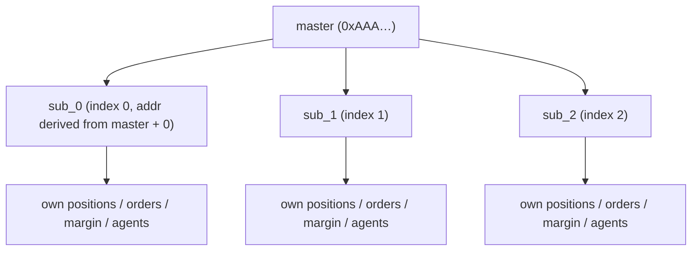
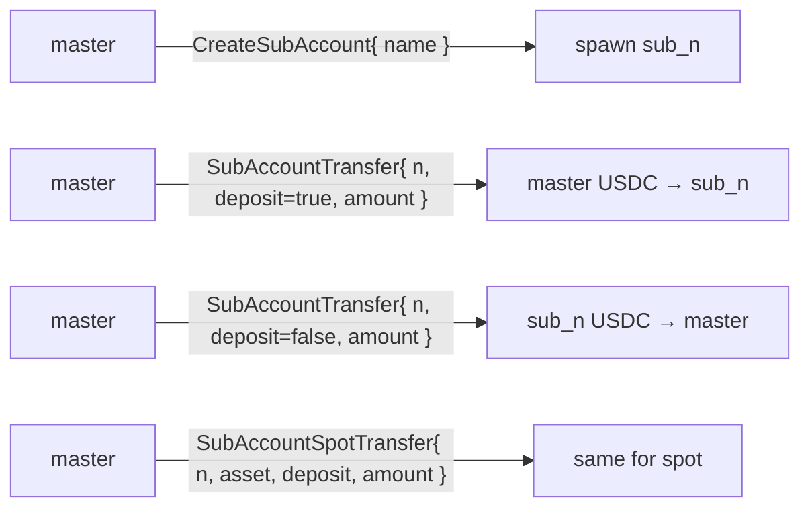
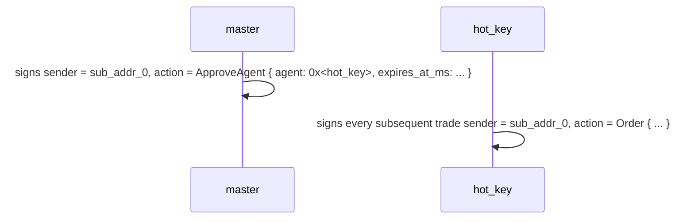
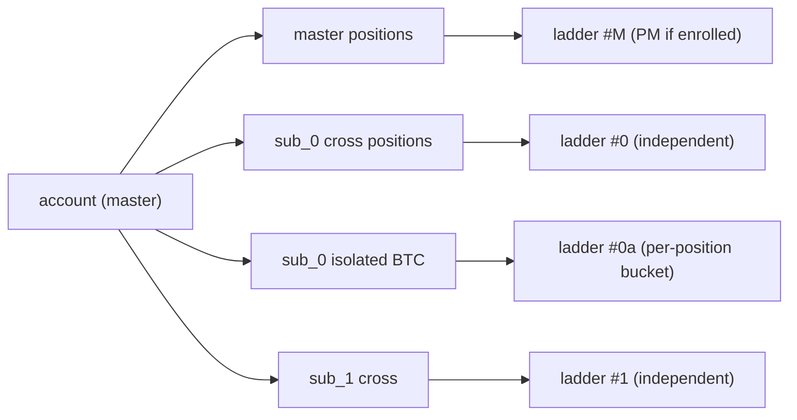
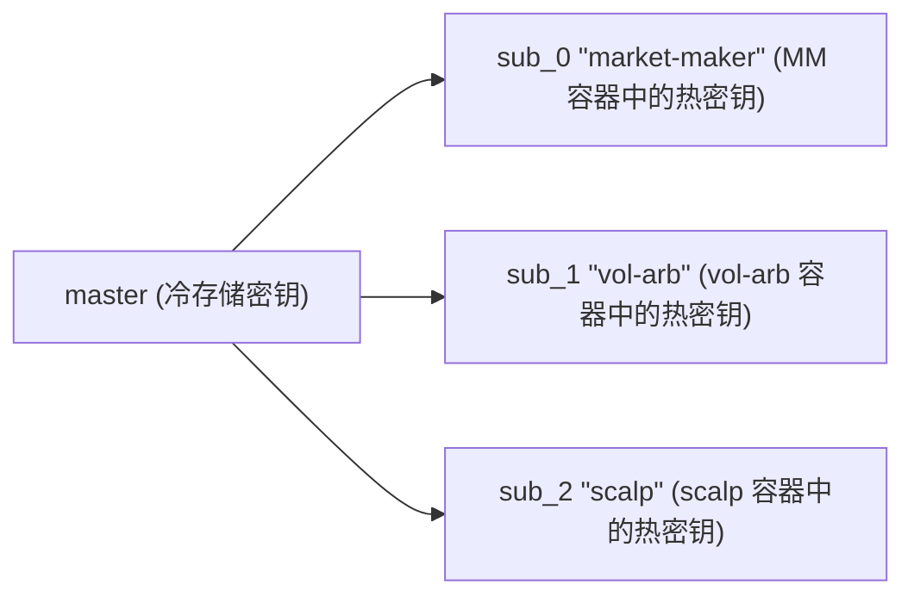
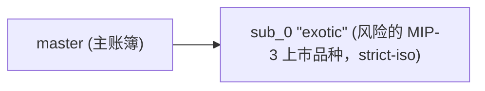
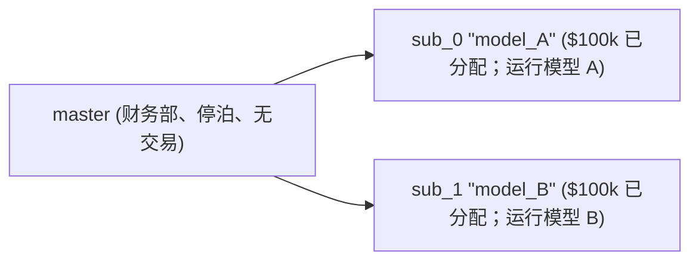

# 子账户

:::info
**预览阶段。** 用户可见的 API 已稳定；地址派生方案将在主网前完成。
:::

## 摘要

子账户是主账户下派生的地址，具有自己的头寸、保证金和订单，但仅通过主账户进行资金的入出。每个主账户最多 32 个子账户。使用它们来隔离策略、分离交易部门或 A/B 投资组合，无需重新注册。

## 心理模型



每个子账户在状态机中都是一级账户 — 拥有自己的余额、头寸、清算阈值和 [代理钱包](./agent-wallets.md)。主账户与子账户的关系记录在一个辅助映射中。

硬上限：每个主账户 **32 个子账户**（V2 可能扩展）。达到上限时，`CreateSubAccount` 返回 `{"error":"sub_account_cap"}`。

## 转账

仅限主账户和子账户之间：



外部提现（链外、到第三方地址）必须来自 **主账户**。子账户无法直接链外提现。

## 地址派生

每个子账户索引 `n` 确定性地映射到从主账户 20 字节地址派生的地址：

```
sub_addr_n = first_20_bytes( keccak256( master_addr || uint64_be(n) ) )
```

任何人都可以在没有链上状态的情况下计算子账户的地址。派生方案在 V1 启动时固定共识；在此之前将返回的地址视为权威。

## 资金隔离保证

| 保证 | 机制 |
|-----------|-----------|
| 子账户的亏损不能耗尽主账户 | 子账户根据自己的余额清算；主账户仅看到转账账本 |
| 子账户的亏损不能耗尽其他子账户 | 相同 — 每个子账户都是一级隔离边界 |
| 主账户可以选择支持亏损的子账户 | 自愿地，通过 `SubAccountTransfer` 存款 |
| 主账户不能被迫支持 | 子账户的爆炸就是子账户的，完全如此 |
| 主账户可以从子账户清算 | 通过 `SubAccountTransfer` 提现（仅当转账后子账户保持安全等级时） |

## 创建

```json
{
  "type": "CreateSubAccount",
  "params": { "name": "scalping-desk", "explicit_index": null }
}
```

| 字段 | 类型 | 说明 |
|-------|------|-------------|
| `name` | string ≤ 64 chars | 记账标签 |
| `explicit_index` | uint32 \| null | 要认领的特定位置；`null` → 下一个可用位置 |

响应：

```json
{
  "accepted": true,
  "data": {
    "sub_index":   0,
    "sub_address": "0x<derived>",
    "name":        "scalping-desk"
  }
}
```

**索引是单调的** — 一旦分配，即使子账户被清空和放弃后，也永远不会被重复使用。谨慎使用 `explicit_index`。

## 资金

```json
{
  "type": "SubAccountTransfer",
  "params": { "sub_index": 0, "deposit": true, "amount": "1000000000" }
}
```

`amount` 单位为 USDC 基本单位（6 位小数）。`deposit: true` 表示主账户 → 子账户；`false` 表示子账户 → 主账户。

对于现货资产，使用 `SubAccountSpotTransfer`（添加 `asset` 字段）。

**转账必须使子账户保持安全等级** — 将子账户推送到 T0+ 的提现将被拒绝，错误为 `{"error":"insufficient sub balance"}`。先充值，然后提现超额。

## 从子账户交易

子账户是常规账户。用子账户的密钥（或 [批准的代理](./agent-wallets.md)）签名，并以子账户的地址作为 `sender` 提交。

常见模式：主账户从子账户的地址为每个子账户签署 `ApproveAgent` — 主账户对其子账户持有委托权限，因此即使 `ApproveAgent` 通常仅限主账户，这也是允许的。每个子账户随后都有自己的热密钥交易流程。



SDK 将每个子账户公开为一个单独的 `Client` 实例，具有自己的密钥对，指向其派生地址。

## 清算隔离

子账户的 [分层清算](./tiered-liquidation.md) 是根据其 **自己的** 账户价值和维持保证金计算的。`sub_0` 中的爆炸不会危及 `sub_1` 或主账户。

您还可以针对每项资产将子账户的保证金模式设置为 `StrictIso`，以便该资产的头寸不会对跨资产 PM 有贡献，即使主账户已注册 PM。



## 子账户级 PM 注册

每个子账户独立注册 [投资组合保证金](./portfolio-margin.md)（对 `pm_min_equity` 进行自己的权益检查）。

```json
{
  "sender": "0x<sub_0_addr>",
  "action": { "type": "UserPortfolioMargin", "params": { "enabled": true } }
}
```

主账户可以保持经典模式，而子账户进行 PM；当一个子账户运行对冲账簿而其他子账户运行方向性交易时很有用。

## 查询

```bash
curl -X POST https://devnet-gateway.mtf.exchange/info \
  -d '{"type":"sub_accounts","address":"0x<master>"}'
```

返回子账户列表，包括索引、派生地址、标签和每个子账户的清算账户状态快照。

每个子账户也可以作为一级账户通过 `account_state`、`open_orders`、`user_fills` 等查询，通过传递其地址作为 `address`。

[HL 兼容等效项](../api/rest/hl-compat.md#subaccounts)。

## 限制

| 限制 | 默认值 | 备注 |
|-------|---------|-------|
| 每个主账户的子账户数 | 32 | V2 可能扩展 |
| 子账户名称长度 | 64 字符 | UTF-8；仅长度验证 |
| 进行中的并发转账 | 每个主账户 8 个 | 内存池上限 |
| 主账户可以从子账户提现 | 是的，如果子账户保持安全 | 否则被拒绝 |
| 子账户可以链外提现 | 否 | 必须通过主账户路由 |
| 子账户可以有代理 | 是的 | 按子账户配置 |
| 子账户可以是多签 | 否 | V1 仅主账户可以是多签 |

## 用例模式

### 策略隔离



每个策略都有自己的代理密钥、自己的清算包络线、自己的收益报告。

### 风险隔离



主账簿获利：完整上涨；sub_0 爆炸上限为其存款。

### A/B 投资组合



每个子账户每季度的 NAV 比较决定哪个获得更多分配。

## 边界情况

<details>
<summary>显示边界情况</summary>

- **`CreateSubAccount` 与首次代理流量之间的竞争。** 子账户在下一个块有效，就像所有状态更改一样。序列：创建 → 批准代理 → 等待 1 块 → 交易。
- **主账户在子账户的 T1 清算期间尝试从子账户转账。** 被拒绝；子账户的抵押品正被用于防守。一旦子账户重新进入安全状态，转账即被允许。
- **主账户删除/放弃子账户。** V1 中不支持。子账户永远留在索引中。空子账户的状态成本为零；不值得担心。
- **子账户的代理密钥被泄露。** 通过主账户撤销（主账户是子账户的主账户，持有委托权限）。使用相同的 `ApproveAgent`，`expires_at_ms` 设置为过去的时间。
- **子账户的子账户。** 不支持。子账户的 `CreateSubAccount` 被拒绝。

</details>

## 序列 — 完整设置

```mermaid
sequenceDiagram
    participant master
    participant sub_0
    participant hot_key
    master->>sub_0: T=0 master creates sub_0
    Note over sub_0: T+1 sub_0 active
    master->>sub_0: T+1 master transfers 1000 USDC into it
    master->>sub_0: T+2 signs ApproveAgent { agent: hot_key, ... } AS sub_0
    Note over sub_0,hot_key: T+3 approval committed; hot_key can sign for sub_0
    hot_key->>sub_0: T+4 places first order on sub_0
    Note over sub_0: T+5 order admits; fills; sub_0 has a position
```

## 另见

- [代理钱包](./agent-wallets.md) — 每个子账户的热密钥
- [投资组合保证金](./portfolio-margin.md) — 与跨资产 PM 的交互
- [保证金模式](./margin-modes.md) — 每个子账户的跨资产/隔离/严格隔离
- [`POST /info sub_accounts`](../api/rest/info.md#sub_accounts) — MTF 原生查询
- [`subAccounts` HL 兼容](../api/rest/hl-compat.md#subaccounts) — HL 格式查询

## 常见问题

<details>
<summary>显示常见问题</summary>

**问：子账户费用与主账户的等级目的是否聚合？**
答：是的。30 天交易量等级汇总主账户 + 所有子账户。在子账户内交易计入主账户的等级折扣。

**问：子账户可以直接从另一个账户接收资金吗（不通过主账户）？**
答：可以 — 向子账户地址的 `UsdcTransfer` 就像向任何账户一样工作。资金之后不受限制必须通过主账户流动；它们只是子账户余额中的资金。

**问：子账户与主账户共享随机数空间吗？**
答：否。每个子账户都有自己的随机数序列。主账户的随机数是主账户的；sub_0 的是 sub_0 的；等等。

**问：我可以将子账户转换为主账户/分离它吗？**
答：V1 中不支持。子账户永久是子账户。要"分离"，请在不同地址创建新账户并转账。

</details>
