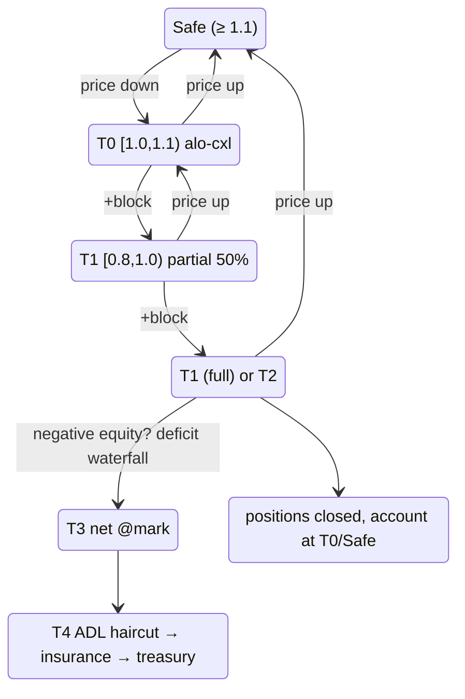

# 分级清算

:::tip
**稳定。**
:::

## TL;DR

一个由 `health = account_value / maint_margin` 驱动的5层阶梯。每一层定义了协议在健康度下降时的行为。[黄牌](#why-a-yellow-card)（T0）是 MetaFlux 的滞后宽限期——任何头寸被平仓前的一个区块警告。T4 [ADL](./adl.md) 是最后手段的亏损互助。

| 层级 | 健康度范围 | 操作 | 头寸受影响？ |
|------|-------------|--------|---|
| （安全） | `health ≥ 1.1` | 空闲 | — |
| **T0** | `1.0 ≤ health < 1.1` | **黄牌**：ALO 订单强制取消，钱包通知 | 否 |
| **T1** | `0.8 ≤ health < 1.0` | 部分[强制平仓](#how-a-forced-close-executes-the-price-floor)（50%）——如果 T1 在 `cooldown_ms` 内再次触发则全仓平仓 | 是（50%）或 是（100%） |
| **T2** | `0.667 ≤ health < 0.8` | 全仓[强制平仓](#how-a-forced-close-executes-the-price-floor) | 是（100%） |
| **T3** | `health < 0.667` | [按标记价格净轧](#t3-backstop--netting-at-mark)与盈利对手方（无法成交的 T1/T2 剩余头寸在此升级） | 是 —— 按标记价格净轧 |
| **T4** | T3 后账户权益为负 | [亏损瀑布流](#t4--the-deficit-waterfall)：ADL 削减 → 保险基金 → 国库队列 | 获胜者的已实现收益削减 |

`account_value` 包含未实现盈亏。`maint_margin` 是按资产的基线（经典）或 SPAN 衍生（PM 注册用户）。

## 层级如何计算

下面的范围是**字面代码常数**，不是近似值。

`BoleEngine::decide(account, account_value: i128, maintenance_margin: u128, ts_ms)` 是一个**纯函数**——它读取冷却状态但从不修改——返回一个 `BoleDecision`：

```
if maintenance_margin == 0            → Idle
if account_value < 0                  → Backstop { deficit = maintenance_margin + |account_value| }

health = account_value / maintenance_margin            # Decimal division

if health ≥ 1.1   (yellow_card_threshold)              → Idle            (Safe)
if health ≥ 1.0                                        → YellowCard      (T0)
if health < 0.667 (full_market_floor)                 → Backstop { deficit = maintenance_margin − account_value }   (T3)
if health < 0.8   (partial_threshold)                 → FullMarket { size_to_close = maintenance_margin }           (T2)
# else 0.8 ≤ health < 1.0  (T1):
if partial_cooldown_active(account)                   → FullMarket { size_to_close = maintenance_margin }
else                                                  → PartialMarket50 { size_to_close = maintenance_margin / 2 }
```

| 常数 | 值 | 符号 |
|----------|-------|--------|
| 黄牌阈值（T0 顶部） | `1.1` | `default_yellow_card_threshold` |
| 部分阈值（T1 顶部） | `0.8` | `default_partial_threshold` |
| 全市场底线（T3 入场） | `0.667`（≈ 2/3） | `full_market_floor` |
| 部分→全仓冷却 | `30_000 ms` | `DEFAULT_PARTIAL_COOLDOWN_MS` |

- 所有比较都是 `rust_decimal::Decimal`（无浮点数）。当 `account_value` 会超过 `Decimal::MAX` 时，`decide` 会先用公共比特数右移两个操作数——这保留了健康度比率，所以在那些量级下选择的层级不变。
- **仅 `PartialMarket50` 会激活冷却**（`record_attempt`）；`FullMarket` 或 `Backstop` 不会阻止后续的部分平仓。所以 T1 部分→全仓升级仅在*之前的部分*仍在其 30 秒窗口内时触发。
- 部分平仓的 `size_to_close` 是 `maintenance_margin / 2`（整数截断）。当 `account_value ≥ 0` 时，backstop 的 `deficit` 是 `maintenance_margin − account_value`，否则是 `maintenance_margin + |account_value|`。
- 驱动器在每个区块评估**增量脏集**（事件脏账户 + 滚动自愈切片），而不是完全扫描——通过模糊测试证明等价于从头扫描。T0 账户在分类后获得其休息 ALO 流动性被强制取消。

## 强制平仓如何执行（价格底线）

T1/T2 强制平仓**永不是市场扫单**。它执行为一个 IOC 限价单，由承诺的标记价格限制：

```
sell (long leg):      limit = mark × (1 − liq_floor)
buy-back (short leg): limit = mark × (1 + liq_floor)
```

- `liq_floor` 是每个市场的风险参数；**默认为市场维持保证金率的一半**（5% 维持市场的平仓执行偏离标记 2.5%）。维持保证金率经过校准以覆盖清算滑点加手续费，所以底线保证强制平仓永远不会实现超过缓冲区大小的滑点。
- 该切片仅在底线内或以上的价格成交。**底线以上无法成交的部分不会卖入薄薄的订单簿**——它立即升级到 T3 backstop 队列。这是反级联的约束：强制平仓不能压低标记价格超过底线，所以它不能将其他账户扫入清算。
- 成交通过**与普通成交相同的结算路径**结算：已实现盈亏击中账户，未平仓头寸移动，对手方的做市方正常结算。
- 一个**清算费用**（默认是已平仓名义价值的 50 基点，每个市场可配置）从账户的剩余正权益中收取——它永远不会创建亏损——并贷记到保险基金，这正是吸收 backstop 缺陷的池子。
- 账户**自己在相反方的休息订单被取消，而不是自成交**（自成交会重新开放平仓刚刚关闭的头寸）。

部分（T1）定大小为核心市场目标腿的 50%；构建者部署的市场可以配置健康度衰减坡道（在维持线下方平仓小切片，健康度下降时平仓更大切片，按市场限制上限）加 30 秒的切片间冷却。

## 完整状态机



`cooldown_ms` 默认为 `30 s`。在冷却窗口内，重新进入 T1 会升级为全仓平仓。

## 为什么是黄牌

大多数公共衍生品链从"健康"直接过渡到"部分平仓"。一个波动率飙升在一个滴答内从 1.5 将健康度打至 0.95，会触发强制卖出，这会压低标记价格，扫入更多账户进入同一层级。级联是观察到的事件中清算痛苦的主要来源。

T0 是一个**单区块滞后层**。你进入该范围；链冻结你的休息开放订单（仅 ALO —— 见下文）并通知你的客户端，但你的东西都没被卖出。你有到下一个共识区块的时间：

- 通过 `Deposit` 增加保证金（或 `UpdateIsolatedMargin` 向桶添加），
- 手动平仓头寸的一部分，
- 或什么都不做——在这种情况下 T1 在下一次评估时触发。

在 100 毫秒的区块时间下，宽限窗口很短但确定性且足够大，足以让自动化风险流程做出反应。

### 为什么仅 ALO 订单被取消

| 订单 TIF | 在 T0 取消？ | 原因 |
|-----------|:----------------:|-------|
| `Alo` | 是 | 纯休息，无手续费收入；资本更好地部署来保卫头寸 |
| `Gtc`（活跃限价） | 否 | 可能是你的活跃价格发现；杀死它可能会进一步将你交易下去 |
| `Ioc`（在途） | 不适用 | 在承认时解决；从不休息 |
| 触发（止损 / 获利） | 否 | 通常正是你想要触发的防守 |

意图：从被动休息释放锁定资本，保留你的活跃风险决定。

## T1 部分 / 全仓过渡

T1 开始为 50% 部分平仓。冷却逻辑：

- **首次 T1 触发**：50% 平仓。`cooldown_armed_at = now`。
- **如果健康度在 `cooldown_armed_at + cooldown_ms` 前回到 T0/安全**：冷却在我们离开 T1 时自然解除。
- **如果健康度在 T1 停留 `cooldown_ms`**：下一个 T1 评估升级为**全仓**平仓而不是另一个部分。
- 冷却在 T2 或 T3 上不会重新激活。

```
T = 0       T1 fire #1, 50% close, cooldown armed
T = 5s      mark slips further, still in T1
T = 20s     mark recovers slightly; in T0
T = 31s     cooldown elapsed (would have escalated, but we're not in T1)
            account considered T0/Safe; cooldown reset
```

对比：

```
T = 0       T1 fire #1, 50% close
T = 5s      still T1
T = 30s     STILL T1 (cooldown elapses while in T1)
T = 30s+    T1 fire #2 → full close
```

冷却不是无操作区——T1 持续触发部分。冷却仅管理部分→全仓升级。

### 工作示例

账户：长 1 BTC，入场 100，USDC 隔离桶 = 20。

```
mark = 100   account_value = 20 + 0 = 20   maint = 5 (5% of 100)  health = 4.0  → Safe
mark = 90    account_value = 20 - 10 = 10  maint = 4.5            health = 2.2  → Safe
mark = 85    account_value = 20 - 15 = 5   maint = 4.25           health = 1.18 → T0 (alo cancel)
mark = 84.5  account_value = 20 - 15.5     maint = 4.225          health = 1.06 → T0
mark = 84    account_value = 20 - 16 = 4   maint = 4.2            health = 0.95 → T1
                  T1 fire: close 0.5 BTC at mark 84
                  realised PnL: -8 (closed 0.5 BTC, entry 100, exit 84)
                  bucket: 20 - 8 = 12
                  remaining position: 0.5 BTC long entry 100, mark 84
                  account_value = 12 - 8 = 4 (unrealised -8 on 0.5 BTC)
                  maint = 0.5 * 84 * 0.05 = 2.1
                  health = 4 / 2.1 = 1.9 → back to Safe
```

一个 50% 部分将健康度从 0.95（T1）恢复到 1.9（安全）。部分平仓的意图是重新调整头寸大小，使剩余的桶可以承载更小的敞口。

如果 50% 平仓没有恢复健康度（更深的溃退），冷却内的第二个 T1 触发会升级：

```
mark = 84    T1 fire partial: 0.5 BTC closed, health → 1.9
mark = 82    health = 0.95 again (still in T1, cooldown active)
              T1 escalates to full close: remaining 0.5 BTC closed at 82
              realised PnL: -9
              bucket: 12 - 9 = 3
              position: 0
              account closed cleanly with 3 USDC remaining; insurance untouched
```

## T3 backstop —— 按标记价格净轧

低于 `health = 0.667`（≈2/3 的维持保证金）链停止尝试订单簿。
头寸——以及任何强制平仓批次订单簿在[价格底线](#how-a-forced-close-executes-the-price-floor)内无法吸收的——会与同一工具上最盈利的相反方头寸**按承诺的标记价格净轧**（最高未实现盈亏优先，确定性平局）：

```
when account enters T3 (or parked un-fillable lots exist):
   match its position lots against profitable opposite-side holders
   close BOTH sides at MARK              # no book interaction, no price impact
   both sides realise PnL at that mark   # value-neutral: equity unchanged
                                         # by the netting itself
   lots with no profitable counterparty stay parked for the next block
```

净轧的对手方保留**每一分钱的盈亏**（按标记价格实现）——他们仅失去开放头寸。两方都不收取手续费。
没有可用标记价格的净轧，或没有任何盈利的相反方，简单地等待——链永不强制卖入空订单簿。

## T4 —— 亏损瀑布流

如果账户在各处都平仓了且其权益**为负**，那个坏债会按固定顺序社会化（ADL **先于**保险基金——净轧的已实现盈利的获胜者首先被追缴，这为真正的尾部事件保留了基金）：

1. **ADL 削减** —— 自适应严重性控制器收回净轧对手方**刚实现**的收益（永不超过他们收到的，永不未实现纸面盈亏）。
2. **保险基金** —— 自动吸收剩余部分（这是[清算费用](#how-a-forced-close-executes-the-price-floor)流入的池子）。
3. **国库储备** —— 无论剩下什么都排队等待多签授权的国库提取（人在环，最后手段）。

账户的负余额随后被清零——债务存在于瀑布流中。见 [ADL](./adl.md) 了解控制器数学。

## 两点保证金检查

清算资格在每个区块的**两点**检查：

1. **区块开始**，标记价格更新后——捕捉刚从价格移动滑入更低层级的账户。
2. **操作后**，这个账户的每个 `Order` / `Cancel` / `Withdraw` 后——捕捉走进更低层级的账户（例如提取过多抵押品）。

这防止了"免费"区块内操纵，用户在区块开始和其他操作间添加风险。

## 恢复模式

| 场景 | 策略 |
|----------|----------|
| 目标是 T0 | 通过 `UpdateIsolatedMargin`（隔离）或 `Deposit`（交叉）增加。在压力前预先位置触发订单。 |
| 已在 T0 | 相同。ALO 订单已被取消；在保护水平放置新限价。 |
| 在 T0 进出 | 将内部警报收紧到 `health < 1.2`。查看驱动因素——资金支付？标记波段边缘？预言机中断？ |
| T1 部分刚触发 | 重新评估。头寸缩小 50%；考虑在冷却的全仓平仓升级前自愿平仓剩余部分。 |
| 重复 T1 冷却陷阱 | 头寸大小对桶来说太大了。不要在没有同时调整大小的情况下重新填充桶。 |

## 如何保持清晰

- 通过 `userState` 查询（HL-compat）或 [`account_state`](../api/rest/info.md#account_state) 观看 `health`。
- 在 `health < 1.2` 处设置内部警报——远高于 T0。
- 对于自动化策略，注册一个[风险观察者机器人](../integration/risk-watcher.md)，在健康度跨越阈值时存入。
- 在 WS 源上观看 [`userEvents`](../api/ws/subscriptions.md#userevents) 以获取即时层级过渡（保证金 / 清算事件乘坐此通道）。

## 边界情况

<details>
<summary>显示边界情况</summary>

- **标记价格波段已启用。** 在标记波段激活期间，清算评估仍然触发——但针对波段标记。订单簿可能处于波段允许协议识别的标记的更糟糕的价格。实际上：波段钳制的对抗性飙升不会即时清算你；你的健康度是针对钳制的标记计算的。
- **资金支付跨越层级边界。** 资金支付缩小 `account_value`。如果你在 `health = 1.05` 且 0.1% 资金费用将你打至 0.99，T1 在同一区块触发。观看资金节奏相对于你的缓冲。
- **两个跨资产的并发 T1 触发（交叉）。** 两个部分发生在同一区块。顺序：按资产名称字母顺序（跨验证者确定性）。保险和 ADL 资格按资产应用。
- **T0 进入然后在下一区块前退出。** 如果你的客户端在同一区块内增加保证金是可能的（区块开始 T0 → 用户操作 `Deposit` → 操作后检查通过 T0）。在区块开始被取消的 ALO 订单保持取消；没有任何东西会自动重新创建它们。

</details>

## 另见

- [投资组合保证金](./portfolio-margin.md) —— 选择性跨资产保证金降低基线维持
- [ADL 分配算法](./adl.md) —— T4 背后的数学
- [保证金模式](./margin-modes.md) —— 交叉 / 隔离 / 严格隔离使用范围的阶梯
- [标记价格](./mark-prices.md) —— 驱动健康度的因素
- [`userEvents` WS 通道](../api/ws/subscriptions.md#userevents) —— 层级过渡乘坐此通道
- [风险观察者模式](../integration/risk-watcher.md) —— 自动化保证金增加

## 常见问题

<details>
<summary>显示常见问题</summary>

**Q: 我能在别人身上手动触发 T1 吗？**
A: 不能。清算是针对承诺的标记 + 账户状态的共识衍生。没有用户可以提交的"清算"操作；协议在区块开始 / 操作后检查点从自己的逻辑触发。

**Q: 我能进入黄牌的最低健康度是多少并清楚地出来？**
A: T0 在 `1.0 ≤ health < 1.1` 时触发。如果你在下一个评估前重新进入安全 (`health ≥ 1.1`)，ALO 订单不会被重新创建（你需要重新提交它们）但不会触发进一步的 T0 操作。

**Q: 有办法选择退出 T1（强制跳过部分→全仓）吗？**
A: 没有。T1 总是先尝试部分。在 T0 提交手动平仓，如果你想根据自己的条款完全平仓。

**Q: 在 T1/T2 如何确定平仓价格？**
A: 一个 IOC **限价**在流行的订单簿，以 `mark × (1 ∓ liq_floor)` 为底线——见[价格底线](#how-a-forced-close-executes-the-price-floor)。已实现的滑点被底线限制（默认：维持保证金率的一半）；订单簿在底线内无法吸收的任何东西都升级到 backstop 而不是扫入更深的层级。

</details>
