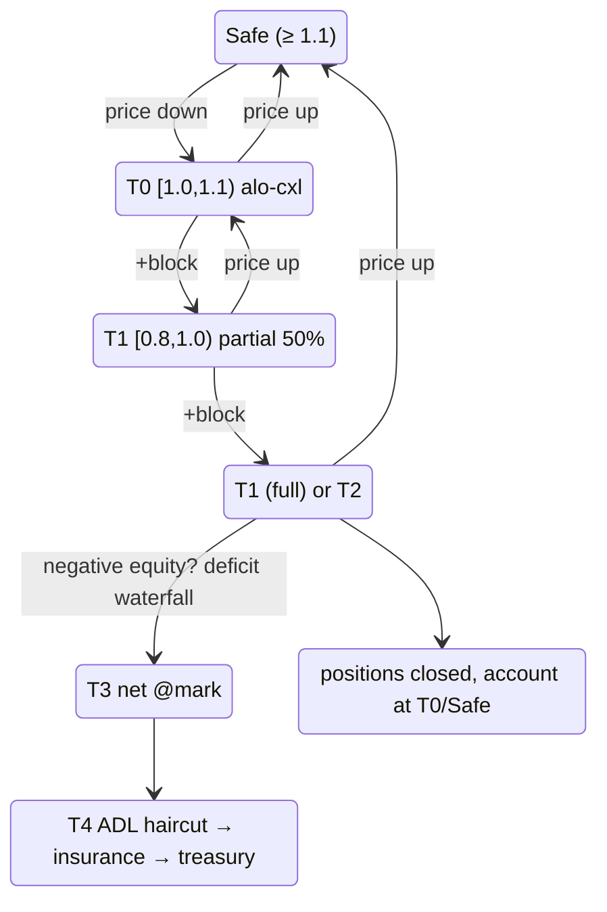

# 分级清算

:::tip
**稳定。**
:::

## 概览

系统采用 5 级阶梯机制，以 `health = account_value / maint_margin` 作为核心指标。每个等级定义了健康度下降时协议的应对措施。[黄牌](#为什么设置黄牌)（T0）是 MetaFlux 的迟滞缓冲期——在任何仓位被强制平仓前，账户有一个区块的预警时间。T4 [ADL](./adl.md) 是最后一道防线，用于社会化损失。

| 等级 | 健康度区间 | 操作 | 是否触及仓位？ |
|------|-------------|--------|---|
| （安全） | `health ≥ 1.1` | 空闲 | — |
| **T0** | `1.0 ≤ health < 1.1` | **黄牌**：ALO 挂单强制撤销，通知钱包 | 否 |
| **T1** | `0.8 ≤ health < 1.0` | 部分[价格下限强制平仓](#强制平仓的执行方式价格下限)（50%）——若 T1 在 `cooldown_ms` 窗口内再次触发，则执行全平 | 是（50%）或是（100%） |
| **T2** | `0.667 ≤ health < 0.8` | 全量[价格下限强制平仓](#强制平仓的执行方式价格下限) | 是（100%） |
| **T3** | `health < 0.667` | 以[标记价净额结算](#t3-兜底标记价净额结算)，与盈利对手方撮合平仓（T1/T2 无法成交的剩余头寸也升级至此） | 是——以标记价净额结算 |
| **T4** | T3 后仍为负权益 | [亏损瀑布](#t4亏损瀑布)：ADL 减记 → 保险基金 → 国库队列 | 赢家已实现盈利被减记 |

`account_value` 含未实现盈亏。`maint_margin` 为单资产基准值（经典模式）或 SPAN 衍生值（PM 模式下）。

## 各等级的计算方式

以下区间为**代码中的字面常量**，非近似值。

`BoleEngine::decide(account, account_value: i128, maintenance_margin: u128, ts_ms)` 是一个**纯函数**——仅读取冷却状态，不产生任何状态变更——返回一个 `BoleDecision`：

```
if maintenance_margin == 0            → Idle
if account_value < 0                  → Backstop { deficit = maintenance_margin + |account_value| }

health = account_value / maintenance_margin            # Decimal division

if health ≥ 1.1   (yellow_card_threshold)              → Idle            (Safe)
if health ≥ 1.0                                        → YellowCard      (T0)
if health < 0.667 (full_market_floor)                 → Backstop { deficit = maintenance_margin − account_value }   (T3)
if health < 0.8   (partial_threshold)                 → FullMarket { size_to_close = maintenance_margin }           (T2)
# else 0.8 ≤ health < 1.0  (T1):
if partial_cooldown_active(account)                   → FullMarket { size_to_close = maintenance_margin }
else                                                  → PartialMarket50 { size_to_close = maintenance_margin / 2 }
```

| 常量 | 值 | 符号 |
|----------|-------|--------|
| 黄牌阈值（T0 上限） | `1.1` | `default_yellow_card_threshold` |
| 部分平仓阈值（T1 上限） | `0.8` | `default_partial_threshold` |
| 全量市场下限（T3 入口） | `0.667`（≈ 2/3） | `full_market_floor` |
| 部分→全量冷却时长 | `30_000 ms` | `DEFAULT_PARTIAL_COOLDOWN_MS` |

- 所有比较均使用 `rust_decimal::Decimal`（无浮点数）。当 `account_value` 可能超出 `Decimal::MAX` 时，`decide` 会先将两个操作数右移相同位数——这样可保留健康度比率，使所选等级在该量级下不变。
- **只有 `PartialMarket50` 会启动冷却计时器**（`record_attempt`）；`FullMarket` 或 `Backstop` 不会阻止后续部分平仓。因此 T1 部分→全量升级，仅在*上一次部分平仓*仍处于 30 秒窗口内时触发。
- 部分平仓的 `size_to_close` 为 `maintenance_margin / 2`（整数截断）。兜底时的 `deficit`：当 `account_value ≥ 0` 时为 `maintenance_margin − account_value`，否则为 `maintenance_margin + |account_value|`。
- 引擎每个区块仅评估**增量脏集**（事件标脏账户 + 滚动自愈切片），而非全量扫描——经模糊测试证明与全量扫描等价。T0 账户在分类后，其静止 ALO 流动性将被强制撤销。

## 强制平仓的执行方式（价格下限）

T1/T2 强制平仓**绝非市价扫单**。它以 IOC 限价单执行，价格以承诺标记价为基准设置边界：

```
sell (long leg):      limit = mark × (1 − liq_floor)
buy-back (short leg): limit = mark × (1 + liq_floor)
```

- `liq_floor` 为单市场风险参数；**默认值为该市场维持保证金率的一半**（维持保证金率为 5% 的市场，执行价格最多偏离标记价 2.5%）。维持保证金率的设定已覆盖清算滑点加手续费，因此价格下限保证强制平仓的实际滑点永远不会超出该缓冲区。
- 切片仅在价格下限以内成交。**超出价格下限无法成交的部分不会被砸入稀薄盘口**——它会立即升级至 T3 兜底队列。这是防踩踏机制的核心：强制平仓不能将标记价压低超过下限，因此不会将其他账户扫入清算。
- 成交通过**与普通成交相同的结算路径**处理：已实现盈亏记入账户，持仓量变动，对手方做市商侧正常结算。
- **清算手续费**（默认为已平仓名义价值的 50 bps，各市场可单独配置）从账户剩余正权益中扣除——绝不会造成亏空——并划入保险基金，后者正是吸收兜底缺口的资金池。
- 账户**在反方向的自有挂单将被撤销，而非自我成交**（自我成交会重新开出刚刚平掉的头寸）。

部分平仓（T1）的规模为核心市场目标仓位的 50%；由 builder 部署的市场可配置健康度衰减斜坡（在维持线以下仅平一小部分，健康度越低平仓规模越大，以市场为单位设置上限），以及两次切片之间 30 秒的冷却间隔。

## 完整状态机



`cooldown_ms` 默认为 `30 s`。在冷却窗口内再次进入 T1，将升级为全量平仓。

## 为什么设置黄牌

大多数公链衍生品交易所直接从"健康"跳转到"部分平仓"。一次波动冲击若将健康度从 1.5 在单个 tick 内砸到 0.95，会触发强制平仓，拉低标记价，进而将更多账户扫入同一等级。这种踩踏效应是清算事件中最主要的痛点来源。

T0 是**一个区块的迟滞缓冲层**。进入该区间后，链会冻结你的静止挂单（仅限 ALO——详见下文）并通知你的客户端，但不会出售任何仓位。在下一个共识区块到来之前，你可以：

- 通过 `Deposit`（或 `UpdateIsolatedMargin`）追加保证金到对应仓位桶，
- 手动部分平仓，
- 或什么都不做——此时 T1 将在下次评估时触发。

在 100 ms 区块时间下，缓冲窗口短暂但确定，足以让自动化风控程序作出响应。

### 为什么只撤销 ALO 挂单

| 订单 TIF | 在 T0 时是否撤销？ | 原因 |
|-----------|:----------------:|-------|
| `Alo` | 是 | 纯静止单，不产生手续费收入；资金用于保护仓位更有价值 |
| `Gtc`（有效限价单） | 否 | 可能是你主动参与价格发现的挂单；撤销后可能导致持仓进一步恶化 |
| `Ioc`（飞行中） | 不适用 | 在准入时即时撮合，永不静止 |
| 触发单（止损/止盈） | 否 | 通常正是你希望激活的防御措施 |

设计意图：释放被动静止挂单占用的锁定资金，同时保留你主动的风险决策。

## T1 部分平仓 / 全量平仓过渡

T1 初始为 50% 部分平仓。冷却逻辑如下：

- **T1 首次触发**：平仓 50%。`cooldown_armed_at = now`。
- **若健康度在 `cooldown_armed_at + cooldown_ms` 前回到 T0/安全区**：离开 T1 后冷却自然解除。
- **若健康度在 T1 停留超过 `cooldown_ms`**：下次 T1 评估将升级为**全量**平仓，而非再次部分平仓。
- T2 或 T3 **不会**重置冷却计时器。

```
T = 0       T1 fire #1, 50% close, cooldown armed
T = 5s      mark slips further, still in T1
T = 20s     mark recovers slightly; in T0
T = 31s     cooldown elapsed (would have escalated, but we're not in T1)
            account considered T0/Safe; cooldown reset
```

对比：

```
T = 0       T1 fire #1, 50% close
T = 5s      still T1
T = 30s     STILL T1 (cooldown elapses while in T1)
T = 30s+    T1 fire #2 → full close
```

冷却期间并非无操作区——T1 会持续触发部分平仓。冷却仅控制从部分平仓升级为全量平仓的时机。

### 示例演算

账户：做多 1 BTC，入场价 100，USDC 隔离保证金桶 = 20。

```
mark = 100   account_value = 20 + 0 = 20   maint = 5 (5% of 100)  health = 4.0  → Safe
mark = 90    account_value = 20 - 10 = 10  maint = 4.5            health = 2.2  → Safe
mark = 85    account_value = 20 - 15 = 5   maint = 4.25           health = 1.18 → T0 (alo cancel)
mark = 84.5  account_value = 20 - 15.5     maint = 4.225          health = 1.06 → T0
mark = 84    account_value = 20 - 16 = 4   maint = 4.2            health = 0.95 → T1
                  T1 fire: close 0.5 BTC at mark 84
                  realised PnL: -8 (closed 0.5 BTC, entry 100, exit 84)
                  bucket: 20 - 8 = 12
                  remaining position: 0.5 BTC long entry 100, mark 84
                  account_value = 12 - 8 = 4 (unrealised -8 on 0.5 BTC)
                  maint = 0.5 * 84 * 0.05 = 2.1
                  health = 4 / 2.1 = 1.9 → back to Safe
```

50% 部分平仓将健康度从 0.95（T1）恢复至 1.9（安全）。部分平仓的目的是将仓位缩减至合适规模，使剩余保证金桶能够承载更小的敞口。

若 50% 平仓未能恢复健康度（行情进一步恶化），冷却期内的第二次 T1 触发将升级：

```
mark = 84    T1 fire partial: 0.5 BTC closed, health → 1.9
mark = 82    health = 0.95 again (still in T1, cooldown active)
              T1 escalates to full close: remaining 0.5 BTC closed at 82
              realised PnL: -9
              bucket: 12 - 9 = 3
              position: 0
              account closed cleanly with 3 USDC remaining; insurance untouched
```

## T3 兜底——标记价净额结算

当 `health < 0.667`（约为维持保证金的 2/3）时，协议停止尝试撮合盘口。该仓位——以及强制平仓因超出[价格下限](#强制平仓的执行方式价格下限)而无法成交的剩余头寸——将以**承诺标记价**与同品种中盈利最大的对手方仓位进行**净额结算**（按未实现盈亏由高至低排序，平局时以确定性规则打破）：

```
when account enters T3 (or parked un-fillable lots exist):
   match its position lots against profitable opposite-side holders
   close BOTH sides at MARK              # no book interaction, no price impact
   both sides realise PnL at that mark   # value-neutral: equity unchanged
                                         # by the netting itself
   lots with no profitable counterparty stay parked for the next block
```

被纳入净额结算的对手方**保留全部盈亏**（以标记价实现）——仅失去未平仓头寸，不收取任何手续费。若无可用标记价或无盈利对手方，结算暂时等待——协议永远不会强制向空盘口卖出。

## T4——亏损瀑布

若账户在所有品种上均已平仓，但权益仍为**负值**，则该坏账按固定顺序社会化（ADL **优先于**保险基金——先由去杠杆赢家的已实现盈利吸收，将保险基金保留用于应对真正的尾部风险）：

1. **ADL 减记**——自适应严重度控制器从净额结算对手方**刚刚实现的盈利**中追回一部分（不超过其所获得的金额，也不涉及未实现的账面盈亏）。
2. **保险基金**——自动吸收剩余缺口（该资金池正是由[清算手续费](#强制平仓的执行方式价格下限)充值的）。
3. **国库储备**——剩余部分进入多签授权的国库提款队列（人工干预，最后手段）。

账户的负余额随即清零——债务由瀑布机制承接。控制器数学详见 [ADL](./adl.md)。

## 双时点保证金检查

每个区块内，清算资格在**两个时点**进行检查：

1. **区块开始**，标记价更新后——捕捉仅因价格变动而滑入更低等级的账户。
2. **操作后**，每次 `Order` / `Cancel` / `Withdraw` 执行后——捕捉账户因自身操作（如提取过多抵押品）而主动滑入更低等级的情况。

这一机制防止了区块内"免费"操纵：即用户在区块开始与其余操作之间的间隙中增加风险敞口。

## 恢复策略

| 场景 | 策略 |
|----------|----------|
| 即将触及 T0 | 通过 `UpdateIsolatedMargin`（隔离模式）或 `Deposit`（全仓模式）追加保证金。在压力来临前预设触发挂单。 |
| 已处于 T0 | 同上。ALO 挂单已撤销；在保护性价位重新挂限价单。 |
| 在 T0 反复进出 | 将内部预警阈值收紧至 `health < 1.2`。排查原因——资金费率支付？标记价带边缘？预言机中断？ |
| T1 部分平仓刚触发 | 重新评估。仓位已缩减 50%；考虑在冷却期全量平仓升级前主动平掉剩余头寸。 |
| 反复陷入 T1 冷却陷阱 | 仓位规模与保证金桶不匹配。补充保证金的同时必须同步缩减仓位。 |

## 如何保持安全

- 通过 [`account_state`](../api/rest/info.md#account_state) 查询监控 `health`。
- 将内部预警设置为 `health < 1.2`——远高于 T0。
- 对于自动化策略，注册[风控监控机器人](../integration/risk-watcher.md)，在健康度跨越阈值时自动追加保证金。
- 订阅 WebSocket 的 [`userEvents`](../api/ws/subscriptions.md#userevents) 频道，实时获取等级切换通知（保证金/清算事件均通过该频道推送）。

## 边界情况

<details>
<summary>显示边界情况</summary>

- **标记价带已激活。** 标记价带生效期间，清算评估仍会触发——但以带状标记价为准。盘口价格可能比协议所能识别的标记价更差。实际效果：对手恶意拉升标价触发清算，被价格带钳制后，**不会**立即导致清算；你的健康度基于钳制后的标记价计算。
- **资金费率支付跨越等级边界。** 资金费率支付会减少 `account_value`。若健康度为 1.05，一次 0.1% 的资金费率扣款将其压至 0.99，T1 会在同一区块触发。请关注资金费率节奏与你的健康度缓冲的关系。
- **两个资产同时触发 T1（全仓模式）。** 两次部分平仓在同一区块内同时发生。顺序：按资产名称字母排序（在各验证节点间具有确定性）。保险和 ADL 资格按资产分别计算。
- **在下一区块前进入并退出 T0。** 若你的客户端在同一区块内追加保证金（区块开始 T0 → 用户操作 `Deposit` → 操作后检查通过 T0），这是可能发生的。在区块开始被撤销的 ALO 挂单不会自动恢复；需要重新提交。

</details>

## 参见

- [组合保证金](./portfolio-margin.md) — 选择加入的跨资产保证金模式，可降低基准维持保证金
- [ADL 分配算法](./adl.md) — T4 的数学原理
- [保证金模式](./margin-modes.md) — 全仓 / 隔离 / 严格隔离模式对阶梯机制的影响范围
- [标记价格](./mark-prices.md) — 影响健康度的核心因素
- [`userEvents` WebSocket 频道](../api/ws/subscriptions.md#userevents) — 等级切换通过该频道推送
- [风控监控模式](../integration/risk-watcher.md) — 自动追加保证金

## 常见问题

<details>
<summary>显示常见问题</summary>

**Q：我能手动触发别人的 T1 清算吗？**
A：不能。清算由共识基于承诺标记价和账户状态衍生产生。用户无法提交任何"清算"操作；协议在区块开始/操作后检查点自行触发。

**Q：健康度最低跌到多少可以进入黄牌后安然退出？**
A：T0 在 `1.0 ≤ health < 1.1` 时触发。若在下次评估前健康度回到安全区（`health ≥ 1.1`），ALO 挂单**不会**自动恢复（需要重新提交），但不会触发进一步的 T0 操作。

**Q：有办法跳过 T1 部分平仓、直接强制全量平仓吗？**
A：没有。T1 总是先尝试部分平仓。如需按自己的节奏全量平仓，请在 T0 时手动提交平仓单。

**Q：T1/T2 的平仓价格如何确定？**
A：以 `mark × (1 ∓ liq_floor)` 为下限的 IOC **限价单**，在当前盘口执行——详见[价格下限](#强制平仓的执行方式价格下限)。已实现滑点受下限约束（默认：维持保证金率的一半）；盘口无法在下限以内吸收的部分升级至兜底队列，而非继续打穿更深价位。

</details>
