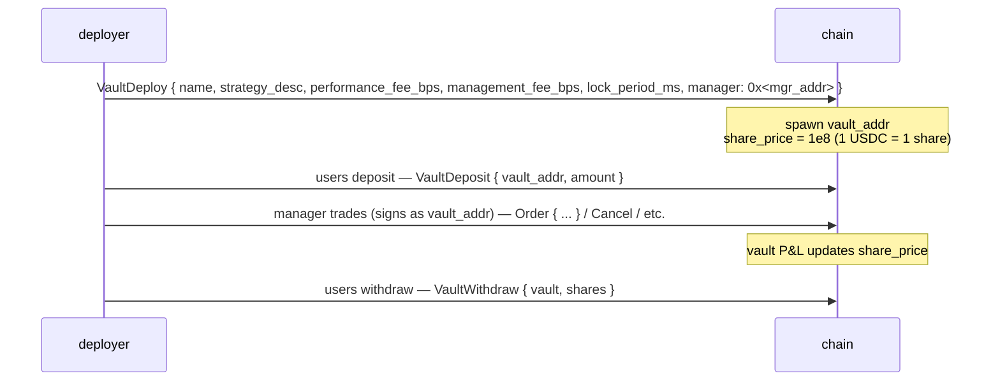
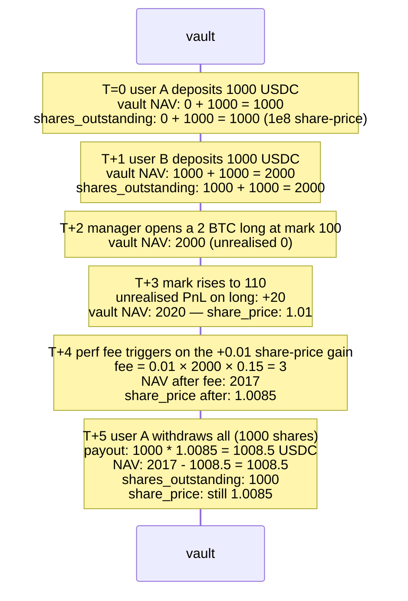

# 金库

:::info
**已在 Devnet 上线。** 金库完整生命周期——创建、存入、提取、转移、分配、修改——均已在 Devnet 实现并完成测试。端到端共识测试仍在持续补充中。
:::

## 概述

金库分为两大类：协议自营的 **MFlux 金库**（即保险/兜底资金池），以及**用户金库**（社区部署的策略，任何人均可存入）。两者共用同一份额定价机制：存入时按当前 `share_price` 铸造份额，提取时按当前 `share_price` 销毁份额。

## MFlux 金库

协议自有资金池，承担三项职能：

1. **兜底交易对手**：当 T3 清算将仓位移交给协议时，MFlux 金库承接该仓位及任何残余亏损。
2. **做市（规划中）**：闲置的 MFlux 资本可部署到指定市场的做市策略中。
3. **保险储备**：持有准备金，用于社会化小额亏损，避免触发 T4 ADL（自动减仓）。

### 向 MFlux 金库存入

```json
{
  "type": "VaultDeposit",
  "params": {
    "vault":       "<mflux_vault_addr>",
    "amount":   "1000000000"
  }
}
```

在下一个区块，按 `amount / share_price × 10^8` 铸造份额并记入存款方账户。

### 提取

```json
{
  "type": "VaultWithdraw",
  "params": {
    "vault":       "<mflux_vault_addr>",
    "shares":   "100000000000"
  }
}
```

销毁 `shares` 份额；在下一个区块向用户支付 `shares × share_price / 10^8` USDC。

### 锁定期

MFlux 金库默认设有 `24 h` 锁定期，从存入时起计算，到期后方可首次提取。锁定以单笔份额为单位；超过 24 小时的份额可随时自由提取。

此机制旨在防止资金在已知 T3 事件发生前大量涌入、亏损被社会化后立即撤出（即"搭便车"问题）。

### 收益与费用

MFlux 金库的费率如下：
- **管理费**：0 bps（无管理人——由协议直接运营）。
- **绩效费**：0 bps。
- **提取费**：0 bps。

收益 = T3 兜底亏损后的净余额 + T1/T2 做市收益。历史份额价格走势图可在实时 `vault_state` 查询中获取（详见 [`/info`](../api/rest/info.md#vault_state)）。

## 用户金库

任何人均可部署金库，汇集 USDC 并在指定管理人的签名授权下执行策略。

### 生命周期



金库地址在状态机中是一个一等账户——拥有独立的仓位、余额和挂单。管理人**代表金库**签署交易（金库地址作为 `sender`，由管理人密钥签名；准入流程与普通代理钱包使用相同的代理授权机制）。

### 部署

```json
{
  "type": "VaultDeploy",
  "params": {
    "name":                 "Yield Arb Strategy",
    "description":          "Funding-rate arbitrage",
    "manager":              "0x<mgr>",
    "performance_fee_bps":  1500,
    "management_fee_bps":   100,
    "lock_period_ms":       86400000,
    "high_water_mark":      true
  }
}
```

| 字段 | 范围 | 说明 |
|-------|-------|-------|
| `performance_fee_bps` | `[0, 3000]` | 超过前期最高净值部分的收益所收取的绩效费 |
| `management_fee_bps` | `[0, 500]` 年化 | 无论盈亏均收取的管理费 |
| `lock_period_ms` | `[0, 30 days]` | 每笔存款的锁定期 |
| `high_water_mark` | bool | 若为 true，绩效费仅在创出新高时收取 |

### 定价

```
share_price(t) = vault_account_value(t) / total_shares(t) × 10^8
```

`vault_account_value` 包含未平仓位的未实现盈亏。

定价在每次提交时更新。存入按**提交后**的份额价格铸造（不使用上一个区块的价格）；提取也按提交后的份额价格销毁。

### 费用机制

每当份额价格超过前期最高水位线时，绩效费即累计至管理人指定地址：

```
on every commit:
    if share_price > high_water_mark:
        gain     = (share_price - high_water_mark) * shares_outstanding
        perf_fee = gain * performance_fee_bps / 1e4
        accrue perf_fee to manager (paid as vault → manager USDC)
        high_water_mark = share_price
```

管理费按区块线性支付：

```
mgmt_per_block = management_fee_bps / 1e4 / (blocks_per_year)
```

两项费用均在计算份额价格前从金库 NAV（净资产价值）中扣除——份额价格已反映已付费用。

### 风险

用户金库可能亏损。若金库 NAV ≥ 负债 + 1 个基本单位，提取按当前份额价格执行。低于此阈值时，金库将被**暂停**，提取请求进入队列，直至 NAV 恢复（通常需要管理人平掉亏损仓位）。

若金库触发 T3（其自身的清算层级），将沿[分层清算](./tiered-liquidation.md)机制逐级处理。对金库执行 T4 ADL 时，通过降低份额价格向存款人追回损失。

金库地址永久存在于链上；即使金库已清空，地址依然保留（V1 中已付 gas 的存储空间不可回收）。

### 查询

```bash
curl -X POST https://devnet-gateway.mtf.exchange/info \
  -d '{"type":"vault_state","vault":"0x<vault>"}'
```

```json
{
  "type": "vault_state",
  "data": {
    "vault":              "0x<addr>",
    "name":               "Yield Arb Strategy",
    "manager":            "0x<mgr>",
    "tvl":             "10000000000",
    "share_price":     "11500000",
    "depositor_count":    142,
    "high_water_mark": "11500000",
    "performance_fee_bps":1500,
    "management_fee_bps": 100,
    "lock_period_ms":     86400000,
    "your_shares":     "5000000000",
    "your_position_value": "575000",
    "your_withdrawable_at_ts": 1735690000000
  }
}
```

## 保险池

MFlux 金库的一部分构成**保险池**——一项专用储备，在 T3 兜底事件发生时优先动用。详见[分层清算](./tiered-liquidation.md#t3-backstop--netting-at-mark)。

当保险池余额不足时，MFlux 金库将从整体资金池中自动补充（补充比例由治理设定，默认为 MFlux NAV 的 10% 用作保险储备）。

## 边界情况

<details>
<summary>查看边界情况</summary>

- **管理人轮换。** 金库管理人可由部署者替换（若金库以多签方式部署，则由多签替换）。新管理人继承全部签名权限。
- **管理人失联。** 已有仓位维持原状，不会自动交易。存款人仍可按份额价格提取（份额价格反映这些仓位的按市价盯市价值）。若仓位因标记价格变动而被清算，相应亏损计入 NAV。
- **清算期间存入。** 处于 T0/T1 阶段的金库仍可接受存款（有利于新资本注入救助），除非管理人将 `accept_deposits` 设置为 `false`。
- **锁定期计算。** 24 小时锁定期以单笔存款为单位。间隔 6 小时的两笔存款将分别在不同时间解锁；若需管理资金流入，请按笔记录。
- **最高水位线与提取。** 提取部分份额不会重置最高水位线；管理人仍可对**剩余**份额在下次超越最高水位线时收取绩效费。

</details>

## 操作流程——存入、管理人交易、提取



## 参见

- [分层清算](./tiered-liquidation.md) — T3 兜底、保险池
- [`POST /info vault_state`](../api/rest/info.md#vault_state)
- [`vaultDetails` HL-compat](../api/rest/hl-compat.md#vaultdetails)
- [`userEvents` WS](../api/ws/subscriptions.md#userevents) — 金库存入/提取/费用事件通过此频道推送
- [质押](./staking.md) — 与金库相互独立

## 常见问题

<details>
<summary>查看常见问题</summary>

**Q：MFlux 金库的存款有保险保障吗？**
A：没有。存款收益来自 T1/T2 兜底活动，同时承担 T3 亏损。正常情况下净收益为正，极端压力下可能出现亏损。

**Q：金库可以持有非 USDC 资产吗？**
A：V1 用户金库仅支持 USDC 计价。现货资产金库将在 V2 推出。

**Q：金库份额可以转让吗？**
A：不可以——V1 份额不可转让。存款人须先提取，接收方再重新存入。V2 可能新增可转让份额代币。

**Q：管理人可以将金库资金提取到自己的地址吗？**
A：不可以。管理人仅拥有**交易**权限，无提取权限。向非存款人提取资金需要金库级别的治理授权（V1 暂不支持）。

</details>
