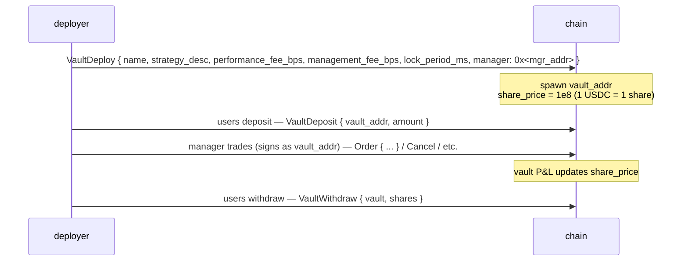

# 金库

:::info
**实时在 devnet 上线。** 完整的金库生命周期 — 创建、存入、提取、转账、分配、修改 — 已在 devnet 上实现并测试。端到端共识测试仍在补充中。
:::

## 简明扼要

两类金库：协议运营的 **MFlux 金库**（保险/应急资金池）和**用户金库**（社区部署的策略，可存入）。两者共享相同的份额定价原理：存入时按当前 `share_price` 铸造份额；提取时按当前 `share_price` 销毁份额。

## MFlux 金库

协议自有资金池。它发挥三个作用：

1. **应急交易对手**：当 T3 清算将头寸交给协议时，MFlux 金库吸收该头寸和任何残余损失。
2. **做市**（计划中）：闲置的 MFlux 资本可部署到精选市场的做市策略中。
3. **保险**：持有储备金以在不触发 T4 ADL 的情况下消化小额损失。

### 存入 MFlux 金库

```json
{
  "type": "VaultDeposit",
  "params": {
    "vault":       "<mflux_vault_addr>",
    "amount":   "1000000000"
  }
}
```

在下个区块向存款人铸造 `amount / share_price × 10^8` 份额。

### 提取

```json
{
  "type": "VaultWithdraw",
  "params": {
    "vault":       "<mflux_vault_addr>",
    "shares":   "100000000000"
  }
}
```

销毁 `shares` 份额；在下个区块支付 `shares × share_price / 10^8` USDC。

### 锁定期

MFlux 金库有默认的 `24 小时` 锁定期，从存入到首次合格提取。按份额锁定；对年限超过 24 小时的份额的提取不受限制。

这防止了资本在已知的 T3 事件前存入，在损失被分摊后立即提取的行为（"搭便车"问题）。

### 性能和费用

MFlux 金库收取：
- **管理费**：0 基点（无经理 — 协议运营）。
- **性能费**：0 基点。
- **提取费**：0 基点。

收益是 T3 应急损失 + T1/T2 做市人利润的净额。历史份额价格图表可在实时 `vault_state` 查询中获得（参见 [`/info`](../api/rest/info.md#vault_state)）。

## 用户金库

任何人都可以部署一个池化 USDC 并在指定经理的签名权限下运行策略的金库。

### 生命周期



金库地址是状态机中的一流账户 — 它拥有自己的头寸、余额和订单。经理代表金库签署交易**（金库地址是 `sender`，经理的密钥签署；认可通过与常规代理钱包相同的代理批准机制）。

### 部署

```json
{
  "type": "VaultDeploy",
  "params": {
    "name":                 "Yield Arb Strategy",
    "description":          "Funding-rate arbitrage",
    "manager":              "0x<mgr>",
    "performance_fee_bps":  1500,
    "management_fee_bps":   100,
    "lock_period_ms":       86400000,
    "high_water_mark":      true
  }
}
```

| 字段 | 范围 | 备注 |
|-------|-------|-------|
| `performance_fee_bps` | `[0, 3000]` | 超过先前高水位线的正收益费用 |
| `management_fee_bps` | `[0, 500]` 年化 | 无论收益如何都收取 |
| `lock_period_ms` | `[0, 30 days]` | 每次存入的锁定 |
| `high_water_mark` | bool | 如为真，性能费仅在新高时收取 |

### 定价

```
share_price(t) = vault_account_value(t) / total_shares(t) × 10^8
```

`vault_account_value` 包括开仓头寸上的未实现损益。

定价在每次提交时更新。存入在**提交后的**份额价格处铸造（你不会获得前一个区块的价格）；提取在提交后的份额价格处销毁。

### 费用机制

性能费在经理指定的地址上按每个份额价格上升到先前高水位线之上时累积：

```
on every commit:
    if share_price > high_water_mark:
        gain     = (share_price - high_water_mark) * shares_outstanding
        perf_fee = gain * performance_fee_bps / 1e4
        accrue perf_fee to manager (paid as vault → manager USDC)
        high_water_mark = share_price
```

管理费按区块线性支付：

```
mgmt_per_block = management_fee_bps / 1e4 / (blocks_per_year)
```

两项费用都在份额定价计算前从金库净资产值中扣除 — 份额价格已反映已支付的费用。

### 风险

用户金库可能亏损。如果金库的净资产值 >= 负债 + 1 个基础单位，则以现行份额价格兑现提取。低于此值时，金库处于**暂停**状态，提取排队等待净资产值恢复（可能通过经理平仓亏损头寸）。

进入 T3 的金库（其自身清算层级）遵循[分层清算](./tiered-liquidation.md)阶梯。金库上的 T4 ADL 通过份额价格下调从存款人处收回。

金库地址永久存在链上；即使是空的金库也会保留（V1 中无法回收已支付的 gas 存储）。

### 查询

```bash
curl -X POST https://devnet-gateway.mtf.exchange/info \
  -d '{"type":"vault_state","vault":"0x<vault>"}'
```

```json
{
  "type": "vault_state",
  "data": {
    "vault":              "0x<addr>",
    "name":               "Yield Arb Strategy",
    "manager":            "0x<mgr>",
    "tvl":             "10000000000",
    "share_price":     "11500000",
    "depositor_count":    142,
    "high_water_mark": "11500000",
    "performance_fee_bps":1500,
    "management_fee_bps": 100,
    "lock_period_ms":     86400000,
    "your_shares":     "5000000000",
    "your_position_value": "575000",
    "your_withdrawable_at_ts": 1735690000000
  }
}
```

## 保险资金池

MFlux 金库的一个子集是**保险资金池** — 一个在 T3 应急事件期间支出的指定储备。参见[分层清算](./tiered-liquidation.md#t3-backstop--netting-at-mark)。

当保险资金池不足时，MFlux 金库从更广泛的资金池中自动补充它（治理设置的比例，默认预留 MFlux 净资产值的 10% 作为保险）。

## 边界情况

<details>
<summary>显示边界情况</summary>

- **经理更换。** 金库的经理可由部署人（或多签部署的金库由多签）替换。新经理继承所有签署权限。
- **经理沉默。** 现有头寸保持不动；无自动交易。存款人仍然可以根据份额价格提取（反映这些头寸的市场对标）。如果头寸因标记价格变动而被清算，这会影响净资产值。
- **清算期间存入。** T0/T1 状态的金库仍接受存款（很好 — 新资本可能会救援），除非经理将 `accept_deposits` 设置为 `false`。
- **锁定期数学。** 24 小时的锁定是按存入计算的。两笔相隔 6 小时的存入在不同时间解锁；如果管理流入，请按存入跟踪。
- **高水位线和提取。** 提取某些份额不会重置高水位线；经理仍然在下一次超过高水位线的收益上获得性能费，对**剩余的**份额。

</details>

## 序列 — 存入、经理交易、提取

```mermaid
sequenceDiagram
    participant vault
    Note over vault: T=0 user A deposits 1000 USDC<br/>vault NAV: 0 + 1000 = 1000<br/>shares_outstanding: 0 + 1000 = 1000 (1e8 share-price)
    Note over vault: T+1 user B deposits 1000 USDC<br/>vault NAV: 1000 + 1000 = 2000<br/>shares_outstanding: 1000 + 1000 = 2000
    Note over vault: T+2 manager opens a 2 BTC long at mark 100<br/>vault NAV: 2000 (unrealised 0)
    Note over vault: T+3 mark rises to 110<br/>unrealised PnL on long: +20<br/>vault NAV: 2020; share_price: 1.01
    Note over vault: T+4 perf fee triggers on the +0.01 share-price gain<br/>fee = 0.01 × 2000 × 0.15 = 3<br/>NAV after fee: 2017<br/>share_price after: 1.0085
    Note over vault: T+5 user A withdraws all (1000 shares)<br/>payout: 1000 * 1.0085 = 1008.5 USDC<br/>NAV: 2017 - 1008.5 = 1008.5<br/>shares_outstanding: 1000<br/>share_price: still 1.0085
```

## 另见

- [分层清算](./tiered-liquidation.md) — T3 应急、保险资金池
- [`POST /info vault_state`](../api/rest/info.md#vault_state)
- [`vaultDetails` HL-compat](../api/rest/hl-compat.md#vaultdetails)
- [`userEvents` WS](../api/ws/subscriptions.md#userevents) — 金库存入/提取/费用事件通过此通道传递
- [质押](./staking.md) — 独立于金库

## 常见问题

<details>
<summary>显示常见问题</summary>

**Q: MFlux 金库存款有保险吗？**
A: 没有。它们从 T1/T2 应急活动中获得收益，并承担 T3 损失。在正常情况下，净收益为正，在严重压力下可能为负。

**Q: 金库能持有非 USDC 资产吗？**
A: V1 用户金库仅以 USDC 计价。现货资产金库是 V2。

**Q: 金库份额可转让吗？**
A: 不可以 — V1 份额不可转让。存款人必须提取，接收人必须存入。V2 可能会增加可转让份额代币。

**Q: 经理能否将金库资本提取到自己的地址？**
A: 不能。经理仅具有**交易**权限，不具有提取权限。向非存款人的提取需要明确的金库级别治理（V1 中未提供）。

</details>
