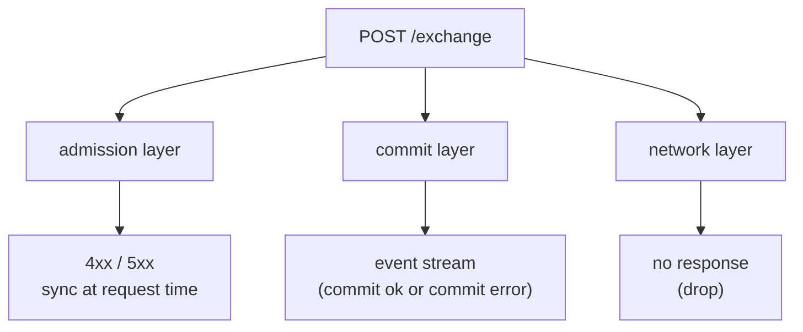
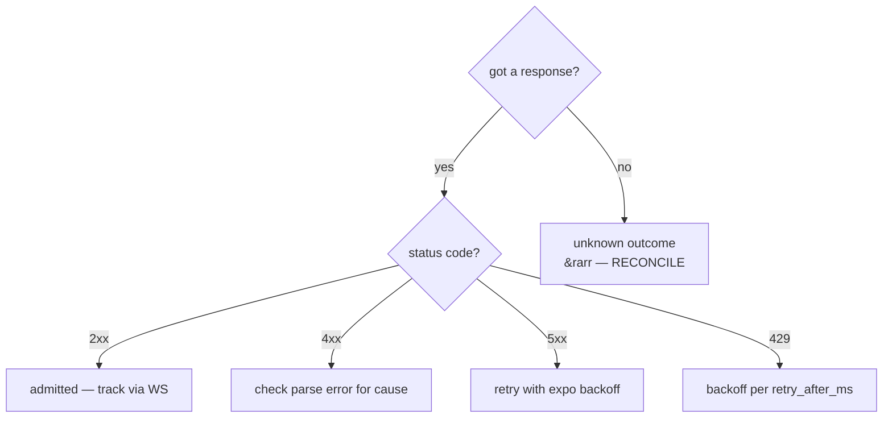
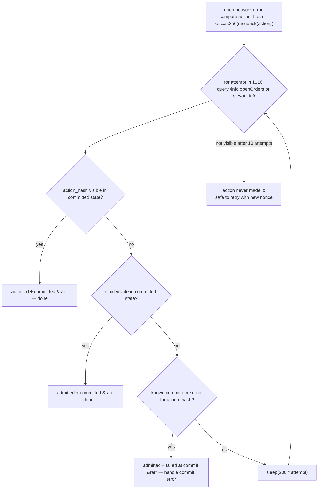

# 错误处理

:::tip
**稳定版。**
:::

本文为生产环境客户端提供决策流程。完整的错误字符串目录见 [错误](../api/errors.md)；本页重点说明每类错误的**处理方式**。

## 三个故障层



| 层级 | 触发时机 | 呈现方式 |
|-------|-----------|--------------|
| 准入层 | `/exchange` 请求时 | HTTP 状态码 + 响应体 |
| 提交层 | 准入后，区块提交时 | `userEvents` / `orderEvents` WS 推送，或可在 `userFills` / `openOrders` 中查询 |
| 网络层 | 任意环节 | TCP 错误、超时、响应截断 |

每一层的语义各不相同。混淆这三层是生产环境中最常见的 Bug。

## 决策树



## 第一层 — 准入错误

请求已被解析，但在准入阶段被拒绝。状态码为 `400`、`401`、`404`、`405`、`422`。

| 类别 | 示例 | 重试规则 |
|-------|----------|------------|
| **客户端 Bug** | `400 invalid_msgpack`、`400 unknown_action_variant`、`400 missing_field` | 禁止重试 — 修复代码 |
| **签名 Bug** | `401 signer_not_sender`、`401 unknown_chainId` | 禁止重试 — 检查 chainId / 密钥 / Agent 状态 |
| **Nonce Bug** | `400 nonce_must_increase` | 递增 nonce 后重试 |
| **逻辑错误** | `422 price_not_tick_aligned`、`422 reduce_only_would_grow` | 重新计算正确的值后重试 |
| **状态错误** | `422 liquidation_tier_blocks_action`、`422 insufficient_balance` | 补充保证金 / 等待等级切换后重试 |
| **Auth 状态** | `401 agent_not_yet_effective` | 等待一个区块后重试 |
| **资源不存在** | `404 order_not_found`、`404 account_not_found` | 不要重试；检查对应资源是否存在 |

```typescript
async function handleAdmissionResponse(r: Response) {
  if (r.status === 202) return { admitted: true };

  const body = await r.json();
  switch (r.status) {
    case 400:
      // client bug — log loudly, do not retry
      throw new ClientBugError(body.error);

    case 401:
      // signing — depends on the cause
      if (body.error === 'agent not yet effective') {
        // wait + retry
        await sleep(200);
        return { admitted: false, retry: true };
      }
      throw new AuthError(body.error);

    case 422:
      // logical — caller can correct and retry
      throw new LogicalError(body.error);

    case 429:
      await sleep(body.retry_after_ms);
      return { admitted: false, retry: true };

    case 503:
      await sleep(body.retry_after_ms);
      return { admitted: false, retry: true };

    default:
      throw new UnknownError(`${r.status}: ${body.error}`);
  }
}
```

## 第二层 — 提交错误

该操作已通过准入（`202`），但在提交阶段失败。此类错误只能通过事件流获知。

| 错误 | 原因 | 可重试？ |
|-------|-------|--------|
| `reduce_only_violation_post_admit` | 准入与派发之间仓位发生变化 | 若意图仍有效则可重试 |
| `stp_rejected` | 自成交防护机制撤销了该订单 | 否 — 调用方的另一笔订单已先行成交 |
| `mark_price_band_violation` | 派发时订单价格偏离标记价格过远 | 否 — 重新评估价格后再下单 |
| `evicted_under_cap_pressure` | 已准入但在出块前被逐出内存池 | 是（需退避） |
| `liquidation_pre_empted` | 准入与派发之间账户进入 T1+ 清算档位 | 否 — 先补足保证金 |

订阅 [`userEvents` WS](../api/ws/subscriptions.md#userevents)（订单生命周期事件通过该通道推送），并按事件类型分发处理：

```typescript
ws.subscribe('orderEvents', { user: address }, (event) => {
  switch (event.data.kind) {
    case 'resting':       /* order is on the book; track oid */            break;
    case 'partialFill':   /* size partially filled; cloid still on book */ break;
    case 'filled':        /* fully filled; remove from open-order set */   break;
    case 'cancelled':     /* terminal */                                   break;
    case 'error':         /* commit-time error; handle per table above */
      handleCommitError(event.data);
      break;
  }
});
```

## 第三层 — 网络错误

这类错误最难判断：服务器是否已收到请求？操作是否已提交？

| 现象 | 处理方式 |
|---------|--------|
| 收到响应前出现 TCP RST | 对账：查询状态以确认结果 |
| 响应超时（超时时间由调用方设置） | 同上 — 执行对账 |
| 响应截断 | 同上 — 执行对账 |
| 连接被拒绝 | 服务端不可用；指数退避后重试 |
| DNS 解析失败 | 网络或 DNS 问题；指数退避后重试 |

### 对账模式



cloid 挂单查询模式（详见 [幂等性](./idempotency.md)）可使对账成本极低：查询挂单列表，检查自己的 cloid 是否存在即可。

对于非订单类操作，通过 `action_hash` 进行匹配（由本地 msgpack 编码确定性生成）。`userEvents` WS 推送的每条事件均包含 `action_hash`。

## 生产实践示例

### 带重试的下单

```typescript
async function placeOrderSafely(client: Client, order: Order, maxAttempts = 3) {
  const cloid = '0x' + randomBytes(16).toString('hex');
  let lastNonce = Date.now();

  for (let attempt = 1; attempt <= maxAttempts; attempt++) {
    try {
      const res = await client.exchange.order({ ...order, cloid }, { nonce: lastNonce });
      return res;
    } catch (e) {
      if (e instanceof NetworkError) {
        // reconcile via cloid
        const placed = await client.info.findOpenOrderByCloid(client.address, cloid);
        if (placed) return placed;

        // bump nonce and retry
        lastNonce = Date.now();
        continue;
      }
      if (e instanceof RateLimitError) {
        await sleep(e.retryAfterMs);
        lastNonce = Date.now();
        continue;
      }
      throw e;  // client / signing / logical bug — propagate
    }
  }
  throw new Error('order failed after retries');
}
```

### 幂等撤单

```typescript
async function cancelSafely(client: Client, asset: number, oid: number) {
  try {
    return await client.exchange.cancel({ asset, oid });
  } catch (e) {
    if (e.body?.error === 'order not found') return { alreadyDone: true };
    if (e instanceof NetworkError) {
      // re-query the order
      const orders = await client.info.openOrders(client.address);
      if (!orders.find(o => o.oid === oid)) return { alreadyDone: true };
      // it's still there — actually retry
      return cancelSafely(client, asset, oid);
    }
    throw e;
  }
}
```

### WS 提交对账

```typescript
const pendingByHash = new Map<string, PendingAction>();

ws.subscribe('userEvents', { user: address }, (event) => {
  const hash = event.data.action_hash;
  const pending = pendingByHash.get(hash);
  if (!pending) return;

  if (event.data.kind === 'error') pending.reject(new CommitError(event.data));
  else                              pending.resolve(event.data);
  pendingByHash.delete(hash);
});

async function submit(action: Action) {
  const hash = keccak256(msgpack(action));
  const p = new Promise((resolve, reject) => pendingByHash.set(hash, { resolve, reject }));
  await client.exchange.submit(action);
  return Promise.race([p, timeout(5000)]);
}
```

## 边界情况

<details>
<summary>展开边界情况</summary>

- **网关返回 5xx，但操作实际已提交。** 若网关在准入后的回复丢失，就可能发生此情况。处理方式与网络丢包相同：通过 cloid/action_hash 执行对账。
- **WS 推送落后于实际状态。** 断线重连期间，重放缓冲区可能已丢弃相关事件。重连后先用 `/info` 轮询确认当前状态，再切换到 WS 接收实时数据。
- **相同 nonce 提交两次，其中一次成功。** 服务端强制要求 nonce 单调递增；第二次尝试会收到 `nonce_too_small`，由此可判断第一次已生效。善用这一信号。
- **延迟触发的逻辑错误。** 触发型（`Trigger`）订单今天准入，但因触发条件始终不满足而永不执行——不会报错，只是一笔长期挂着的委托。请定期将挂单集与 Bot 的预期委托集进行核对。

</details>

## 另请参阅

- [错误](../api/errors.md) — 完整错误目录
- [幂等性](./idempotency.md) — nonce 与 cloid 机制
- [WS 订阅](../api/ws/subscriptions.md) — 提交时事件
- [频率限制](../api/rate-limits.md) — 重试节奏控制

## 常见问题

<details>
<summary>展开常见问题</summary>

**Q: 提交时错误应作为异常抛出，还是作为数据处理？**
A: 作为数据处理。这些都是正常的订单结果——因 STP 被 `cancelled`，或因准入后 reduce-only 检查失败而 `error`。按业务逻辑记录并处理即可，不要因此崩溃程序。

**Q: 什么情况下可以忽略准入错误？**
A: 对于纯幂等流程（撤销一笔不存在的订单），`404` 可以静默吞掉。其他情况下，请以 INFO 或更高级别记录日志，并选择重试或通知运维人员。

**Q: 如何限制重试次数？**
A: 按每个逻辑操作设置时钟预算。下单操作 5 秒已经足够宽裕；撤单操作 2 秒即可。超出预算后，交由运维人员或风控模块处理。

</details>
