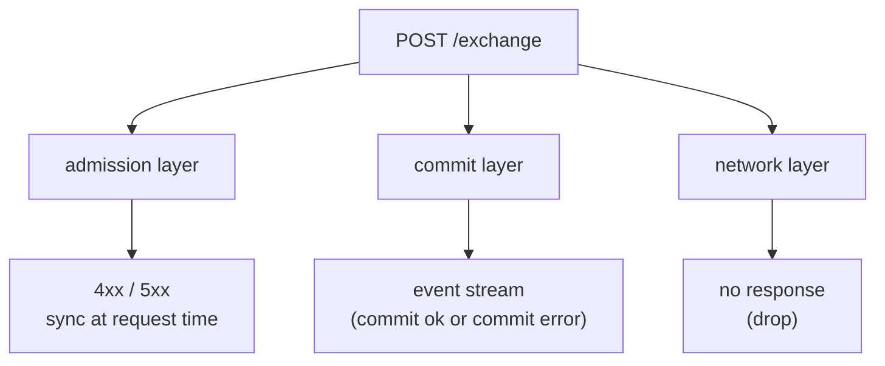
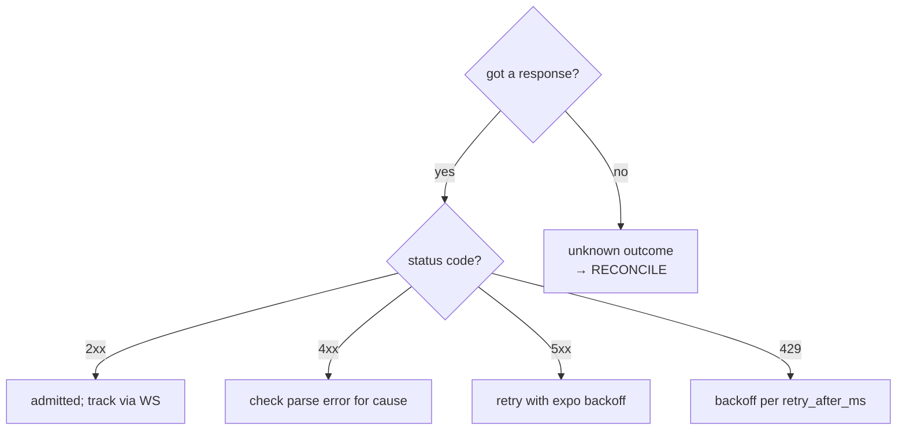
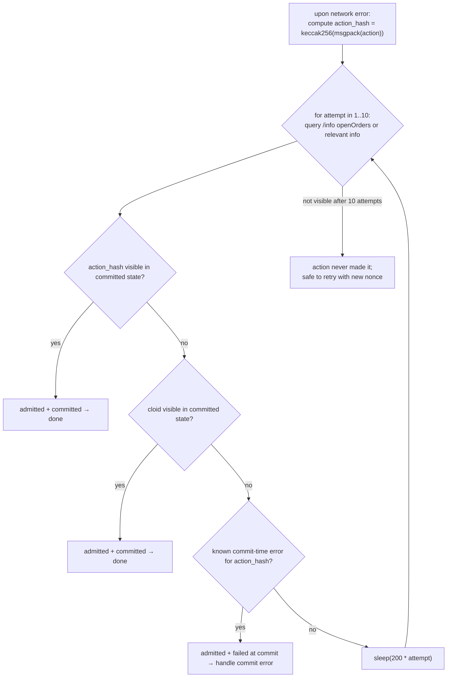

# 错误处理

:::tip
**稳定版。**
:::

为生产客户端提供的决策树。完整的错误字符串目录在[错误](../api/errors.md)中；本页告诉您如何**处理**每个类别。

## 三层失败机制



| 层 | 何时触发 | 如何表现 |
|-------|-----------|--------------|
| 准入层 | 在 `/exchange` 请求时 | HTTP 状态 + 响应体 |
| 提交层 | 在块提交时，准入后 | `userEvents` / `orderEvents` WS 推送，或可见于 `userFills` / `openOrders` |
| 网络层 | 任何地方 | TCP 错误、超时、部分响应 |

每层具有不同的语义。混淆它们是最常见的生产错误。

## 决策树



## 第 1 层 - 准入错误

请求已解析，但在准入时被拒绝。状态 `400`、`401`、`404`、`405`、`422`。

| 类别 | 示例 | 重试规则 |
|-------|----------|------------|
| **客户端错误** | `400 invalid_msgpack`、`400 unknown_action_variant`、`400 missing_field` | 不要重试 — 修复代码 |
| **签名错误** | `401 signer_not_sender`、`401 unknown_chainId` | 不要重试 — 验证 chainId / 密钥 / 代理状态 |
| **随机数错误** | `400 nonce_must_increase` | 增加随机数；重试 |
| **逻辑错误** | `422 price_not_tick_aligned`、`422 reduce_only_would_grow` | 计算正确值；重试 |
| **状态错误** | `422 liquidation_tier_blocks_action`、`422 insufficient_balance` | 充值 / 等待层级转变；重试 |
| **认证状态** | `401 agent_not_yet_effective` | 等待一个块；重试 |
| **未找到** | `404 order_not_found`、`404 account_not_found` | 不重试；检查资源 |

```typescript
async function handleAdmissionResponse(r: Response) {
  if (r.status === 202) return { admitted: true };

  const body = await r.json();
  switch (r.status) {
    case 400:
      // client bug — log loudly, do not retry
      throw new ClientBugError(body.error);

    case 401:
      // signing — depends on the cause
      if (body.error === 'agent not yet effective') {
        // wait + retry
        await sleep(200);
        return { admitted: false, retry: true };
      }
      throw new AuthError(body.error);

    case 422:
      // logical — caller can correct and retry
      throw new LogicalError(body.error);

    case 429:
      await sleep(body.retry_after_ms);
      return { admitted: false, retry: true };

    case 503:
      await sleep(body.retry_after_ms);
      return { admitted: false, retry: true };

    default:
      throw new UnknownError(`${r.status}: ${body.error}`);
  }
}
```

## 第 2 层 - 提交错误

操作已被准入（`202`）但在提交时失败。您只能通过事件流了解它。

| 错误 | 原因 | 重试？ |
|-------|-------|--------|
| `reduce_only_violation_post_admit` | 在准入和分发之间仓位发生变化 | 如果意图仍然适用则是 |
| `stp_rejected` | 自交易防止杀死了订单 | 否 — 调用者的另一个订单先匹配 |
| `mark_price_band_violation` | 订单价格在分发时离标记价格太远 | 否 — 重新评估价格并重新挂单 |
| `evicted_under_cap_pressure` | 已准入但在块前从内存池中被驱逐 | 是（带退避） |
| `liquidation_pre_empted` | 在准入和分发之间账户移至 T1+ | 否 — 先修复保证金 |

订阅 [`userEvents` WS](../api/ws/subscriptions.md#userevents)（订单生命周期事件在该频道上）并按事件类型分发：

```typescript
ws.subscribe('orderEvents', { user: address }, (event) => {
  switch (event.data.kind) {
    case 'resting':       /* order is on the book; track oid */            break;
    case 'partialFill':   /* size partially filled; cloid still on book */ break;
    case 'filled':        /* fully filled; remove from open-order set */   break;
    case 'cancelled':     /* terminal */                                   break;
    case 'error':         /* commit-time error; handle per table above */
      handleCommitError(event.data);
      break;
  }
});
```

## 第 3 层 - 网络错误

最模糊的类别。服务器是否收到了请求？操作是否提交了？

| 症状 | 操作 |
|---------|--------|
| TCP RST 在响应前 | 协调：查询状态以确定结果 |
| 响应超时（您设置的超时） | 相同 — 协调 |
| 部分 / 截断响应 | 相同 — 协调 |
| 连接被拒绝 | 服务器端不可用；以指数退避重试 |
| DNS 失败 | 网络 / DNS 问题；以指数退避重试 |

### 协调模式



cloid-on-orders 模式（见[幂等性](./idempotency.md)）使这变得便宜：查询未平仓订单，查看您的 cloid 是否在那里。

对于非订单操作，匹配 `action_hash`（从您的本地 msgpack 编码确定）。`userEvents` WS 提要在每个事件上都包含 `action_hash`。

## 生产方案

### 带重试的订单下单

```typescript
async function placeOrderSafely(client: Client, order: Order, maxAttempts = 3) {
  const cloid = '0x' + randomBytes(16).toString('hex');
  let lastNonce = Date.now();

  for (let attempt = 1; attempt <= maxAttempts; attempt++) {
    try {
      const res = await client.exchange.order({ ...order, cloid }, { nonce: lastNonce });
      return res;
    } catch (e) {
      if (e instanceof NetworkError) {
        // reconcile via cloid
        const placed = await client.info.findOpenOrderByCloid(client.address, cloid);
        if (placed) return placed;

        // bump nonce and retry
        lastNonce = Date.now();
        continue;
      }
      if (e instanceof RateLimitError) {
        await sleep(e.retryAfterMs);
        lastNonce = Date.now();
        continue;
      }
      throw e;  // client / signing / logical bug — propagate
    }
  }
  throw new Error('order failed after retries');
}
```

### 带幂等安全的取消

```typescript
async function cancelSafely(client: Client, asset: number, oid: number) {
  try {
    return await client.exchange.cancel({ asset, oid });
  } catch (e) {
    if (e.body?.error === 'order not found') return { alreadyDone: true };
    if (e instanceof NetworkError) {
      // re-query the order
      const orders = await client.info.openOrders(client.address);
      if (!orders.find(o => o.oid === oid)) return { alreadyDone: true };
      // it's still there — actually retry
      return cancelSafely(client, asset, oid);
    }
    throw e;
  }
}
```

### WS 提交协调

```typescript
const pendingByHash = new Map<string, PendingAction>();

ws.subscribe('userEvents', { user: address }, (event) => {
  const hash = event.data.action_hash;
  const pending = pendingByHash.get(hash);
  if (!pending) return;

  if (event.data.kind === 'error') pending.reject(new CommitError(event.data));
  else                              pending.resolve(event.data);
  pendingByHash.delete(hash);
});

async function submit(action: Action) {
  const hash = keccak256(msgpack(action));
  const p = new Promise((resolve, reject) => pendingByHash.set(hash, { resolve, reject }));
  await client.exchange.submit(action);
  return Promise.race([p, timeout(5000)]);
}
```

## 边界情况

<details>
<summary>显示边界情况</summary>

- **网关返回 5xx 但操作实际上已提交。** 如果网关的准入后回复丢失，可能会发生。处理方式类似网络丢弃：通过 cloid/action_hash 协调。
- **WS 提要落后于实际状态。** 恢复缓冲区可能在您重新连接时驱逐了事件。在恢复时重新轮询 `/info` 以确定锚点；切换到 WS 以获取实时尾部。
- **相同随机数提交两次 — 一次成功。** 服务器强制随机数单调性；第二个尝试看到 `nonce_too_small` 并且您学到第一个是实时的。使用此信号。
- **时间炸弹逻辑错误。** 一个 `Trigger` 订单今天准入但永远不会触发，因为其触发条件永远不成立。没有错误；只是一个挂在那里的止损订单。定期协调您的未平仓订单集与您的机器人预期集合。

</details>

## 另见

- [错误](../api/errors.md) — 完整目录
- [幂等性](./idempotency.md) — 随机数 + cloid 机制
- [WS 订阅](../api/ws/subscriptions.md) — 提交时事件
- [速率限制](../api/rate-limits.md) — 控制重试速度

## 常见问题

<details>
<summary>显示常见问题</summary>

**问：我应该将提交时错误视为异常还是数据？**
答：数据。它们是常规订单结果 — 因 STP 被 `cancelled`，因准入后 reduce-only 而 `error`。根据业务逻辑进行记录 + 处理；不要在它们上崩溃。

**问：是否有理由忽略准入错误？**
答：对于纯幂等流（不存在的订单的取消），`404` 可以忽略。对于其他所有情况，以 INFO+ 级别记录并要么重试要么上报给操作员。

**问：我如何限制重试次数？**
答：每个逻辑操作的时间预算。对于订单下单，5 秒很慷慨；对于取消，2 秒。超过这个时间，上报给操作员或您的风险监视器。

</details>
