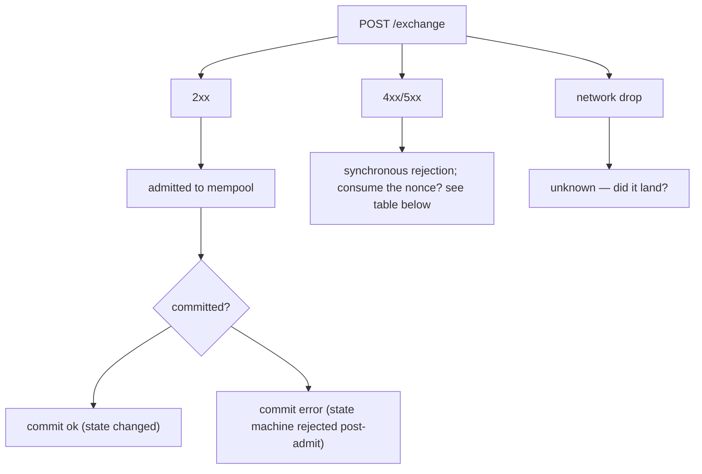
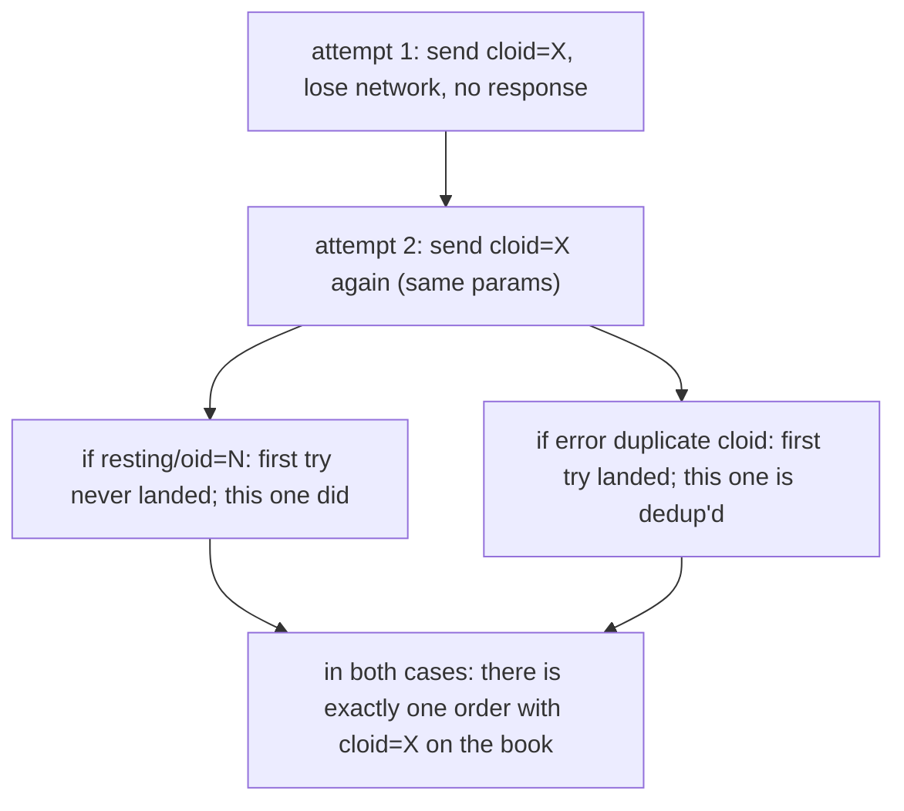

# 幂等性

:::tip
**稳定版。**
:::

如何安全地重试，避免重复消耗 nonce 或重复下单。

## TL;DR

- 每个操作都有一个 `nonce`。重复使用同一个会返回 `400 nonce_must_increase`。
- 在每个 `Order` / `ModifyOrder` 上设置唯一的 `cloid`；服务器会拒绝同一账户的重复 `cloid`，因此重试是安全的。
- 对于非下单操作，**状态机** 本身就是幂等的（取消不存在的订单是无害的；转账由余额检查强制执行）。
- 网络错误分为三类——准入拒绝、提交时错误、网络中断——每种都有不同的重试规则。

## 三类错误



## Nonce 消耗

| 结果 | Nonce 消耗？ | 安全重试？ |
|---------|:---------------:|:--------------:|
| `202 admitted` | 是 | 否——重复效果 |
| `400 nonce_must_increase` | 否（已经超过） | 否——用更高的 nonce 提交 |
| `400 invalid_msgpack` / 其他解析错误 | 否 | 是——修复后用同一 nonce 重新提交 |
| `401 signer_*` | 否 | 否，直到签名问题解决；nonce 未被消耗 |
| `422 reduce_only_violation` 及其他准入时逻辑错误 | 否 | 是，一旦逻辑问题解决 |
| `429 rate_limit` | 否 | 是，在 `retry_after_ms` 之后 |
| `503 mempool_full` | 否 | 是，在 `retry_after_ms` 之后 |
| 网络中断（无响应） | 未知 | 对账——见下面 [网络中断后对账](#网络中断后对账) |

规则：**请求获得服务器响应 → nonce 决策已制定**。网络中断是唯一模糊的情况。

## 策略：cloid

对于下单，客户端订单 ID 是最强的去重原语。

```typescript
const cloid = crypto.randomBytes(16);  // 16 bytes

await client.order({
  asset: 0, side: 'Buy', priceE8: '...', sizeE8: '...',
  tif: 'Gtc', cloid: '0x' + cloid.toString('hex'),
});
```

服务器返回：

| 服务器响应 | 含义 |
|-----------------|---------------|
| `{"resting":{"oid":N,"cloid":"0x..."}}` | 订单已下单，去重确认 |
| `{"error":"duplicate cloid"}` | 之前使用相同 cloid 的请求已准入；**订单已在账本上**。按 cloid 查询。 |
| `{"error":"<other>"}` | 该条目失败；可用新 cloid 或相同 cloid 重试 |

订单重试规则：**相同 cloid + 相同参数** 端到端幂等。如果第一次尝试成功，第二次会看到 `duplicate cloid`，你就知道原始订单已就位。



相同逻辑适用于 `ModifyOrder`——为修改设置新 cloid，去重修改。

## 策略：状态机幂等性

大多数非下单操作在状态机级别都是幂等的：

| 操作 | 幂等？ | 原因 |
|--------|:-----------:|-----|
| `Cancel` | 是 | 取消不存在/已取消的订单返回 `{"error":"order not found"}`——无害 |
| `CancelByCloid` | 是 | 相同 |
| `UpdateLeverage` | 是 | 将杠杆设置为当前值是空操作 |
| `UpdateMarginMode` | 是 | 相同 |
| `UserPortfolioMargin` | 是 | 相同 |
| `ApproveAgent` | 是 | 相同的批准数据覆盖现有记录 |
| `UsdcTransfer` | 否 | 每次转账新的金额 |
| `WithdrawUsdc` | 否 | 相同 |
| `Delegate` / `Undelegate` | 否 | 每次调用都添加到操作队列 |

对于非幂等操作，使用以下任一方式：
- **以 nonce 作为去重键**：跟踪你提交的 nonce，永不用同一 nonce 提交两次。服务器无论如何都会强制执行。
- **外部去重表**：保持一个 `{request_id → nonce}` 映射；如果你的重试看到这个 request_id 已有 nonce，则说明已提交。

## 网络中断后对账

当响应丢失（TCP 关闭、超时等）时，你不知道操作是否已提交。进行对账：

### 对于订单

按 cloid 查询：

```bash
curl -X POST $BASE/info \
  -d '{"type":"openOrders","user":"0x..."}' | jq '.[] | select(.cloid == "0x<cloid>")'
```

如果存在 → 已准入；视为成功。
如果不存在 → 检查 `userFills` 以查看针对该 cloid 的成交。
如果仍不存在 → 准入失败（或从内存池驱逐）。用相同 cloid 重新提交。

### 对于转账/提现

查询账户的 `userFills`（包括融资和转账）或中断时间点附近的 `block_info`。按本地计算的 action_hash 匹配——每个操作都有确定性哈希，无论准入结果如何。

```typescript
const actionHash = keccak256(msgpack(action));
// search for events with this action_hash in WS history or info queries
```

如果无法确定结果：
- **对于幂等操作**：安全重试（使用新 nonce，因为旧 nonce 可能已消耗）。
- **对于非幂等操作**：暂停；查询账户状态以查看是否发生了副作用；仅在确定后恢复。

## 序列——超时后使用 cloid 重试

```mermaid
sequenceDiagram
    participant C as Client
    participant S as Server
    C->>S: T=0 attempt 1: POST /exchange Order { cloid: X }
    Note over C,S: T=2s (no response — network drop)
    C->>S: T=2s attempt 2: POST /exchange Order { cloid: X } (same params, NEW nonce)
    S-->>C: T=2.1s response: error nonce_too_small → original was admitted! the new nonce is needed but the order itself is already in place.
    S-->>C: OR response: resting/oid=N → original never landed; this one did
    S-->>C: OR response: error duplicate cloid → original landed too; we're already dedup'd
    C->>S: T=2.2s query openOrders by cloid: confirm presence
```

cloid 加上服务器端检查使得重试在网络不可靠的情况下也是安全的。

## Nonce 问题排查

| 现象 | 原因 | 解决 |
|---------|-------|-----|
| 每个请求都出现 `nonce_must_increase` | 本地时钟偏差（使用 `Date.now()`） | 同步时钟；或使用单调计数器 |
| 两个脚本在 nonce 上碰撞 | 共享同一账户 | 使用共享 nonce 服务，或每个账户一个脚本 |
| 重新连接后出现 `nonce_too_small` | 本地 nonce 计数器重置为中断前的值 | 跨重启持久化最后提交的 nonce |

## 另见

- [`POST /exchange`](../api/rest/exchange.md) — 完整信封（包括 `nonce`）
- [错误](../api/errors.md) — 每个错误字符串 + 补救
- [错误处理](./error-handling.md) — 准入 vs 提交 vs 网络决策树
- [速率限制](../api/rate-limits.md) — 控制重试速率

## FAQ

<details>
<summary>显示 FAQ</summary>

**Q：我应该用 `Date.now()` 还是计数器？**
A：对于单实例客户端，`Date.now()` 是可以的。对于一个账户上的多实例客户端，使用共享单调计数器（如 Redis `INCR`），这样两个实例就不会碰撞。

**Q：如果我想故意重放一个操作（幂等流程）怎么办？**
A：使用相同的 `cloid`（对于订单）和新 `nonce`。服务器通过 cloid 强制去重；nonce 只保持连线完整。

**Q：订单被取消/成交后，cloid 可重用吗？**
A：否。Cloid 每个账户全局唯一，永久唯一。为每个订单使用新的。

**Q：WS feed 是否给我可用于对账的提交时确认？**
A：是的。订阅 `userEvents` 并按 `action_hash` 或 `cloid` 匹配。WS feed 是重试期间确认提交状态的推荐方式。

</details>
