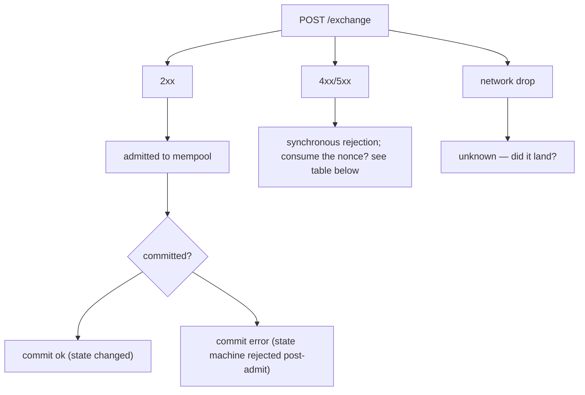
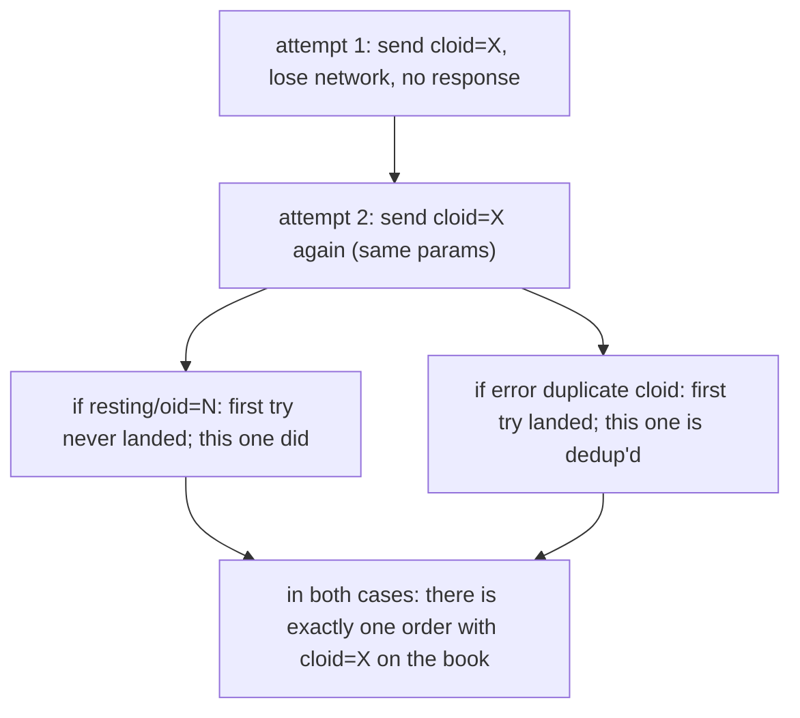

# 幂等性

:::tip
**稳定版。**
:::

如何安全重试，避免重复消耗 nonce 或重复下单。

## 摘要

- 每个操作都有一个 `nonce`。重用同一个 nonce 会返回 `400 nonce_must_increase`。
- 每条 `Order` / `ModifyOrder` 请求都应设置唯一的 `cloid`；服务器会拒绝同一账户内重复的 `cloid`，因此重试是安全的。
- 对于非订单操作，**状态机**本身具有天然幂等性（取消一个不存在的订单不会造成任何影响；转账由余额检查来保障）。
- 网络错误分为三类——准入拒绝、提交错误、网络中断——每类对应不同的重试策略。

## 三类错误



## Nonce 消耗规则

| 结果 | Nonce 已消耗？ | 可以重试？ |
|---------|:---------------:|:--------------:|
| `202 admitted` | 是 | 否——会产生重复效果 |
| `400 nonce_must_increase` | 否（已过期） | 否——请使用更大的 nonce 重新提交 |
| `400 invalid_msgpack` / 其他解析错误 | 否 | 是——修复后以相同 nonce 重新提交 |
| `401 signer_*` | 否 | 否，需先修复签名问题；nonce 未被消耗 |
| `422 reduce_only_violation` 及其他准入阶段逻辑错误 | 否 | 是，修复逻辑问题后可重试 |
| `429 rate_limit` | 否 | 是，等待 `retry_after_ms` 后重试 |
| `503 mempool_full` | 否 | 是，等待 `retry_after_ms` 后重试 |
| 网络中断（无响应） | 未知 | 需对账——参见下方[网络中断后对账](#reconcile-after-network-drop) |

规则总结：**只要收到服务器响应，nonce 的处置结果就已确定**。网络中断是唯一存在歧义的情况。

## 策略：cloid

对于下单操作，客户端订单 ID 是最可靠的去重手段。

```typescript
const cloid = crypto.randomBytes(16);  // 16 bytes

await client.order({
  asset: 0, side: 'Buy', priceE8: '...', sizeE8: '...',
  tif: 'Gtc', cloid: '0x' + cloid.toString('hex'),
});
```

服务器返回值说明：

| 服务器响应 | 含义 |
|-----------------|---------------|
| `{"resting":{"oid":N,"cloid":"0x..."}}` | 订单已成功挂单，去重确认通过 |
| `{"error":"duplicate cloid"}` | 具有相同 cloid 的请求已被准入；**订单已在委托簿上**，请通过 cloid 查询 |
| `{"error":"<other>"}` | 本次提交失败；可使用新 cloid 或相同 cloid 重试 |

订单重试规则：**相同 cloid + 相同参数**在端到端层面是幂等的。如果第一次请求已落单，第二次会收到 `duplicate cloid`，从而确认原始订单已存在。



同样的逻辑适用于 `ModifyOrder`——为每次改单设置新的 cloid，即可对改单操作进行去重。

## 策略：状态机幂等性

大多数非订单操作在状态机层面本身就具有幂等性：

| 操作 | 幂等？ | 原因 |
|--------|:-----------:|-----|
| `Cancel` | 是 | 取消不存在或已取消的订单会返回 `{"error":"order not found"}`，不造成任何影响 |
| `CancelByCloid` | 是 | 同上 |
| `UpdateLeverage` | 是 | 将杠杆设置为当前值等同于空操作 |
| `UpdateMarginMode` | 是 | 同上 |
| `UserPortfolioMargin` | 是 | 同上 |
| `ApproveAgent` | 是 | 相同的授权数据会覆盖已有记录 |
| `UsdcTransfer` | 否 | 每次调用都会转移一笔新金额 |
| `WithdrawUsdc` | 否 | 同上 |
| `Delegate` / `Undelegate` | 否 | 每次调用都会向操作队列追加新条目 |

对于**非幂等**操作，可采用以下任一方式进行去重：
- **以 nonce 作为去重键**：记录已提交的 nonce，切勿以相同 nonce 提交两次。服务器会强制执行此规则。
- **外部去重表**：维护一张 `{request_id → nonce}` 映射表；如果重试时发现该 request_id 已有对应 nonce，说明请求已经提交过了。

## 网络中断后对账 {#reconcile-after-network-drop}

当响应丢失（TCP 断开、超时等）时，你无法确定操作是否已提交。请按以下方式对账：

### 针对订单

通过 cloid 查询：

```bash
curl -X POST $BASE/info \
  -d '{"type":"openOrders","user":"0x..."}' | jq '.[] | select(.cloid == "0x<cloid>")'
```

- 若存在 → 已准入，视为成功。
- 若不存在 → 检查 `userFills` 中是否有该 cloid 的成交记录。
- 若仍不存在 → 准入失败（或已从 mempool 中被驱逐），使用相同 cloid 重新提交。

### 针对转账 / 提现

查询账户的 `userFills`（包含资金费率和转账记录），或查询中断时间附近的 `block_info`。使用本地计算出的 action_hash 进行匹配——无论准入结果如何，每个操作都有一个确定性哈希。

```typescript
const actionHash = keccak256(msgpack(action));
// search for events with this action_hash in WS history or info queries
```

如果无法确定结果：
- **对于幂等操作**：可安全重试（使用新 nonce，因为旧 nonce 可能已被消耗）。
- **对于非幂等操作**：暂停操作；查询账户状态，确认副作用是否已发生；只有在确认结果后才继续。

## 时序图——超时后使用 cloid 重试

```mermaid
sequenceDiagram
    participant C as Client
    participant S as Server
    C->>S: T=0 attempt 1: POST /exchange Order { cloid: X }
    Note over C,S: T=2s (no response — network drop)
    C->>S: T=2s attempt 2: POST /exchange Order { cloid: X } (same params, NEW nonce)
    S-->>C: T=2.1s response: error nonce_too_small → original was admitted! the new nonce is needed but the order itself is already in place.
    S-->>C: OR response: resting/oid=N → original never landed; this one did
    S-->>C: OR response: error duplicate cloid → original landed too; we're already dedup'd
    C->>S: T=2.2s query openOrders by cloid: confirm presence
```

cloid 与服务器端检查的组合，使得即使在网络不稳定的情况下重试也是安全的。

## Nonce 问题排查

| 现象 | 原因 | 解决方法 |
|---------|-------|-----|
| 每次请求都返回 `nonce_must_increase` | 本地时钟偏差（使用了 `Date.now()`） | 同步时钟，或改用单调递增计数器 |
| 两个脚本的 nonce 发生冲突 | 共用同一账户 | 使用共享 nonce 服务，或每个账户只运行一个脚本 |
| 重连后出现 `nonce_too_small` | 本地 nonce 计数器重置到中断前的值 | 在重启前持久化最后一次提交的 nonce |

## 另请参阅

- [`POST /exchange`](../api/rest/exchange.md) — 包含 `nonce` 的完整请求结构
- [错误码](../api/errors.md) — 所有错误字符串及修复方式
- [错误处理](./error-handling.md) — 准入错误、提交错误与网络错误的决策树
- [频率限制](../api/rate-limits.md) — 合理控制重试节奏

## 常见问题

<details>
<summary>展开常见问题</summary>

**Q：应该使用 `Date.now()` 还是计数器？**
A：对于单实例客户端，`Date.now()` 完全够用。对于同一账户的多实例客户端，请使用共享单调递增计数器（例如 Redis `INCR`），避免多个实例产生 nonce 冲突。

**Q：如果我想主动重放一个操作（幂等流程），该怎么做？**
A：对于订单，使用相同的 `cloid` 并配合新的 `nonce`。服务器通过 cloid 执行去重；nonce 只是保证请求在传输层的有效性。

**Q：原始订单被取消或成交后，cloid 可以复用吗？**
A：不可以。cloid 在同一账户内永久唯一，不可复用。每个订单都必须使用新的 cloid。

**Q：WebSocket 推送是否能提供提交确认，用于对账？**
A：可以。订阅 `userEvents` 并通过 `action_hash` 或 `cloid` 进行匹配。在重试过程中，推荐使用 WebSocket 推送来确认提交状态。

</details>
