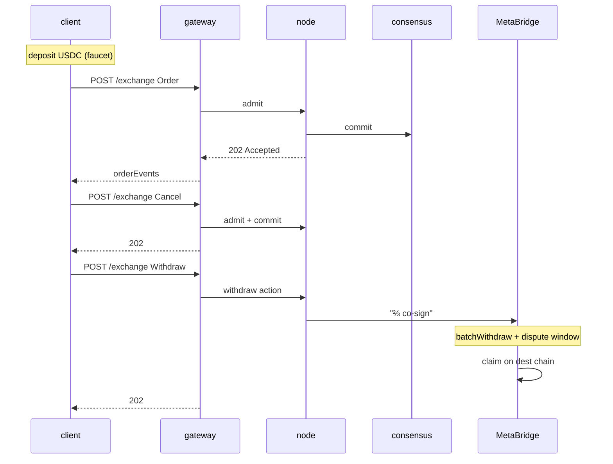

# 快速上手 — 5 分钟端到端流程

:::info
**状态：** 接口层已**稳定**。当前使用 Devnet 端点，主网尚无可用性保证。
:::

充值、下单、撤单、提款——读完本页，你的 TypeScript / Python / curl 会话将完整走通一次对 devnet 的全流程交互。

## 前置条件

- 一个 EVM 私钥（任意 32 字节十六进制；devnet 请重新生成一个——不要复用主网私钥）
- 在 MetaBridge 支持的源链上持有 USDC（目前支持 Base；Solana 和 Arbitrum 即将上线）——devnet 可直接使用水龙头代替
- `curl` 或任意 HTTP 客户端

## 端点

网关是唯一的公开入口。MTF 原生接口为默认路径；HL 兼容接口位于 `/hl/*`。

| 服务 | URL（devnet） |
|---------|--------------|
| 网关入口 | `https://devnet-gateway.mtf.exchange` |
| MTF 原生（默认） | `POST /info` · `POST /exchange` · `GET /ws` |
| HL 兼容 | `POST /hl/info` · `POST /hl/exchange` · `GET /hl/ws` |
| CCXT 兼容 | `/ccxt/*` |
| EVM JSON-RPC | `POST /evm` |
| 水龙头（devnet） | `POST /faucet` |
| 浏览器 | `https://devnet.mtf.exchange/explorer` |

> 水龙头**不是**独立服务——它就是网关入口上的 `POST /faucet` 路由。如果你自行运行节点，相同的原生接口（`/info` · `/exchange` · `/ws` · `/faucet`）也会直接在 `http://localhost:8080` 提供服务。详见 [`POST /faucet`](../api/rest/faucet.md)。

完整端点列表（含测试网及主网上线后的地址）请参阅[网络](../networks.md)。

## 第一步 — 获取 devnet USDC

```bash
curl -X POST https://devnet-gateway.mtf.exchange/faucet \
  -H 'content-type: application/json' \
  -d '{"address":"0x<YOUR_ADDRESS>"}'
# -> {"address":"0x…","usdc":3000,"mtf":10,"status":"queued"}
```

每次申领可获得 **3000 USDC** 全仓保证金**和 10 MTF** 现货代币——**每个地址仅限一次**（重复申领将返回 `429 address already funded`），且同一 IP 每分钟限速 1 次。可选的 `amount` 参数只能*向下*限制 USDC 发放数量（≤ 3000）；MTF 数量固定。发放状态为 `"queued"`——约 1 个区块后到账，请稍等片刻再确认余额：

以下原始 curl 示例使用网关上 `/hl/*` 路径的 **HL 兼容**格式（camelCase 类型如 `clearinghouseState` / `openOrders`，msgpack 签名信封）——如果你已有 HL 客户端会很方便。`@metaflux/sdk` 示例则走网关默认路径（`/info` · `/exchange`）的 MTF 原生接口。二者任选其一，都通过同一个入口，只是路径不同。

```bash
curl -X POST https://devnet-gateway.mtf.exchange/hl/info \
  -H 'content-type: application/json' \
  -d '{"type":"clearinghouseState","user":"0x<YOUR_ADDRESS>"}'
```

响应中应可看到 `marginSummary.accountValue: "3000.0"`。

## 第二步 — 下限价单

完整签名流程详见[签名](./signing.md)。本快速上手使用官方 TypeScript SDK（`@metaflux/sdk`——将在主网上线前发布；参见 [TypeScript SDK](./typescript-sdk.md)）。

```typescript
import { MetaFluxClient } from '@metaflux/sdk';

const client = new MetaFluxClient({
  privateKey: process.env.PRIVATE_KEY!,
  baseUrl:    'https://devnet-gateway.mtf.exchange', // MTF-native is the gateway default path
  chainId:    31337,
});

const meta = await client.info.meta();
const btcId = meta.universe.findIndex(m => m.name === 'BTC');

const result = await client.exchange.order({
  asset:    btcId,
  isBuy:    true,
  price:    '50000',
  size:     '0.1',
  tif:      'Gtc',
  reduceOnly: false,
});

console.log('order id:', result.oid);
```

原始 curl（HL 兼容格式——需自行构建签名；参见[签名](./signing.md)）：

```bash
curl -X POST https://devnet-gateway.mtf.exchange/hl/exchange \
  -H 'content-type: application/json' \
  -d @order.json
```

其中 `order.json` 为你自行组装的 HL 格式信封。

### 现货交易示例

[现货](../products/spot.md)是代币对代币的 CLOB，与永续合约相互独立——无杠杆，无持仓。使用原生 [`spot_order`](../api/rest/exchange.md#spot_order) 操作下现货订单：需提供**现货交易对 ID**（不是永续合约的 `market`）、`side`、`limit_px`、`size` 以及 `tif`。`gtc`/`alo` 挂单会锁定预留余额到托管账户；`ioc` 不会挂单等待成交。

```jsonc
// the `action` you sign and POST to /exchange (sender-authorized, no `owner`)
{
  "type": "spot_order",
  "order": {
    "pair":     200,           // spot pair id from /info, not a perp market id
    "side":     "bid",         // bid = buy base (pays quote); ask = sell base
    "size":     100000000,
    "limit_px": 200000000,     // a limit is required — market spot is not yet supported
    "tif":      "gtc",
    "stp_mode": "cancel_oldest"
  }
}
```

同步响应中会携带分配到的 `oid`，并附带 `resting` 或 `filled` 状态（与永续合约订单的状态枚举相同）。可通过 [`POST /info`](../api/rest/info.md) 查询现货余额和现货挂单；使用 [`spot_cancel`](../api/rest/exchange.md#spot_cancel) 撤单，撤单后托管资金将退回。

## 第三步 — 确认订单已进入委托簿

```bash
curl -X POST https://devnet-gateway.mtf.exchange/hl/info \
  -H 'content-type: application/json' \
  -d '{"type":"openOrders","user":"0x<YOUR_ADDRESS>"}'
```

响应中应能看到第二步返回的 `oid` 对应的订单。

或者，订阅实时更新（对任何正式使用场景均推荐此方式）：

```typescript
const ws = client.ws();
ws.subscribe('userEvents', { user: client.address }, (event) => {
  console.log('event:', event);
});
```

## 第四步 — 撤单

```typescript
await client.exchange.cancel({ asset: btcId, oid: result.oid });
```

```bash
# raw curl
curl -X POST https://devnet-gateway.mtf.exchange/hl/exchange \
  -d @cancel.json
```

## 第五步 — 提款

```typescript
await client.exchange.withdrawUsdc({
  amount:           '100',
  destinationChain: 'Arbitrum',
  destinationAddr:  '0x<DESTINATION>',
});
```

这将发起一笔 MetaBridge 提款请求。MetaFlux 验证者集合完成 ⅔ 权益加权多签并经过争议窗口（约几分钟）后，即可在目标链上执行 `claim`（参见[跨链桥](../bridge/)）。

## 整体流程回顾



## 下一步

- [签名](./signing.md) — SDK 签名机制详解
- [代理钱包实战](./agent-wallets-howto.md) — 生产环境热密钥方案
- [订单类型](../concepts/order-types.md) — 普通限价单之外的更多类型
- [错误处理](./error-handling.md) — 准入错误、提交错误与网络错误的区分
- [WS 订阅](../api/ws/subscriptions.md) — 实时数据推送
- [从 HL 迁移](./migrating-from-hl.md) — 已有 HL 机器人？先看这篇

## 故障排查

<details>
<summary>展开故障排查</summary>

| 现象 | 可能原因 | 解决方法 |
|---------|--------------|-----|
| `401 signer is not the sender` | `chainId` 错误 | devnet 请使用 `31337` |
| `400 invalid msgpack` | 编码器对 map 键重新排序 | 使用符合规范的 msgpack 库 |
| info 接口返回 `404 unknown user` | 该地址尚无链上状态 | 请先充值（水龙头） |
| `429 rate limit` | 请求频率过高 | 参见[频率限制](../api/rate-limits.md)，降低请求频率 |
| 提款卡在目标链 | MetaBridge 提款待处理（争议窗口期） | 等待 ⅔ 多签完成及争议窗口结束，然后在目标链执行 `claim`（参见[跨链桥](../bridge/)） |

</details>

## 另请参阅

- [网络](../networks.md) — devnet / testnet / mainnet 端点及 chainId
- [签名](./signing.md) — 完整信封规范
- [`POST /exchange`](../api/rest/exchange.md)
- [`POST /info`](../api/rest/info.md)
- [WS](../api/ws/index.md)
