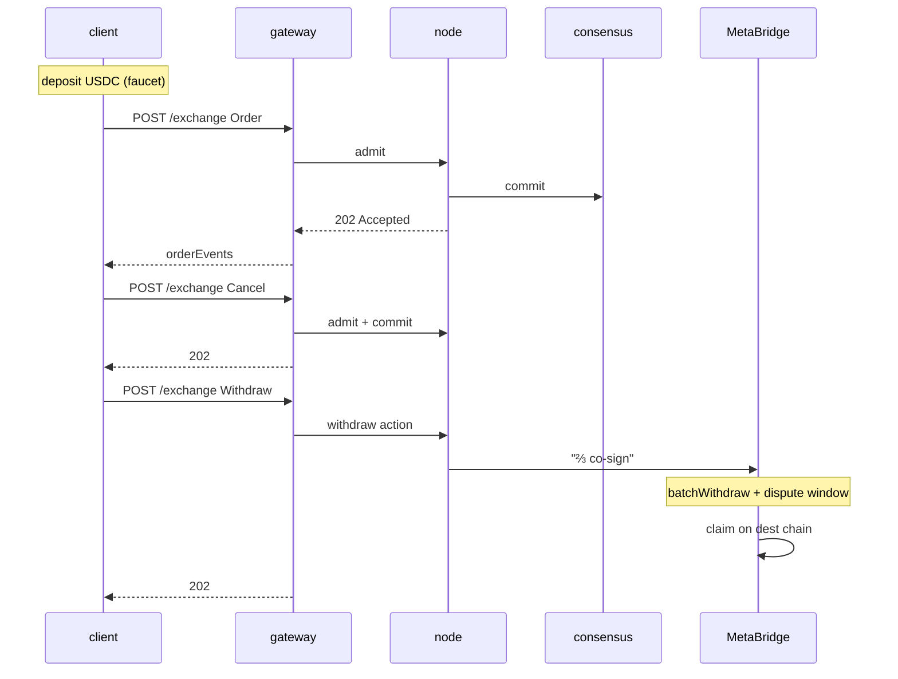

# 快速开始 — 5 分钟端到端

:::info
**状态。** **稳定的**接线表面。Devnet 端点，无主网保证。
:::

存款、下单、取消、提现。到本页面结束，您的 TypeScript / Python / curl 会话已针对 devnet 完成了完整的往返。

## 前置条件

- 一个 EVM 私钥（任何 32 字节十六进制；对于 devnet，生成新的 — 不要重用主网密钥）
- 某条 MetaBridge 源链上的 USDC（Base；Solana 和 Arbitrum 即将推出）— devnet 允许使用水龙头路由
- `curl` 或任何 HTTP 客户端

## 端点

网关是唯一的公共前门。MTF-native 是默认路径；
HL-compat 位于 `/hl/*` 下。

| 服务 | URL (devnet) |
|---------|--------------|
| 网关前门 | `https://devnet-gateway.mtf.exchange` |
| MTF-native（默认） | `POST /info` · `POST /exchange` · `GET /ws` |
| HL-compat | `POST /hl/info` · `POST /hl/exchange` · `GET /hl/ws` |
| CCXT-compat | `/ccxt/*` |
| EVM JSON-RPC | `POST /evm` |
| 水龙头（devnet） | `POST /faucet` |
| 浏览器 | `https://devnet.mtf.exchange/explorer` |

> 水龙头**不是**单独的服务 — 它是网关前门上的 `POST /faucet` 路由。自己运行节点？相同的原生表面
> （`/info` · `/exchange` · `/ws` · `/faucet`）直接在
> `http://localhost:8080` 上服务。参见 [`POST /faucet`](../api/rest/faucet.md)。

查看[网络](../networks.md)以获取完整列表，包括测试网和（发布后）主网。

## 第 1 步 — 获取 devnet USDC

```bash
curl -X POST https://devnet-gateway.mtf.exchange/faucet \
  -H 'content-type: application/json' \
  -d '{"address":"0x<YOUR_ADDRESS>"}'
# -> {"address":"0x…","usdc":3000,"mtf":10,"status":"queued"}
```

一次领取授予**3000 USDC** 跨抵押品**和 10 MTF** 现货代币 —
**每个地址仅一次**（第二次领取返回 `429 address already funded`），
频率限制为 1 / 分钟 / IP。可选的 `amount` 仅将 USDC 授予向下限制（≤ 3000）；MTF 是固定的。授予是 `"queued"` — 大约 1 个区块后到达，
所以在确认余额之前等待一下：

下面的原始 curl 使用网关上 `/hl/*` 下的 **HL-compat** 形状
（camelCase 类型如 `clearinghouseState` / `openOrders`、msgpack 签名的
信封）— 如果您已有 HL 客户端，这很方便。`@metaflux/sdk` 示例
改为在网关的默认路径（`/info` · `/exchange`）上使用 MTF-native。
选择一条道路；两者都经过同一个前门，只是不同的路径。

```bash
curl -X POST https://devnet-gateway.mtf.exchange/hl/info \
  -H 'content-type: application/json' \
  -d '{"type":"clearinghouseState","user":"0x<YOUR_ADDRESS>"}'
```

您应该会看到 `marginSummary.accountValue: "3000.0"`。

## 第 2 步 — 下单

完整的签名流程在[签名](./signing.md)中。对于此快速入门，使用官方 TypeScript SDK（`@metaflux/sdk` — 在主网前发布；参见 [TypeScript SDK](./typescript-sdk.md)）。

```typescript
import { MetaFluxClient } from '@metaflux/sdk';

const client = new MetaFluxClient({
  privateKey: process.env.PRIVATE_KEY!,
  baseUrl:    'https://devnet-gateway.mtf.exchange', // MTF-native is the gateway default path
  chainId:    31337,
});

const meta = await client.info.meta();
const btcId = meta.universe.findIndex(m => m.name === 'BTC');

const result = await client.exchange.order({
  asset:    btcId,
  isBuy:    true,
  price:    '50000',
  size:     '0.1',
  tif:      'Gtc',
  reduceOnly: false,
});

console.log('order id:', result.oid);
```

原始 curl（HL-compat 形状 — 您自己构建签名；参见[签名](./signing.md)）：

```bash
curl -X POST https://devnet-gateway.mtf.exchange/hl/exchange \
  -H 'content-type: application/json' \
  -d @order.json
```

其中 `order.json` 是您组装的 HL 形状信封。

### 现货交易示例

[现货](../concepts/spot-trading.md)是一个代币对代币 CLOB，与
永续合约分离 — 无杠杆、无头寸。使用原生
[`spot_order`](../api/rest/exchange.md#spot_order) 操作下达现货单：它采用一个**现货对
id**（不是永续合约 `market`）、一个 `side`、一个 `limit_px`、一个 `size` 和一个 `tif`。一个
待执行的 `gtc`/`alo` 订单锁定预留余额托管；`ioc` 永不待执行。

```jsonc
// the `action` you sign and POST to /exchange (sender-authorized, no `owner`)
{
  "type": "spot_order",
  "order": {
    "pair":     200,           // spot pair id from /info, not a perp market id
    "side":     "bid",         // bid = buy base (pays quote); ask = sell base
    "size":     100000000,
    "limit_px": 200000000,     // a limit is required — market spot is not yet supported
    "tif":      "gtc",
    "stp_mode": "cancel_oldest"
  }
}
```

同步响应包含分配的 `oid`，带有 `resting` 或 `filled`
条目（与永续合约订单相同的状态联合）。通过 [`POST /info`](../api/rest/info.md) 读回您的现货余额和
未平仓现货订单；通过
[`spot_cancel`](../api/rest/exchange.md#spot_cancel) 取消，这会退款托管。

## 第 3 步 — 检查订单是否在账簿上

```bash
curl -X POST https://devnet-gateway.mtf.exchange/hl/info \
  -H 'content-type: application/json' \
  -d '{"type":"openOrders","user":"0x<YOUR_ADDRESS>"}'
```

您应该会看到您的订单，其中 `oid` 来自第 2 步。

或者，订阅实时更新（对于任何非平凡的使用，首选）：

```typescript
const ws = client.ws();
ws.subscribe('userEvents', { user: client.address }, (event) => {
  console.log('event:', event);
});
```

## 第 4 步 — 取消

```typescript
await client.exchange.cancel({ asset: btcId, oid: result.oid });
```

```bash
# raw curl
curl -X POST https://devnet-gateway.mtf.exchange/hl/exchange \
  -d @cancel.json
```

## 第 5 步 — 提现

```typescript
await client.exchange.withdrawUsdc({
  amount:           '100',
  destinationChain: 'Arbitrum',
  destinationAddr:  '0x<DESTINATION>',
});
```

这排队了一个 MetaBridge 提现。在 MetaFlux 验证器集合共同签署到 ⅔ 权益加权法定人数，且争议窗口过期（几分钟）后，您可以在目标链上 `claim`（参见[桥接](../bridge/)）。

## 刚才发生了什么



## 后续步骤

- [签名](./signing.md) — SDK 签名内部
- [实践中的代理钱包](./agent-wallets-howto.md) — 生产热密钥模式
- [订单类型](../concepts/order-types.md) — 超出普通限价订单
- [错误处理](./error-handling.md) — 录取与提交与网络
- [WS 订阅](../api/ws/subscriptions.md) — 推送实时数据
- [从 HL 迁移](./migrating-from-hl.md) — 已经有 HL 机器人？先看这个页面

## 故障排除

<details>
<summary>显示故障排除</summary>

| 症状 | 可能的原因 | 修复 |
|---------|--------------|-----|
| `401 signer is not the sender` | 错误的 `chainId` | 使用 `31337` 用于 devnet |
| `400 invalid msgpack` | 编码器重新排序映射键 | 使用标准兼容的 msgpack 库 |
| `404 unknown user` on info | 地址还没有链上状态 | 先存款（水龙头） |
| `429 rate limit` | 太多请求 | 参见[速率限制](../api/rate-limits.md)；退避 |
| 提现在目标链上卡住 | MetaBridge 提现待决（争议窗口） | 等待 ⅔ 共同签署 + 争议窗口；然后在目标链上 `claim`（参见[桥接](../bridge/)） |

</details>

## 另见

- [网络](../networks.md) — devnet / 测试网 / 主网端点 + chainIds
- [签名](./signing.md) — 完整的信封规范
- [`POST /exchange`](../api/rest/exchange.md)
- [`POST /info`](../api/rest/info.md)
- [WS](../api/ws/index.md)
