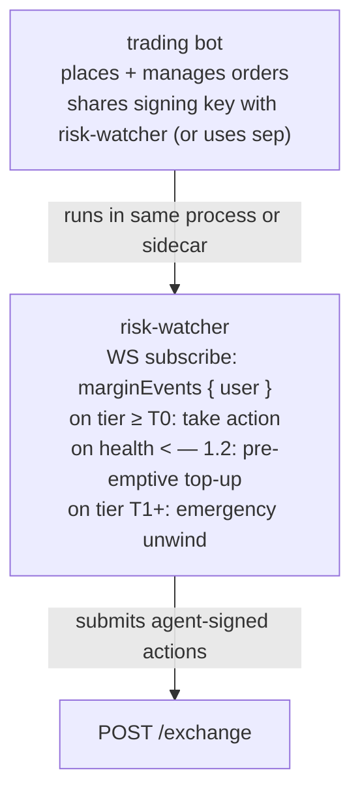
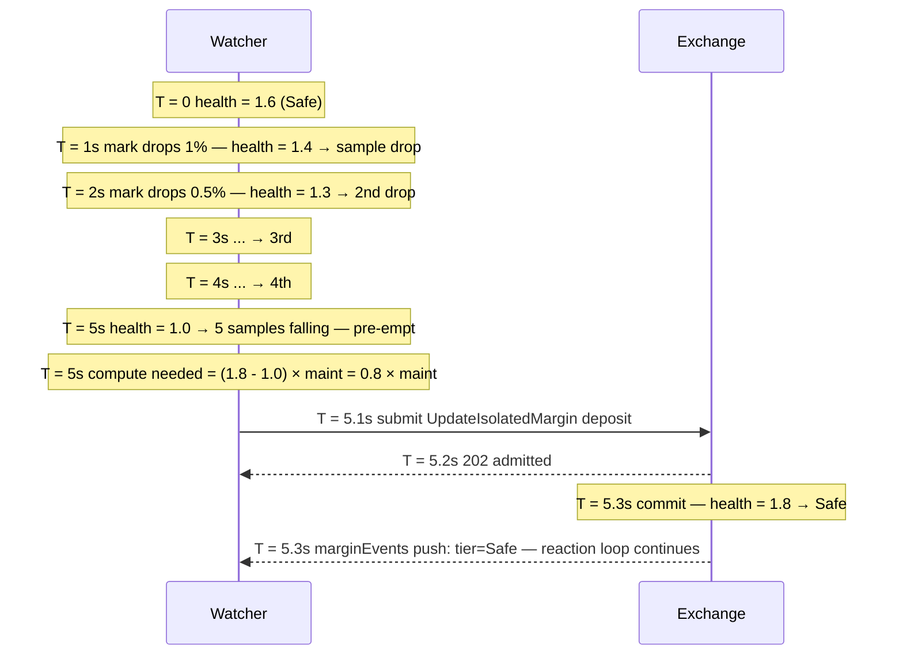

# 风险监控程序模式

:::tip
**稳定版。**
:::

风险监控程序（risk-watcher）是一个自动化进程，用于持续监测账户健康状态，并在协议的[分级清算](../concepts/tiered-liquidation.md)阶梯触发之前主动介入——补充保证金、缩减仓位或采取防御性交易。

任何持仓过夜的生产级交易机器人都应运行一个风险监控程序。协议的 T0 黄牌给你留出约一个区块（~100ms）的反应时间；风险监控程序的作用就是让这段时间得到有效利用。

## 概要

订阅 `marginEvents`，响应分级状态变化：在 `maint_margin` 触及约束线之前，通过 `UpdateIsolatedMargin`（隔离保证金模式）或 `Deposit`（全仓模式）及时补仓。

## 架构



即便风险监控程序与交易程序部署在同一进程中，两者在逻辑上仍是独立的——其决策与交易策略的决策互不干涉。一个常见的错误是将"要不要平掉这个仓位？"和"要不要做这笔交易？"混为一谈；风险监控程序只回答前者。

## 输入数据

- `marginEvents` WS 推送：实时的 `account_value`、`maint_margin`、`health`、`tier`。
- `mark` WS 推送（按持仓资产）：用于前瞻性估算。
- `fundingTicks` WS 推送：用于预判每小时资金费用。

## 响应规则

| 触发条件 | 动作 | 说明 |
|---------|--------|-----------|
| `health < 1.5` 且连续 5 个样本持续下降 | 主动补仓，将健康度拉回 1.8 | T0 之前的缓冲 |
| `分级跃升至 T0` | 立即补仓或部分平仓 | 有一个区块的时间在 T1 触发前行动 |
| `分级跃升至 T1` | 紧急处理：对亏损最大的仓位全部平仓 | 抢在协议以更差价格强制部分平仓之前自救 |
| 下一分钟内资金费用 > 0.5 × free_collateral | 提前补仓 | 资金费用可能直接将你推入 T0 |
| 标记价格在 30 秒内波动超过近 1 小时 sigma 的 3 倍 | 快照持仓并告警运营人员 | 可能发生市场结构突变 |

阈值需根据策略自行调整。激进做市商：收紧缓冲（健康度下限 1.3）。保守账本：放宽缓冲（健康度下限 1.8）。

## 实现示例（TypeScript）

```typescript
import { MetaFluxClient } from '@metaflux/sdk';

const trader = new MetaFluxClient({ /* trading agent */ });
const watcher = new MetaFluxClient({ /* dedicated watcher agent */ });

const TARGET_HEALTH = 1.8;
const T0_DEPOSIT_USDC = 1000;  // tune to position size

let recentSamples: number[] = [];

watcher.ws().subscribe('marginEvents', { user: trader.address }, async (event) => {
  const { health, tier, account_value, maint_margin } = event.data;

  recentSamples.push(health);
  if (recentSamples.length > 5) recentSamples.shift();

  // Tier-based reactions
  if (tier === 'T1') {
    console.log('[ALERT] T1 — emergency unwind');
    await emergencyUnwind(trader);
    return;
  }
  if (tier === 'T0') {
    console.log('[WARN] T0 — top up');
    await deposit(watcher, T0_DEPOSIT_USDC);
    return;
  }

  // Pre-emptive
  const allFalling = recentSamples.length === 5
    && recentSamples.every((h, i) => i === 0 || h < recentSamples[i-1]);
  if (allFalling && health < 1.5) {
    console.log('[INFO] pre-emptive top-up');
    const needed = Math.ceil((TARGET_HEALTH * maint_margin - account_value) / 1e6);
    await deposit(watcher, needed);
  }
});

async function deposit(c: MetaFluxClient, usdc: number) {
  // For Cross: assume USDC already in the master's free balance
  // For Isolated: use UpdateIsolatedMargin to add to the bucket
  await c.exchange.updateIsolatedMargin({
    asset: 0,
    isIsolated: true,
    isolatedAmount: (usdc * 1e6).toString(),
  });
}

async function emergencyUnwind(c: MetaFluxClient) {
  const state = await c.info.clearinghouseState();
  for (const pos of state.assetPositions) {
    // close the largest-loss position first
    await c.exchange.order({
      asset: pos.coin,
      isBuy: pos.szi < 0,    // opposite side closes
      price: '0',            // market (extreme price)
      size:  Math.abs(pos.szi).toString(),
      tif:   'Ioc',
      reduceOnly: true,
    });
  }
}
```

## 关键设计决策

- **为监控程序使用独立 Agent。** 交易 Agent 负责下单，监控 Agent 负责保证金管理。即便交易主机遭到入侵，也无法影响保证金操作。
- **监控程序的权限范围。** Agent 可以提交 `UpdateIsolatedMargin` 以及下单/撤单，但**无法**提款，因此监控程序只能在子账户内部的保证金桶之间调拨资金，无法将资金转出账户——这正是我们期望的行为。
- **监控程序的 nonce 空间。** 监控 Agent 与交易 Agent 共享主账户的 nonce 空间（参见 [Agent 钱包](../concepts/agent-wallets.md)）。两端均使用 `Date.now()` 即可，毫秒以内的碰撞概率可以忽略不计。

## 补仓计算公式

将健康度从 H₀ 提升到目标值 H₁ 所需的补仓量：

```
needed_deposit = (H₁ - H₀) × maint_margin
```

示例：维持保证金 = 10 USDC，当前健康度 1.0，目标 1.5。
所需补仓 = (1.5 - 1.0) × 10 = 5 USDC。

建议为每个区块的补仓金额设置上限，避免在短暂波动时过度消耗资金。激进的默认策略：预留 1 倍仓位名义价值用于补仓；耗尽后上报运营人员处理。

## 时序示例——主动补仓



## 常见故障模式

- **监控程序与交易程序产生竞争条件。** 交易程序提交了新仓位，监控程序对尚在途中的仓位作出响应。解决方法：仅在区块提交后才响应（保证金事件在提交时触发，因此这一点已由协议保证）。
- **监控程序的 Agent 已过期。** 压力期间监控程序无法执行操作。应对措施：定期轮换 Agent、监控 Agent 到期时间，确保剩余有效期不低于 24 小时。
- **压力期间内存池已满。** 监控程序的补仓请求返回 503。采用指数退避加随机抖动的方式重试，提交频率最高每 100ms 一次。
- **补仓成功但预言机价格持续走坏。** 补仓提高了 account_value，但若 maint 也随之上升（标记价格继续不利移动），健康度改善可能不足。处理方式：等待区块提交后重新评估；再次补仓或开始平仓。

## 不建议部署风险监控程序的场景

- 极短周期仓位（在同一区块内开仓并平仓）——健康度无关紧要。
- 纯现货交易且不使用保证金——不存在清算阶梯。
- 完全隔离的单仓机器人，且已明确接受该保证金桶的亏损上限——自动补仓会破坏原有的风险隔离机制。

## 相关资源

- [分级清算](../concepts/tiered-liquidation.md) — 你所防范的清算阶梯机制
- [`userEvents` WS](../api/ws/subscriptions.md#userevents) — 保证金与分级状态变化通过此通道推送
- [`update_isolated_margin`](../api/rest/exchange.md#update_isolated_margin)
- [Agent 钱包](../concepts/agent-wallets.md) — 监控程序需要其专属的已授权 Agent
- [错误处理](./error-handling.md) — 补仓提交的重试逻辑
