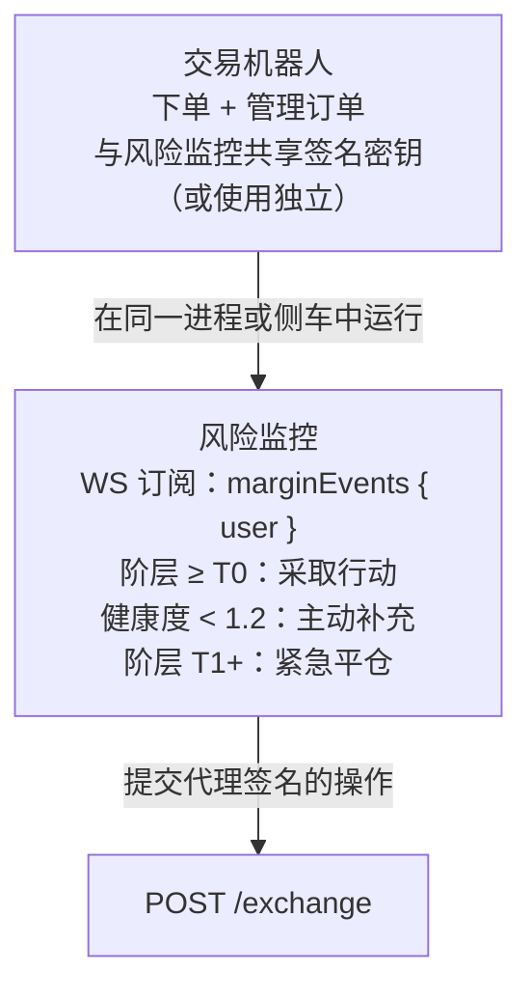
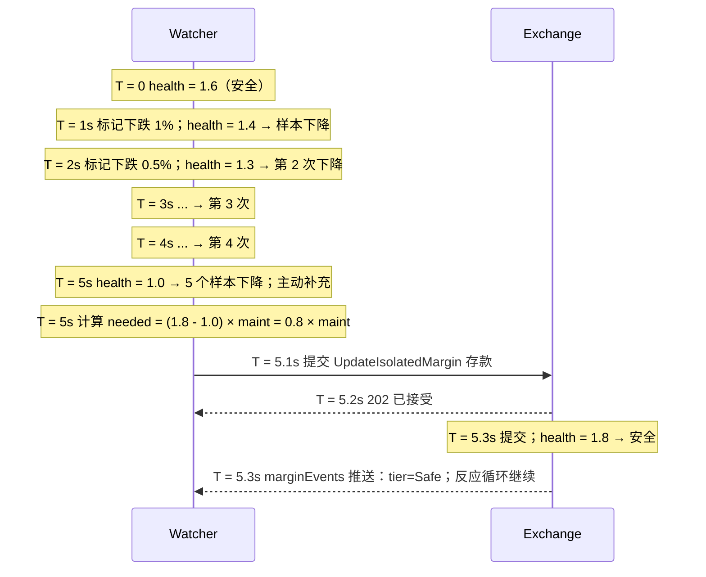

# 风险监控模式

:::tip
**稳定版本。**
:::

风险监控是一个自动化流程，用于监视您账户的健康状况并进行干预——存入保证金、减少头寸或进行防守性交易——以防协议的[分层清算](../concepts/tiered-liquidation.md)阶梯对您生效。

持仓过夜的生产交易机器人应该运行一个。协议的 T0 黄牌给您一个区块的时间（约 100ms）；风险监控会高效地利用这个区块。

## 摘要

订阅 `marginEvents`，对阶层转换做出反应，在 `maint_margin` 生效前通过 `UpdateIsolatedMargin`（隔离）或 `Deposit`（交叉）进行补充。

## 架构



监控器是独立的逻辑流程，即使在共存时也是如此——其决策独立于交易策略的决策。常见的失败模式是混淆"我应该平仓这个头寸吗？"与"我应该进行这笔交易吗？"；风险监控只回答第一个问题。

## 输入

- `marginEvents` WS 推送：实时 `account_value`、`maint_margin`、`health`、`tier`。
- `mark` WS 推送（每个持有资产）：用于前瞻性估计。
- `fundingTicks` WS 推送：预测每小时融资费用。

## 反应规则

| 触发条件 | 操作 | 理由 |
|---------|------|------|
| `health < 1.5` 且连续 5 个样本下降 | 主动存入以将健康度提升至 1.8 | T0 前的缓冲 |
| `阶层转换至 T0` | 立即存入或部分平仓 | 一个区块的时间在 T1 前采取行动 |
| `阶层转换至 T1` | 紧急：全部平仓损失最大的头寸 | 抢在更差的价格部分平仓前 |
| `下一分钟融资支付 > 0.5 × free_collateral` | 预先存入 | 融资费用可能使您进入 T0 |
| 标记价格在 30 秒内移动 > 3× 最近 1 小时西格玛 | 快照头寸 + 警报操作员 | 可能的制度转变 |

根据您的策略调整阈值。激进的做市商：更紧的缓冲（健康度 1.3 底线）。保守策略：更松（健康度 1.8 底线）。

## 实现草图（TypeScript）

```typescript
import { MetaFluxClient } from '@metaflux/sdk';

const trader = new MetaFluxClient({ /* 交易代理 */ });
const watcher = new MetaFluxClient({ /* 专用监控代理 */ });

const TARGET_HEALTH = 1.8;
const T0_DEPOSIT_USDC = 1000;  // 根据头寸大小调整

let recentSamples: number[] = [];

watcher.ws().subscribe('marginEvents', { user: trader.address }, async (event) => {
  const { health, tier, account_value, maint_margin } = event.data;

  recentSamples.push(health);
  if (recentSamples.length > 5) recentSamples.shift();

  // 基于阶层的反应
  if (tier === 'T1') {
    console.log('[ALERT] T1 — 紧急平仓');
    await emergencyUnwind(trader);
    return;
  }
  if (tier === 'T0') {
    console.log('[WARN] T0 — 补充保证金');
    await deposit(watcher, T0_DEPOSIT_USDC);
    return;
  }

  // 主动补充
  const allFalling = recentSamples.length === 5
    && recentSamples.every((h, i) => i === 0 || h < recentSamples[i-1]);
  if (allFalling && health < 1.5) {
    console.log('[INFO] 主动补充');
    const needed = Math.ceil((TARGET_HEALTH * maint_margin - account_value) / 1e6);
    await deposit(watcher, needed);
  }
});

async function deposit(c: MetaFluxClient, usdc: number) {
  // 交叉模式：假设 USDC 已在主账户的自由余额中
  // 隔离模式：使用 UpdateIsolatedMargin 将资金添加到桶中
  await c.exchange.updateIsolatedMargin({
    asset: 0,
    isIsolated: true,
    isolatedAmount: (usdc * 1e6).toString(),
  });
}

async function emergencyUnwind(c: MetaFluxClient) {
  const state = await c.info.clearinghouseState();
  for (const pos of state.assetPositions) {
    // 先平仓损失最大的头寸
    await c.exchange.order({
      asset: pos.coin,
      isBuy: pos.szi < 0,    // 反向平仓
      price: '0',            // 市价（极端价格）
      size:  Math.abs(pos.szi).toString(),
      tif:   'Ioc',
      reduceOnly: true,
    });
  }
}
```

## 关键选择

- **监控使用独立代理。** 交易员的代理进行交易；监控的代理管理保证金。交易主机的妥协不会导致保证金操纵。
- **监控权限。** 代理可以提交 `UpdateIsolatedMargin` 和下单/撤单。代理无法提现，因此监控无法将资金移出账户——只能在子桶之间移动。这是理想的。
- **监控随机数空间。** 监控和交易员共享主账户的随机数空间（参见[代理钱包](../concepts/agent-wallets.md)）。两者都使用 `Date.now()`——碰撞风险是毫秒级以下。

## 预存数学

从健康度 H₀ 提升至目标 H₁：

```
needed_deposit = (H₁ - H₀) × maint_margin
```

示例：maint = 10 USDC，当前健康度 1.0，目标 1.5。
needed = (1.5 - 1.0) × 10 = 5 USDC。

限制监控每个区块的存款额以避免在瞬间制度中花费过多。激进默认值：保留 1× 头寸名义金额用于补充；一旦耗尽，升级至操作员。

## 序列 —— 主动补充



## 失败模式

- **监控与交易员竞争。** 交易员提交新头寸；监控对在途头寸做出反应。解决：仅在提交后反应（边界事件在提交时触发，所以这已经是这样了）。
- **监控的代理已过期。** 在压力下，监控无法采取行动。缓解：紧凑的轮换节奏，监控代理过期，永远不要 < 24 小时至过期。
- **压力下内存池已满。** 监控的存款收到 503。使用指数退避重试；每 100ms 最多提交一次。
- **存款成功但预言机仍然不利。** 存款提高了 account_value；如果 maint 也上升（标记对您不利），健康度可能不会改善足够。循环：提交后重新评估；再次存款或平仓。

## 何时不部署风险监控

- 极短期头寸（在单个区块内开仓和平仓）——健康度不重要。
- 纯现货交易无保证金——不适用清算阶梯。
- 完全隔离单头寸机器人，您已明确接受桶损失限制——自动化补充会破坏隔离。

## 参阅

- [分层清算](../concepts/tiered-liquidation.md) —— 您正在防守的阶梯
- [`userEvents` WS](../api/ws/subscriptions.md#userevents) —— 保证金/阶层转换在此通道上
- [`update_isolated_margin`](../api/rest/exchange.md#update_isolated_margin)
- [代理钱包](../concepts/agent-wallets.md) —— 监控需要其自己的批准代理
- [错误处理](./error-handling.md) —— 用于存款提交重试逻辑
