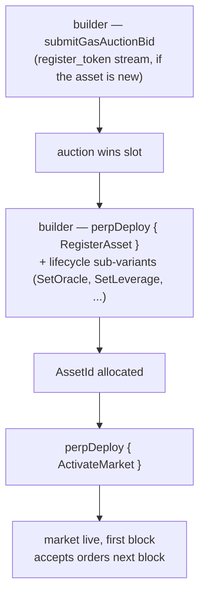

# MIP-3 — 无许可永续市场部署

:::info
**已实施。**
:::

任何开发者均可通过支付链上 Gas 拍卖费用，在 MetaFlux 上部署新的永续合约市场，无需协议团队审批、评审委员会或白名单资格。拍卖价格加上最低保证金是唯一的准入门槛。（无许可**现货**市场部署为同系列提案，参见 [MIP-1](./mip-1.md)。）

## 设计背景

这是协议的核心能力之一。中心化交易所对上币项目进行人工筛选；MetaFlux 则将上币流程本身纳入协议层。希望为小众资产创建市场的开发者无需任何许可——只需赢得拍卖并提交初始参数即可。

MetaFlux 对业内领先链上永续合约平台所开创的无许可市场部署设计进行了适配，保留了以下对应关系与调整：

- 三条独立的 Gas 拍卖通道（`perp_deploy_gas_auction`、`spot_pair_deploy_gas_auction`、`register_token_gas_auction`）——结构与 HL 相同。永续部署对应 MIP-3；现货通道对应 [MIP-1](./mip-1.md)。
- 拍卖参数（衰减率、退款窗口期、槽位间隔）可通过治理配置
- 初始维持保证金比率、最大杠杆、资金费率上限——随部署竞价一并提交，须在治理设定的范围内

## 部署流程



永续合约部署通过 `perpDeploy` 动作执行，由 `PerpDeployKind` 子变体分发，覆盖市场完整生命周期（共 8 个子变体）：

1. **`RegisterAsset`** — 注册新的永续资产，分配 `AssetId`。（若代币符号尚未注册，需先通过 `register_token_gas_auction` 通道完成注册。）
2. **`SetOracle`** — 绑定或轮换该资产的预言机数据源子集。
3. **`SetLeverage`** — 设置最大杠杆上限。
4. **`SetFeeTier`** — 设置挂单方/吃单方手续费档位（基点，受单市场上限约束）。
5. **`SetMakerRebate`** — 设置挂单方返佣（基点，≤ 2）。
6. **`SetMinSize`** — 设置市场最小下单规模。
7. **`ActivateMarket`** — 激活市场（开放交易；需完成全部配置）。
8. **`DeactivateMarket`** — 停止接受新订单（现有持仓继续有效）。

赢得部署槽位需通过 Gas 拍卖：开发者针对相应通道调用 **`submitGasAuctionBid { auction_kind, bid_amount, ... }`**。每笔竞价包含：
- 一笔 USDC 金额，在提交时托管，竞价失败后退还（扣除少量手续费）。
- 市场规格参数——初始杠杆、维持保证金比率、资金费率参数、预言机数据源配置。

拍卖在区块边界结算——每个槽位最高出价者胜出，中标金额直接销毁（不支付给任何人），规格参数成为已部署市场的正式参数。

## 竞价托管与退款

竞价在拍卖期间处于托管状态。竞价失败时，金额扣除少量拍卖手续费后退还至开发者账户。竞价成功时，中标金额在槽位结束时销毁（不支付给任何人）。

可通过以下接口查询当前有效竞价：

```json
POST /info { "type": "mip3_active_bids" }
```

## 参数边界

治理设定竞价规格参数必须满足的范围限制：

- 初始杠杆在 `[1, max_leverage]` 区间内（默认 `max_leverage = 50`）
- 维持保证金比率 ≥ `min_maintenance_ratio`（默认 1%）
- 资金费率上限 ≤ `max_funding_per_hour`（默认 0.5%）
- 预言机数据源须来自已批准列表

参数超出边界的竞价将在提交时被拒绝。

## 拍卖参数

每条通道（永续合约 / 现货 / 代币注册）的拍卖均包含以下参数：

- **槽位间隔** — 新一轮拍卖的结算频率（治理配置，默认 1 小时）
- **衰减率** — 若槽位无人认领，最低出价的下降方式（治理配置，默认 24 小时内线性衰减）
- **退款窗口期** — 槽位结束后，落败竞价方可申请退款的时限（治理配置，默认 7 天）

以上三项均可通过 `SetGlobal` 动作由治理修改（MIP-3 开发者治理全局参数：`SetGasAuctionDuration`、`SetMinDeployStake`、`SetGasAuctionMinBid`、`SetDeployerFeeCap`、`SetPerMarketLimits`、`SetEnableMip3`）。

## 部署后

新市场从下一个区块起进入正式资产注册表。流动性由开发者自行解决，协议不提供初始挂单。

开发者通常通过将 MIP-3 部署与同一市场的流动性来源结合来引导深度——例如 [MIP-2 Metaliquidity](./mip-2.md)、通过开发者手续费返佣吸引的外部做市商，或用户创建的金库。

## MIP-4

MetaFlux 运营的聚合器与无许可部署形成互补，详见 [MIP-4 — 永续流动性聚合器 / 内化器](mip-4.md)。

## 另请参阅

- [MIP-1 — 现货代币标准 + 市场部署](./mip-1.md) — 无许可部署的现货同系列提案
- [分级清算](../concepts/tiered-liquidation.md) — 同样适用于 MIP-3 部署的市场，与协议上线市场一致
- [组合保证金](../concepts/portfolio-margin.md) — MIP-3 市场通过标准情景纳入机制接入组合保证金
