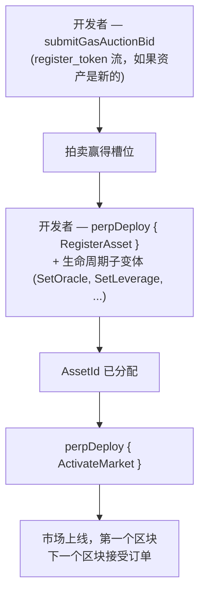

# MIP-3 — 无权限衍生品市场部署

:::info
**已实施。**
:::

任何开发者都可以通过链上燃气费拍卖在 MetaFlux 上部署新的永续合约市场。没有协议团队的门槛控制，没有审核委员会，没有白名单。拍卖价格加上最小押金是唯一的障碍。（无权限**现货**市场部署是姊妹提案，[MIP-1](./mip-1.md)。）

## 为什么存在此提案

核心的差异化轴线。中心化交易所管理上市；MetaFlux 让上市流程本身成为协议的一部分。想要为某个利基资产创建市场的开发者不需要获得许可 — 他们需要赢得拍卖并提供种子参数。

这是 MetaFlux 对先进的链上衍生品协议所开创的无权限市场部署设计的改进，保持以下等价性和调整：

- 三个不同的燃气费拍卖流（`perp_deploy_gas_auction`、`spot_pair_deploy_gas_auction`、`register_token_gas_auction`）— 与 HL 结构相同。衍生品部署是 MIP-3；现货流支持 [MIP-1](./mip-1.md)。
- 拍卖参数（衰减、退款窗口、槽位间隔）由治理配置
- 初始维护率、最大杠杆、资金费用上限 — 随部署竞价提交，受治理设定的范围限制

## 部署流程



衍生品部署是 `perpDeploy` 操作，由 `PerpDeployKind` 子变体分发，涵盖完整的市场生命周期（8 个子变体）：

1. **`RegisterAsset`** — 注册新的永续合约资产；分配一个 `AssetId`。（如果令牌符号还没有注册，需要先通过 `register_token_gas_auction` 流注册。）
2. **`SetOracle`** — 绑定 / 轮换资产的预言机来源子集。
3. **`SetLeverage`** — 设置最大杠杆上限。
4. **`SetFeeTier`** — 设置做市商 / 交易者费用等级（基点，受单个市场限制的上限）。
5. **`SetMakerRebate`** — 设置做市商返佣（基点，≤ 2）。
6. **`SetMinSize`** — 设置市场的最小订单规模。
7. **`ActivateMarket`** — 激活市场（允许交易；需要完整配置）。
8. **`DeactivateMarket`** — 关闭新订单（现有头寸保留）。

赢得部署槽位需要通过燃气费拍卖进行：开发者针对相关流调用 **`submitGasAuctionBid { auction_kind, bid_amount, ... }`**。每个竞价包括：
- 一个 USDC 金额，在提交时托管，失败时退款（减去小额费用）。
- 市场规格 — 初始杠杆、维护保证金率、资金费用参数、预言机源配置。

拍卖在区块边界处结算 — 每个槽位的最高出价者获胜，支付金额被销毁（不支付给任何人），规格参数成为已部署市场的参数。

## 竞价托管与退款

竞价在拍卖运行期间被托管。失败时，竞价被返还给开发者账户，减去小额拍卖费。成功时，获胜金额在槽位结束时被销毁（不支付给任何人）。

活跃竞价可通过以下方式查看：

```json
POST /info { "type": "mip3_active_bids" }
```

## 参数范围

治理设置了竞价规格参数必须遵循的范围：

- 初始杠杆在 `[1, max_leverage]` 内（默认 `max_leverage = 50`）
- 维护保证金率 ≥ `min_maintenance_ratio`（默认 1%）
- 资金费用上限 ≤ `max_funding_per_hour`（默认 0.5%）
- 预言机源来自批准列表

具有超出范围参数的竞价在提交时被拒绝。

## 拍卖参数

每个流（衍生品 / 现货 / 令牌注册），拍卖具有：

- **槽位间隔** — 新拍卖结算的频率（治理，默认 1 小时）
- **衰减** — 如果槽位未被认领，最小竞价如何下降（治理，默认在 24 小时内线性下降）
- **退款窗口** — 槽位关闭后失败竞价者可以申请退款的时长（治理，默认 7 天）

所有三个都可通过 `SetGlobal` 操作由治理更改（MIP-3 开发者治理全局变量：`SetGasAuctionDuration`、`SetMinDeployStake`、`SetGasAuctionMinBid`、`SetDeployerFeeCap`、`SetPerMarketLimits`、`SetEnableMip3`）。

## 部署后

新市场从下一个区块开始存在于规范资产注册表中。流动性是开发者的问题；协议不提供种子订单。

开发者通常通过将 MIP-3 部署与同一市场上的流动性来源相结合来引导深度 — [MIP-2 元流动性](./mip-2.md)、由开发者费用返佣吸引的外部做市商，或用户创建的金库。

## MIP-4

参见 [MIP-4 — 衍生品流动性聚合器 / 内部化器](mip-4.md)了解补充无权限部署的 MetaFlux 运营的聚合器。

## 另见

- [MIP-1 — 现货令牌标准 + 市场部署](./mip-1.md) — 无权限部署的现货姊妹提案
- [分级清算](../concepts/tiered-liquidation.md) — 适用于 MIP-3 已部署的市场，就像协议列出的市场一样
- [组合保证金](../concepts/portfolio-margin.md) — MIP-3 市场通过标准情景包含选择加入 PM
