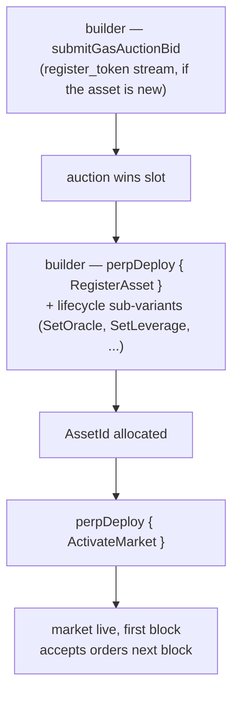

# MIP-3 — 无许可永续合约市场部署

:::info
**已实施。**
:::

任何开发者均可通过链上 Gas 竞拍，在 MetaFlux 上部署新的永续合约市场，无需经过协议团队审批，无需评审委员会，也无需白名单准入。唯一的门槛是竞拍价加上最低保证金存款。（无许可**现货**市场部署的姊妹提案，请参见 [MIP-1](./mip-1.md)。）

## 设计初衷

这是 MetaFlux 的核心差异化方向。中心化交易所依赖人工筛选上币；MetaFlux 则将上币流程本身纳入协议层。想为某种小众资产创建市场的开发者无需任何人的许可——只需赢得竞拍并提供初始参数。

MetaFlux 在借鉴主流链上永续合约平台无许可市场部署设计的基础上进行了适配与调整，主要对应关系如下：

- 三条独立的 Gas 竞拍通道（`perp_deploy_gas_auction`、`spot_pair_deploy_gas_auction`、`register_token_gas_auction`）——结构与 HL 相同。永续合约部署对应 MIP-3；现货通道参见 [MIP-1](./mip-1.md)。
- 竞拍参数（衰减率、退款窗口、槽间隔）可通过治理配置
- 初始维持保证金比率、最大杠杆倍数、资金费率上限——随竞拍报价一同提交，须在治理设定的范围内

## 部署流程



永续合约部署使用 `perpDeploy` 操作，通过 `PerpDeployKind` 子变体覆盖市场完整生命周期，共 8 个子变体：

1. **`RegisterAsset`** — 注册新的永续合约资产，分配 `AssetId`。（若代币符号尚未注册，须先通过 `register_token_gas_auction` 通道完成注册。）
2. **`SetOracle`** — 绑定或切换该资产的预言机来源子集。
3. **`SetLeverage`** — 设置最大杠杆上限。
4. **`SetFeeTier`** — 设置挂单方/吃单方手续费档位（单位 bps，受每市场限额约束）。
5. **`SetMakerRebate`** — 设置挂单方返佣（单位 bps，上限 ≤ 2）。
6. **`SetMinSize`** — 设置该市场的最小下单数量。
7. **`ActivateMarket`** — 激活市场（开放交易；需完成全部配置）。
8. **`DeactivateMarket`** — 停止接受新订单（已有持仓继续有效）。

赢得部署槽位需通过 Gas 竞拍完成：开发者调用 **`submitGasAuctionBid { auction_kind, bid_amount, ... }`** 向对应通道发起报价。每笔报价包含：
- 一笔 USDC 金额，提交时锁入托管，竞拍失败后退还（扣除少量手续费）。
- 市场规格参数——初始杠杆、维持保证金比率、资金费率参数、预言机来源配置。

竞拍在区块边界结算——每个槽位最高出价者胜出，中标金额销毁（不归任何人所有），规格参数成为所部署市场的正式参数。

## 报价托管与退款

竞拍进行期间，报价资金锁入托管。竞拍失败时，报价金额退回开发者账户，扣除少量竞拍手续费。竞拍胜出时，中标金额在槽位关闭时销毁（不归任何人所有）。

可通过以下接口查看当前有效报价：

```json
POST /info { "type": "mip3_active_bids" }
```

## 参数范围

治理机制设定报价规格参数须满足的边界条件：

- 初始杠杆范围 `[1, max_leverage]`（默认 `max_leverage = 50`）
- 维持保证金比率 ≥ `min_maintenance_ratio`（默认 1%）
- 资金费率上限 ≤ `max_funding_per_hour`（默认 0.5%）
- 预言机来源须在已批准列表内

超出范围的报价将在提交时被直接拒绝。

## 竞拍参数

每条通道（永续合约 / 现货 / 代币注册）的竞拍具有以下参数：

- **槽间隔** — 每次竞拍结算的时间频率（治理配置，默认 1 小时）
- **衰减率** — 槽位无人认领时最低出价的下降方式（治理配置，默认 24 小时线性衰减）
- **退款窗口** — 槽位关闭后竞拍失败者可申请退款的期限（治理配置，默认 7 天）

以上三项均可通过 `SetGlobal` 操作由治理修改（MIP-3 开发者治理全局参数：`SetGasAuctionDuration`、`SetMinDeployStake`、`SetGasAuctionMinBid`、`SetDeployerFeeCap`、`SetPerMarketLimits`、`SetEnableMip3`）。

## 部署后

新市场从下一个区块起进入正式资产注册表。流动性由开发者自行负责，协议不提供任何初始挂单。

开发者通常会结合同一市场上的流动性来源来引导深度——例如 [MIP-2 Metaliquidity](./mip-2.md)、通过开发者手续费返佣吸引的外部做市商，或用户自建的资金库。

## MIP-4

有关 MetaFlux 运营的、与无许可部署互补的聚合器，请参见 [MIP-4 — 永续合约流动性聚合器 / 内化器](mip-4.md)。

## 另请参阅

- [MIP-1 — 现货代币标准 + 市场部署](./mip-1.md) — 无许可部署的现货版本
- [分层清算](../concepts/tiered-liquidation.md) — 同样适用于 MIP-3 部署的市场
- [组合保证金](../concepts/portfolio-margin.md) — MIP-3 市场通过标准场景纳入，即可启用组合保证金
