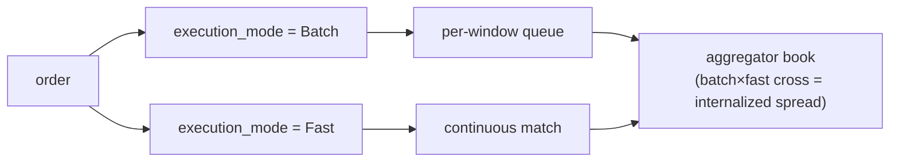

# MIP-4 — 永续合约流动性聚合器 / 内化器

:::info
**规划中。** 目标版本为 V2；不在 v1 主网范围内。
:::

MIP-4 是由 MetaFlux 运营的**永续合约流动性聚合器 / 内化器** — 一个以自营账本承接流入订单流、并从内化价差中获利的批发商。这一模式直接借鉴自股票市场结构：在股票市场中，单一批发商承接大量散户订单流，是整个行业最具盈利能力的业务线。MIP-4 将这一模式引入链上永续合约。

## 存在意义

能力驱动型定位：MIP-4 并非在挂牌广度上竞争（那是 [MIP-3](./mip-3.md) 的领域），而是在散户订单流的成交质量上竞争。通过以自营账本内化订单流，聚合器可回收原本以挂单费形式支付出去的价差，并将其中一部分以价格改善的形式回馈给用户。这与零售经纪商批发商的卖点如出一辙："最优价格，往往优于盘口最优报价。"

该模式与基于现有客户端 SDK 构建的 Robinhood 式散户 UI 天然契合 — 属于产品 / 前端层，而非协议层。

## 是什么

一种新的市场模式和协议层，具备以下特性：

1. **为每个资产维护独立订单簿** — `BTC-AGG`、`ETH-AGG`、`SOL-AGG` 等 — 与对应的 MIP-3 市场（`BTC`、`ETH`、`SOL`）并行运行。聚合器订单簿独立于标准 CLOB，拥有自己的价格和深度结构。
2. **以两档模式执行**，通过每笔订单的 `execution_mode` 字段进行选择：
   - **Batch**（低手续费，吃单约 1–2 bps）— 订单汇入每时间窗口队列，每隔 `batch_window_ms`（默认 200–300 ms）以单一价格统一清算。在聚合器自营账本内采用 FBA 式均一价格清算。UI 标签："最优价格"。
   - **Fast**（较高手续费，吃单约 5–8 bps）— 订单持续与聚合器的挂单账本在盘口最优价格成交。UI 标签："即时"。
3. **捕获内化价差** — 当 Batch 订单流与 Fast 订单流对冲（或两笔 Batch 订单对冲）时，聚合器居中撮合并捕获价差。这是真正的收益驱动来源。

对于聚合器市场，`execution_mode` 字段为必填项；对于标准的 Continuous/FBA 市场，该字段将被忽略。

## 两档执行模式 — Batch 与 Fast

两档模式均在聚合器的**自营**账本中执行；用户通过每笔订单的 `execution_mode` 字段选择档位。内化是指聚合器账本内两档订单流发生对冲时的过程。

- **Batch** — 订单汇入每时间窗口队列，每隔 `batch_window_ms`（默认 200–300 ms）以单一均一价格清算，采用 FBA 式机制。
- **Fast** — 订单持续与聚合器挂单账本在盘口最优价格成交。
- **内化** — 当 Batch 订单流与 Fast 订单流对冲（或两笔 Batch 订单对冲）时，聚合器居中撮合并捕获价差。这是收益驱动来源。

### 剩余路由（后续阶段）

当聚合器自营账本流动性不足以消化某笔订单时，**剩余部分**将向外路由 — 首先路由至链上标准 CLOB（即 MIP-3 市场），在后续阶段待 MetaBridge 成熟后，再路由至外部交易场所。外部场所回退属于 **V3+** 升级内容；V2 的路由目标仅为链上 CLOB。整体架构为此预留了扩展空间，但 V2 不包含该功能。

## MetaFlux 运营，非构建者部署

与 [MIP-3](./mip-3.md) 不同 — MIP-3 允许任何构建者通过 Gas 竞价无需许可地部署市场 — 聚合器由 **MetaFlux 本身**运营。只有治理多签账户可部署聚合器实例，且每个资产仅有一个标准实例。

这是经过深思熟虑的锁定设计选择：

- **避免逆向选择** — 防止多个相互竞争的聚合器分割同一订单流。
- **避免监管模糊** — 规避无需许可做市的合规不确定性。
- **保持收益流入协议** — 内化收益进入与其他业务相同的手续费分配瀑布（见下文），而非流入第三方运营商的口袋。

## 与 MIP-3 的关系 — 互补，而非蚕食

MIP-3 与 MIP-4 服务于订单流的两个不同侧面：

- **MIP-3 市场**承载**专业订单流**，仍是**价格发现**的场所。这些是无需许可部署的标准永续合约/现货市场。
- **MIP-4 聚合器**通过精心设计的内化账本承载**散户订单流**。

聚合器不会蚕食 MIP-3：专业交易者继续在 MIP-3 账本上交易（参考价格在那里），聚合器甚至会将自身库存对冲回那些账本。双向设计，相辅相成。聚合器市场采用 `-AGG` 命名空间，确保两者永不冲突。

## 手续费经济模型

内化收益进入**与 MIP-3 相同的手续费分配瀑布** — 不存在独立的 MIP-4 经济模型。根据[手续费模型](../concepts/fees.md)，聚合器收益分配如下：

- **70%** — 回购销毁（降低有效供应量）
- **20%** — 验证者，由其作为分红分发给各自的质押者
- **10%** — 基金会 / 国库

在散户侧，构建者代码手续费（上限 8 bps）是散户 UI 收费的天然经济席位 — 与零售经纪商货币化订单流的方式相同。

## 成果 → MIP-6，推迟至 V3

"MIP-4" 编号此前曾规划用于**成果 / 预测市场**。该机制已**重新编号为 [MIP-6](./mip-6.md)**，并推迟至 **V3**。MIP-4 现在仅指聚合器，请勿将 MIP-4 重新用于成果市场。

## 另见

- [MIP-3 — 无需许可的永续合约市场部署](./mip-3.md) — 互补的专业订单流 / 价格发现侧
- [MIP-6 — 成果 / 预测市场](./mip-6.md) — 重新编号的成果市场提案，推迟至 V3
- [手续费](../concepts/fees.md) — 内化收益流入的共享手续费分配瀑布
- [FBA](../concepts/fba.md) — Batch 档所基于的批量清算机制
