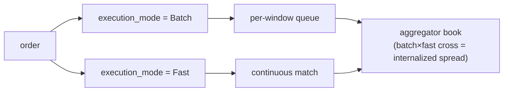

# MIP-4 — Perps 流动性聚合器 / 内部化者

:::info
**已规划。** 目标为 V2；不在 v1 主网范围内。
:::

MIP-4 是一个 MetaFlux 运营的 **perps 流动性聚合器 / 内部化者** — 一个批发商，针对自身簿记吸收传入的订单流，并获取内部化点差。该模型直接借鉴自股票市场结构，其中处理大部分零售流的单一批发商运营业务中利润最高的部分。MIP-4 将这种模式引入链上 perps。

## 存在的原因

这是一个能力驱动的差异化轴：MIP-4 不是在列表深度上竞争（那是 [MIP-3](./mip-3.md)），而是在零售流的执行质量上竞争。通过针对自身静止簿记内部化流，聚合器可以收回本会作为做市费支付的点差 — 并将部分点差返还给用户作为价格改进。这与零售经纪商批发商的宣传口号相同："最佳价格，通常优于报价最优位。"

它与建立在现有客户端 SDK 之上的 Robinhood 风格零售 UI 天然配对 — 是产品/前端，而非协议。

## 是什么

一个新的市场模式和协议层，包括：

1. **为每项资产运营自己的订单簿** — `BTC-AGG`、`ETH-AGG`、`SOL-AGG` 等 — 与对应的 MIP-3 市场（`BTC`、`ETH`、`SOL`）并存。聚合器簿记不同于规范的 CLOB，具有自己的价格和深度结构。
2. **在两个层级执行**，通过 `execution_mode` 字段按订单选择：
   - **批量**（低费用，约 1-2 bps 吃单费）— 订单汇入每窗口队列，每 `batch_window_ms`（默认 200-300 ms）以单一价格清算。聚合器自身簿记内的 FBA 风格统一价格清算。UI 标签："最佳价格"。
   - **快速**（更高费用，约 5-8 bps 吃单费）— 订单持续匹配聚合器静止簿记的最优报价。UI 标签："即时"。
3. **获取内部化点差** — 当批量流与快速流交叉（或两个批量订单交叉）时，聚合器夹在中间并获取点差。这是真正的收入驱动力。

对于聚合器市场，`execution_mode` 字段是必需的；对于规范的连续/FBA 市场，将被忽略。

## 两个执行层级 — 批量 vs 快速

两个层级都针对聚合器**自己的**簿记执行；用户通过 `execution_mode` 字段按订单选择层级。内部化是当两个层级在聚合器簿记内交叉时发生的情况。

- **批量** — 订单汇入每窗口队列，每 `batch_window_ms`（默认 200-300 ms）以单一统一价格清算，FBA 风格。
- **快速** — 订单持续匹配聚合器静止簿记的最优报价。
- **内部化** — 当批量流与快速流交叉（或两个批量订单交叉）时，聚合器夹在中间并获取点差。这是收入驱动力。

### 残差路由（后期阶段）

当聚合器自身簿记过于稀薄无法吸收订单时，**残差**会路由出去 — 首先到规范的链上 CLOB（MIP-3 市场），稍后在 MetaBridge 成熟时到外部场所。外部场所回退是 **V3+** 升级；V2 路由目标仅是链上 CLOB。该结构为此预留了空间，但 V2 不会交付它。

## MetaFlux 运营，而非构建者部署

不同于 [MIP-3](./mip-3.md) — 任何构建者都可通过 gas 拍卖无许可地部署市场 — 聚合器由 **MetaFlux 本身**运营。只有治理多签可部署聚合器实例，每项资产有一个规范实例。

这是一个刻意的、锁定的设计选择：

- **避免逆向选择** — 多个竞争聚合器分割相同流。
- **避免监管模糊** — 关于无许可做市。
- **保持收入流向协议** — 内部化收入进入相同的费用瀑布（下方），而非第三方运营者的口袋。

## 与 MIP-3 的关系 — 互补而非蚕食

MIP-3 和 MIP-4 服务流的两个不同方面：

- **MIP-3 市场** 承载**专业流**并保持**价格发现**的场所。这些是规范的、无许可部署的 perp/spot 市场。
- **MIP-4 聚合器** 通过精选、内部化的簿记承载**零售流**。

聚合器不会蚕食 MIP-3：专业交易者继续交易 MIP-3 簿记（那是参考价格所在），聚合器甚至将其头寸对冲回这些簿记。双向设计。聚合器市场被命名为（`-AGG`），正是为了两者永远不会冲突。

## 费用经济学

内部化收入进入 **与 MIP-3 相同的费用分配瀑布** — 没有单独的 MIP-4 经济学。根据 [费用模型](../concepts/fees.md)，聚合器收入流动为：

- **80%** — 回购并销毁（降低有效供应）
- **10%** — 验证者
- **10%** — 基金会 / 财政

在零售方面，构建者代码费（上限 8 bps）是零售 UI 收费的自然经济位置 — 与零售经纪商获利其订单流的地方相同。

## 成果 → MIP-6，延迟到 V3

数字"MIP-4"之前草拟了**成果 / 预测市场**。该机制已**重新编号为 [MIP-6](./mip-6.md)** 并**延迟到 V3**。MIP-4 现在仅指聚合器；不要为成果重用 MIP-4。

## 另见

- [MIP-3 — 无许可 perp 市场部署](./mip-3.md) — 互补的专业流 / 价格发现方面
- [MIP-6 — 成果 / 预测市场](./mip-6.md) — 重新编号的成果提案，延迟到 V3
- [费用](../concepts/fees.md) — 内部化收入进入的共享费用瀑布
- [FBA](../concepts/fba.md) — 批量层级构建于其上的批量清算机制
