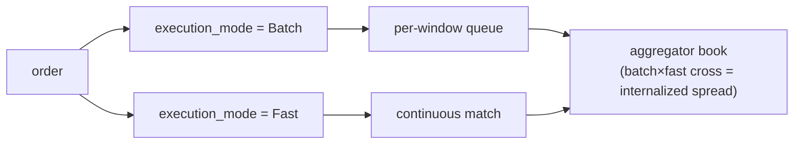

# MIP-4 — 永续合约流动性聚合器 / 内部化引擎

:::info
**规划中。** 目标版本为 V2，不在 v1 主网范围内。
:::

MIP-4 是由 MetaFlux 运营的**永续合约流动性聚合器 / 内部化引擎** — 一个针对自有账本吸收入向订单流并赚取内部化价差的做市商。该模式直接借鉴自股票市场结构：处理大量散户订单流的单一批发做市商，是业内盈利能力最强的角色。MIP-4 将这一模式带入链上永续合约市场。

## 设计动机

这是一条以能力驱动的差异化路径：与其在上线广度上竞争（那是 [MIP-3](./mip-3.md) 的战场），MIP-4 专注于为散户订单流提供更优的成交质量。通过在自有账本内内部化订单流，聚合器可以回收原本需要作为挂单方费用支付出去的价差，并将其中一部分以价格改善的形式返还给用户。这与散户经纪商批发商的卖点如出一辙："最优价格，往往优于盘口最优报价。"

该功能与基于现有客户端 SDK 构建的 Robinhood 风格散户 UI 天然契合 — 这属于产品/前端层，而非协议层。

## 功能概述

这是一种新的市场模式和协议层，具备以下特性：

1. **为每个资产运行独立的订单账本** — `BTC-AGG`、`ETH-AGG`、`SOL-AGG` 等 — 与对应的 MIP-3 市场（`BTC`、`ETH`、`SOL`）并行运作。聚合器账本独立于规范 CLOB，拥有各自的价格和深度结构。
2. **两档执行模式**，通过订单的 `execution_mode` 字段按单选择：
   - **批量模式**（低费率，吃单约 1–2 bps）— 订单汇入每个时间窗口的队列，每隔 `batch_window_ms`（默认 200–300 ms）以单一价格统一清算。在聚合器自有账本内采用 FBA 式统一价格清算。界面标签："最优价格"。
   - **即时模式**（较高费率，吃单约 5–8 bps）— 订单持续与聚合器账本盘口最优挂单撮合成交。界面标签："立即成交"。
3. **捕获内部化价差** — 当批量流与即时流交叉成交（或两笔批量订单相互撮合）时，聚合器居中捕获价差。这是真正的收益驱动力。

对于聚合器市场，`execution_mode` 字段为必填项；对于规范的连续/FBA 市场，该字段将被忽略。

## 两档执行模式 — 批量模式 vs 即时模式

两档模式均在聚合器**自有**账本内执行；用户通过订单的 `execution_mode` 字段按单选择档位。内部化是指两档模式在聚合器账本内交叉撮合时所发生的过程。

- **批量模式** — 订单汇入每个时间窗口的队列，每隔 `batch_window_ms`（默认 200–300 ms）以单一统一价格清算，采用 FBA 机制。
- **即时模式** — 订单持续与聚合器账本盘口最优挂单撮合成交。
- **内部化** — 当批量流与即时流交叉成交（或两笔批量订单相互撮合）时，聚合器居中捕获价差。这是核心收益驱动力。

### 剩余路由（后续阶段）

当聚合器自有账本深度不足以吸收某笔订单时，**剩余部分**将对外路由 — 首先路由至规范链上 CLOB（即 MIP-3 市场），待 MetaBridge 成熟后，在后续阶段再路由至外部交易场所。对外部场所的回退支持属于 **V3+** 升级内容；V2 的路由目标仅为链上 CLOB。整体架构预留了该能力的扩展空间，但 V2 版本不会随附此功能。

## 由 MetaFlux 运营，非构建者部署

与 [MIP-3](./mip-3.md) 不同 — MIP-3 允许任何构建者通过 Gas 竞拍无需许可地部署市场 — 聚合器由 **MetaFlux 自身**运营。只有治理多签才能部署聚合器实例，且每个资产只有一个规范实例。

这是经过深思熟虑的锁定设计决策：

- **避免逆向选择** — 防止多个竞争聚合器分割同一订单流。
- **避免监管模糊地带** — 规避无需许可做市所带来的合规不确定性。
- **确保收益回流协议** — 内部化收益进入与其他收益相同的费用分配瀑布（见下文），而非流入第三方运营商口袋。

## 与 MIP-3 的关系 — 互补而非竞争

MIP-3 与 MIP-4 服务于订单流的两个不同侧面：

- **MIP-3 市场**承载**专业订单流**，仍是**价格发现**的主要场所。这些是规范的、无需许可部署的永续合约/现货市场。
- **MIP-4 聚合器**通过精心设计的内部化账本承载**散户订单流**。

聚合器不会蚕食 MIP-3：专业交易者仍在 MIP-3 账本上交易（参考价格在那里），聚合器甚至会将自身库存对冲回这些账本。从设计上就是双向互动的关系。聚合器市场通过命名空间（`-AGG`）明确区分，确保两者永不冲突。

## 费用经济模型

内部化收益进入**与 MIP-3 相同的费用分配瀑布** — MIP-4 没有独立的经济模型。按照[费用模型](../concepts/fees.md)，聚合器收益的分配方式如下：

- **80%** — 回购销毁（降低流通供应量）
- **10%** — 验证者
- **10%** — 基金会 / 国库

在散户侧，构建者代码费用（上限 8 bps）是散户 UI 收费的天然经济位置 — 与散户经纪商从订单流中变现的方式相同。

## 预测市场 → MIP-6，推迟至 V3

"MIP-4" 这一编号此前曾规划用于**结果市场 / 预测市场**。该机制已**重新编号为 [MIP-6](./mip-6.md)**，并推迟至 **V3** 实现。MIP-4 现在专指聚合器，仅此而已；请勿将 MIP-4 重新用于结果市场。

## 参见

- [MIP-3 — 无需许可的永续合约市场部署](./mip-3.md) — 互补的专业订单流 / 价格发现侧
- [MIP-6 — 结果市场 / 预测市场](./mip-6.md) — 重新编号的结果市场提案，推迟至 V3
- [费用模型](../concepts/fees.md) — 内部化收益所汇入的共享费用分配瀑布
- [FBA](../concepts/fba.md) — 批量模式所依赖的批量清算机制
