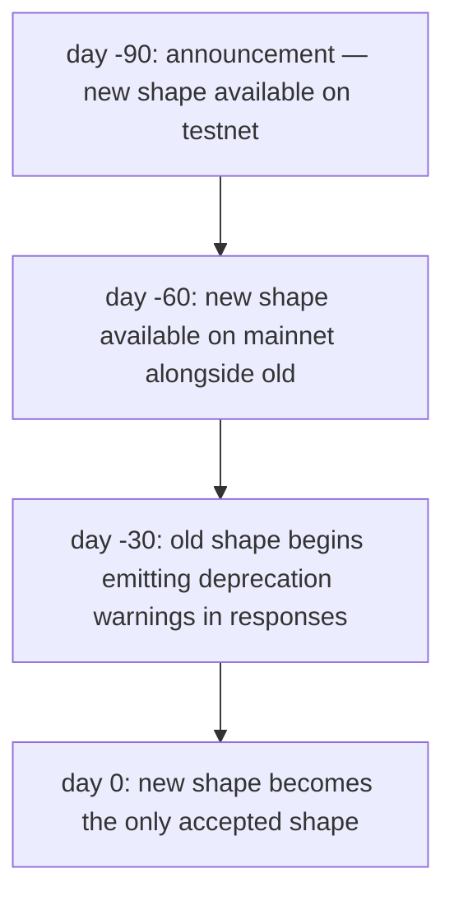
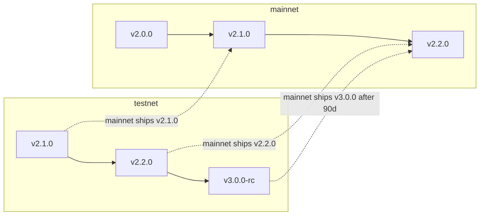

# 版本管理与弃用策略

:::info
**状态说明。** 本政策已**稳定**发布。具体版本迁移详情请参阅变更日志。
:::

## 简要概览

- 协议版本采用语义化版本三元组（`MAJOR.MINOR.PATCH`）。
- 破坏性的通信格式变更归入 `MAJOR`；向下兼容的新增内容归入 `MINOR`；缺陷修复归入 `PATCH`。
- 主网的破坏性变更须有 90 天弃用过渡期，期间同时接受新旧两种通信格式。
- 测试网版本领先于主网，以便在上线前发现迁移问题。

## 版本组成

协议的 `protocol_version` 可通过 `/info node_info` 获取：

```json
{
  "type": "node_info",
  "data": { "protocol_version": "1.2.0", ... }
}
```

| 组成部分 | 含义 | 示例 |
|-----------|---------|----------|
| MAJOR | 破坏性通信格式变更 | 重命名 `Order` 字段；移除 action 变体；更改签名域；更改 RPC URL 结构 |
| MINOR | 向下兼容的新增内容 | 新增 action 变体；新增 info 类型；新增 WS 频道；新增错误字符串 |
| PATCH | 仅行为层面的修复 | 不影响通信格式的缺陷修复；性能优化 |

## 什么是「通信格式」

通信格式（wire shape）是客户端在序列化与签名逻辑中所承诺的全部内容，具体包括：

| 通信格式 | 示例 |
|-----------|----------|
| 是 | Action 的 `type` 字符串、字段名、字段类型、枚举值、响应结构、状态码、错误字符串、EIP-712 域 |
| 是 | 数值缩放约定（定点整数、USDC 基础单位） |
| 是 | WS 频道名称、载荷结构、帧格式 |
| 否 | 服务器内部存储；共识实现；标记价格/预言机来源权重（由治理控制，不纳入协议版本管理）；手续费档位阈值（由治理控制） |

由治理机制决定的可变参数（手续费档位、标记价格权重、压力测试冲击值、清算阈值）**不**属于通信格式承诺的范畴。其**结构**受到约束，但具体数值可随时调整。

## 主网承诺

| 变更类别 | 通知方式 | 宽限期 |
|--------------|--------------|--------------|
| MAJOR（破坏性） | 激活前 90 天通知 | 新旧两种格式同时接受 ≥ 90 天 |
| MINOR（新增） | 不设宽限期；在变更日志中公告 | 不适用 |
| PATCH（修复） | 不设宽限期 | 不适用 |

MAJOR 变更的发布流程如下：



90 天过渡期与机构级变更管理周期相匹配。机器人运营者有充足时间完成迁移；在重叠期内，客户端可同时运行新旧两种通信逻辑。

## 弃用警告

在重叠过渡期内，使用旧格式的请求响应中会包含一个非致命性警告：

```json
{
  "accepted": true,
  "mempool_depth": 3,
  "_deprecation": {
    "field":      "params.price",
    "deprecated_at_version": "2.0.0",
    "removal_at_version":    "3.0.0",
    "migration": "use px (string, fixed-point 10^8)"
  }
}
```

`_deprecation` 字段在解析器中始终为可选——已迁移至新格式的客户端不会收到此字段。

## 变更日志

协议变更日志发布于 `https://mtf.exchange/changelog`（上线前 URL 待定），并同步镜像至本仓库的 `CHANGELOG.md`。每条记录包含：

- 版本三元组
- 激活日期
- 类别（MAJOR / MINOR / PATCH）
- 各项变更说明，MAJOR / MINOR 变更附有迁移指引

订阅方式：
- RSS at `https://mtf.exchange/changelog.rss`
- GitHub Releases on this repo
- WS push on a planned `_meta` channel (TBD)

## 测试网领先于主网

测试网通常领先主网 1–2 个 MINOR 版本。在主网正式发布前，迁移过程中发现的问题会先在测试网得到验证。接入测试网的机器人运营者可提前获知破坏性变更预警。



## 治理可在不触发版本变更的情况下修改的内容

协议层通过通信格式进行版本管理。治理机制可直接修改：

- 各市场参数（最小价格变动单位、杠杆上限、维持保证金比例、标记价格构成、资金费率上限）
- 手续费档位阈值与费率
- 投资组合保证金（PM）压力测试冲击幅度及相关性矩阵
- 清算档位阈值与冷却时间（在约束范围内——重大调整须走 MAJOR 流程）
- 限速配额
- 保险池补充比例

上述变更**不会**触发协议版本号更新。这些变更**会**在计划中的 `_governance` WS 频道上广播事件，当前值也可通过 `/info` 接口查询。

凡需要基于当前参数值进行计算的客户端（例如在客户端本地计算 PM 保证金），必须实时读取参数值，切勿将其硬编码。

## 客户端 SDK 版本管理

各 SDK（`@metaflux/sdk`、Rust 版 `metaflux-client`、Python 版 `metaflux-client`）遵循独立于协议的语义化版本管理：

- `0.x.y` — 主网上线前阶段；每次 MINOR 升级均可能引入破坏性变更
- `1.x.y` — 主网上线后阶段；严格遵循语义化版本规范

SDK 的 `1.x` API 面向特定的协议 MAJOR 版本。协议 MAJOR 升级时，SDK 随之升级 MAJOR；SDK 1.x 对应协议 2.x，SDK 2.x 对应协议 3.x，在 90 天过渡期内同时支持新旧两个版本。

## 主网上线前的注意事项

在主网正式上线前：
- Devnet 可在提前 24 小时通知的情况下变更通信格式。
- 测试网运行最新的协议 MINOR/MAJOR 版本，领先于主网计划发布版本；测试网上出现问题属于预期现象。
- 各文档页面的状态标识反映当前内容的稳定性（稳定 / 预览 / 计划中）。

## 参见

- [网络环境](./networks.md) — 各网络端点与 chainId
- [安全](./security.md) — 安全模型与漏洞披露政策
