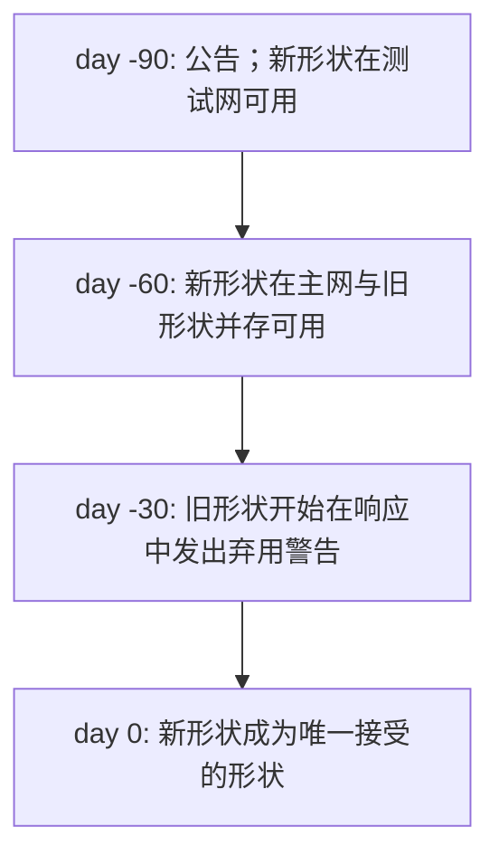
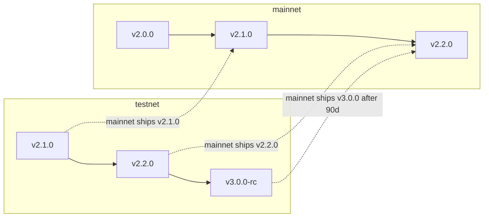

# 版本控制与弃用

:::info
**状态.** **稳定**策略。具体版本转换详见变更日志。
:::

## TL;DR

- 协议版本是一个 semver 形式的三元组 (`MAJOR.MINOR.PATCH`)。
- 破坏性的线路变化放在 `MAJOR` 中；非破坏性添加在 `MINOR` 中；修复在 `PATCH` 中。
- 主网破坏性变化需要 90 天的弃用窗口，期间接受旧的和新的线路形状。
- 测试网运行在主网之前，以在生产环境前发现迁移问题。

## 版本组件

协议的 `protocol_version` 通过 `/info node_info` 公开：

```json
{
  "type": "node_info",
  "data": { "protocol_version": "1.2.0", ... }
}
```

| 组件 | 含义 | 示例 |
|-----------|---------|----------|
| MAJOR | 破坏性线路变化 | 重命名 `Order` 字段；移除操作变体；更改签名域；更改 RPC URL 形状 |
| MINOR | 可加性的非破坏性 | 新操作变体；新信息类型；新 WS 通道；新错误字符串 |
| PATCH | 仅行为修复 | 保留线路形状的错误修复；性能改进 |

## 什么是"线路形状"

线路形状是客户端在其序列化/签名逻辑中承诺的一切。具体来说：

| 线路形状 | 示例 |
|-----------|----------|
| 是 | 操作 `type` 字符串、字段名、字段类型、枚举值、响应形状、状态代码、错误字符串、EIP-712 域 |
| 是 | 数值缩放约定（定点整数、USDC 基本单位） |
| 是 | WS 通道名称、有效载荷形状、帧格式 |
| 否 | 服务器内部存储；共识实现；标记/预言机源权重（由治理控制，不涉及协议版本）；费用等级阈值（治理） |

治理可变参数（费用等级、标记组成权重、场景冲击、清算阈值）**不是**线路形状承诺的一部分。它们的**形状**已承诺；它们的值可以随时变动。

## 主网承诺

| 变化类别 | 通知 | 宽限期 |
|--------------|--------------|--------------|
| MAJOR（破坏性） | 激活前 90 天 | 旧的和新的形状都接受≥90 天 |
| MINOR（可加性） | 0 天；变更日志中公布 | 不适用 |
| PATCH（修复） | 0 天 | 不适用 |

MAJOR 变化的推出方式如下：



90 天窗口符合机构变更管理周期。机器人运营商有充足的时间迁移；客户端可以在重叠期间运行双线路代码。

## 弃用警告

在重叠窗口期间，对旧形状的响应包括非致命性警告：

```json
{
  "accepted": true,
  "mempool_depth": 3,
  "_deprecation": {
    "field":      "params.price",
    "deprecated_at_version": "2.0.0",
    "removal_at_version":    "3.0.0",
    "migration": "use px (string, fixed-point 10^8)"
  }
}
```

`_deprecation` 字段在你的解析器中始终是可选的——新形状的客户端永远不会看到它。

## 变更日志

协议变更日志发布在 `https://mtf.exchange/changelog`（发布前 URL 待定），并在此仓库的 `CHANGELOG.md` 中镜像。每个条目包括：

- 版本三元组
- 激活日期
- 类别（MAJOR / MINOR / PATCH）
- 每项变化的描述，MAJOR / MINOR 的迁移说明

订阅方式：
- RSS at `https://mtf.exchange/changelog.rss`
- GitHub Releases on this repo
- WS push on a planned `_meta` channel (TBD)

## 测试网领先主网

测试网通常运行在主网之前 1–2 个次要版本。测试网发现的迁移问题会在主网推出日期前解决。拥有测试网集成的机器人运营商会提前获得破坏性变化的警告。



## 治理可以在不进行版本控制的情况下更改什么

协议层进行线路版本控制。治理可以改变：

- 逐市场参数（刻度、杠杆上限、维持率、标记组成、融资上限）
- 费用等级阈值和费率
- PM 场景冲击幅度和相关矩阵
- 清算等级阈值和冷却期（在限制内——重大变化需要 MAJOR）
- 费率限制预算
- 保险池补充比率

这些变化**不会**增加协议版本。它们**会**在计划的 `_governance` WS 通道上发出事件，并可通过 `/info` 查询其当前值。

针对当前参数值进行计算的客户端（例如客户端计算 PM 保证金）必须实时读取参数；永远不要硬编码。

## 客户端 SDK 版本控制

SDK（`@metaflux/sdk`、Rust 的 `metaflux-client`、Python 的 `metaflux-client`）独立于协议遵循 semver：

- `0.x.y` — 主网前；每个次要版本都允许破坏性变化
- `1.x.y` — 主网后；API 表面上严格遵循 semver

SDK 的 `1.x` API 表面针对特定的协议 MAJOR。当协议增加 MAJOR 时，SDK 增加 MAJOR；SDK 1.x 支持协议 2.x，SDK 2.x 支持协议 3.x，在 90 天窗口期间有重叠支持。

## 主网前注意事项

在主网启动之前：
- Devnet 可能会以 24 小时通知破坏线路形状。
- 测试网运行最新的协议 MINOR/MAJOR，领先主网的计划发布；测试网上的中断是预期的。
- 每个文档中的状态横幅反映什么是稳定的、预览版的和计划的。

## 另请参阅

- [Networks](./networks.md) — 逐网络端点 + chainIds
- [Security](./security.md) — 安全模型和披露策略
